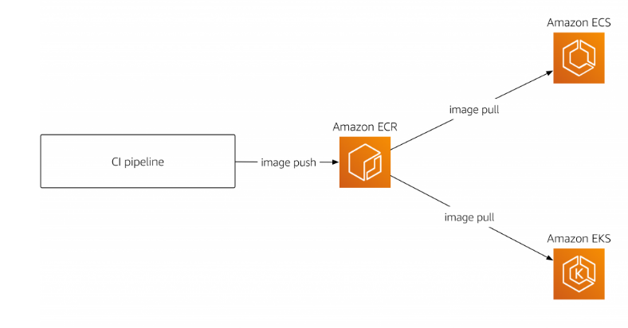

## ECR (Elastic Container Registry)

: AWS에서 제공하는 컨테이너 레지스트리

- 개발자가 컨테이너 이미지를 손쉽게 저장, 관리 및 배포할 수 있게 도와줌
- 컨테이너 이미지를 ECR에 업로드 하여 ECS를 이용해 배포
- Private Docker Hub와 유사

 

## ECS (Elastic Container Service)

: 완전 관리형 컨테이너 오케스트레이션 서비스

- 다양한 오케스트레이션 서비스가 있음
- 다양한 AWS 기능과 통합이 쉬움

 

    

---

 

### Reference

- [@topasvga](https://brunch.co.kr/@topasvga/1190)
