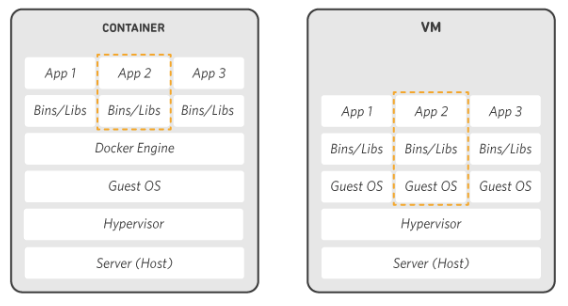

## Docker

: Go 언어로 작성된 리눅스 컨테이너 기반으로 하는 오픈소스 가상화 플랫폼

- 성능 향상
- 뛰어난 이식성
- 쉽게 Scale Out을 할 수 있는 이식성

 

> ### 가상화를 사용하는 이유

- 서버 관리자 입장
  - CPU 사용률이 낮은 서버들 → 리소스 낭비
  - 그렇다고 모든 서비스를 한 서버에 올린다면 안정성에 문제가 생김
- `서버 가상화` → 안정성을 높이며 리소스를 최대한 활용 가능

 

> ### 컨테이너란?

: 가상화 기술 중 하나로, OS 레벨의 가상화로 프로세스를 격리시켜 동작하는 방식

 

> ### Docker를 사용하는 경우

- MSA (Micro Service Architecture)
  - Docker 컨테이너를 통해 표준화된 코드 배포를 활용하여 MSA 구축 및 확장
- CICD
  - 환경 표준화, 언어 스택 및 버전 간 충동 제거
- 데이터 처리
  - 빅 데이터 처리를 서비스로서 제공
- 서비스로서의 컨테이너

 

## VM vs Docker

    
    <h5>출처: https://aws.amazon.com/ko/docker/</h5>

- VM (Virtual Machine)
  - Host OS 위에 가상화를 위한 `Hypervisor` 엔진, `Guest OS`를 올려 사용
  - Host OS와 Guest OS를 완벽히 분리 → 높은 격리 레벨
  - 무겁고 느림
- Docker
  - Docker 엔진 위에 애플리케이션 실행에 `필요한 바이너리`만 올라감
  - Host의 `커널 공유` → IO 처리가 쉬워 효율을 높일 수 있음

 

---

### Reference

- [@aws](https://aws.amazon.com/ko/docker/)
- [@khj93](https://khj93.tistory.com/entry/Docker-Docker-%EA%B0%9C%EB%85%90)
