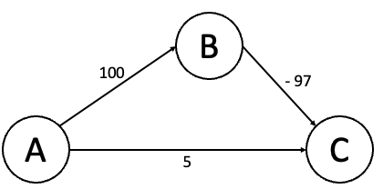
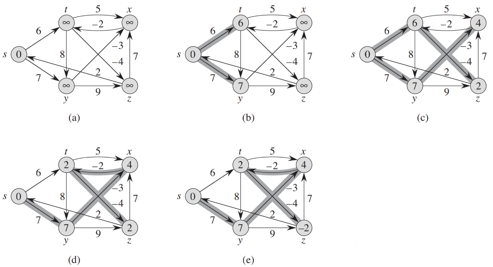

## **벨만-포드 알고리즘** (Bellman-Ford Algorithm)

: 그래프에서 한 정점에서 다른 정점까지의 최단 경로를 구하는 알고리즘 중 하나

&nbsp; [다익스트라 알고리즘](https://github.com/lcomment/development-recipes/blob/main/Computer%20Science/Algorithm/dijkstra.md)과 마찬가지로 벨만-포드 알고리즘 역시 `Single-Path`를 구하는 알고리즘이다. 두 알고리즘의 가장 큰 차이점은 벨만-포드 알고리즘은 `음의 가중치`도 허용한다는 것이다. 다음의 예시를 보면서 이해하자.

<br>

> ### 다익스트라 알고리즘의 한계

<p align=center></p>

&nbsp; 위와 같은 그래프에서 `A → C`의 최소비용을 구하고자 한다. 이 때 존재하는 두 가지 경로는 다음과 같다.

- ① A → B → C = 100 + (-97) = `3`
- ② A → C = `5`

&nbsp; 당연히 ① 경로가 최소비용의 거리지만, 다익스트라 알고리즘에서는 정점 A의 인접 간선인 정점 B와 정점 C 중 최소인 정점 C를 방문하여 최단 거리를 5로 확정 짓는다. 이는 앞서 설명했듯이 다익스트라 알고리즘은 전제조건으로 `가중치는 양의 정수만 허용`하기 때문이다. 따라서 음의 가중치를 가진 간선이 존재한다면 `벨만-포드 알고리즘`을 이용하여 최단 경로를 구해야 한다.

<br>

### 벨만-포드 알고리즘의 특징

- (𝑉-1)번의 매 단계마다 모든 간선을 전부 확인
- 모든 노드 간의 최단 경로 계산
- 음수 간선이 있어도 최적의 해를 찾을 수 있음
  - 음수 간선의 순환을 감지할 수 있음
- 시간복잡도: 𝑂(𝑉﹒𝐸)

> → 모든 간선의 비용이 양수일 때는 `다익스트라`, 음수 간선이 포함된 경우에는 `벨만-포드`

<br>

### **동작 순서**

<p align=center></p>

- ① 최단 비용 테이블 초기화
- ② 출발 정점 선택
- ③ Loop: (`V-1만큼 반복`)
  - 모든 간선 E개를 하나씩 확인
  - 각 간선을 거쳐 다른 노드로 가는 비용을 계산
  - 최소 비용 테이블 갱신
- ④ 음수 간선 사이클 체크를 위해 ③ 과정 한번 더 수행

<br>

## **구현**

### **BELLMAN-FORD(G, w, s)**

```
// Initialize
for each vertex v ∈ G.V
    v.d = ∞
    v.π = NIL

for i=1 to |G.V|-1
    for each edge(u, v) ∈ G.E
        // Relax
        if v.d > u.d + w(u, v)
            v.d = u.d + w(u, v)
            v.π = u

for each edge (u, v) ∈ G.E
    if v.d > u.d + w(u, v)
        return FALSE

return TRUE
```

&nbsp; 위의 수도 코드를 보면서 로직을 이해해보자. 밑의 코드는 각각 Java와 Python으로 구현한 코드다. (코드들은 백준 알고리즘의 [타임머신](https://www.acmicpc.net/problem/11657) 문제의 해결 코드입니다.)

<details>
<summary style='font-size: 15px'>Java 코드 보기</summary>
<div markdown="1">

```java
import java.io.BufferedReader;
import java.io.IOException;
import java.io.InputStreamReader;
import java.util.ArrayList;
import java.util.Arrays;

public class BellmanFord {
	static class Edge{
		int start, end, weight;

		Edge(int start, int end, int weight){
			this.start = start;
			this.end = end;
			this.weight = weight;
		}
	}
	static int V, E, K;
	static ArrayList<Edge> edges = new ArrayList<>();
	static long[] dist;

	public static void main(String[] args) throws IOException{
		BufferedReader br = new BufferedReader(new InputStreamReader(System.in));

		int[] VE = Arrays.stream(br.readLine().split(" ")).mapToInt(Integer::parseInt).toArray();
		V = VE[0];
		E = VE[1];

		dist = new long[V+1];
		Arrays.fill(dist, Integer.MAX_VALUE);

		for(int i=0 ; i<E ; i++) {
			int[] input = Arrays.stream(br.readLine().split(" ")).mapToInt(Integer::parseInt).toArray();
			edges.add(new Edge(input[0], input[1], input[2]));
		}

		boolean nagativeCycle = bellmanFord();

		if(nagativeCycle)
			System.out.println(-1);
		else {
			for(int i=2 ; i<=V ; i++) {
				if(dist[i] != Integer.MAX_VALUE)
					System.out.println(dist[i]);
				else
					System.out.println(-1);
			}
		}
	}
	static boolean bellmanFord() {
		dist[1] = 0;

		for(int i=0 ; i<V-1 ; i++) {
			for(Edge e : edges) {
				if(dist[e.start] != Integer.MAX_VALUE && dist[e.end] > dist[e.start] + e.weight) {
					dist[e.end] = dist[e.start] + e.weight;
				}
			} // for-Each
		} // for_i

		for(Edge e : edges) {
			if(dist[e.start] != Integer.MAX_VALUE && dist[e.end] > dist[e.start] + e.weight)
				return true;
		}

		return false;
	}
}
```

</div>
</details>

<details>
<summary style='font-size: 15px'>Python 코드 보기</summary>
<div markdown="1">

```python
import sys

input = sys.stdin.readline
INF = int(1e9)

v, e = map(int, input().split())
edges = []
distance = [INF] * (v + 1)

for _ in range(e):
    a, b, c = map(int, input().split())
    edges.append((a, b, c))


def bellman_ford():
    distance[1] = 0
    for i in range(v):
        for j in range(e):
            cur_node = edges[j][0]
            next_node = edges[j][1]
            edge_cost = edges[j][2]

            if distance[cur_node] != INF and distance[next_node] > distance[cur_node] + edge_cost:
                distance[next_node] = distance[cur_node] + edge_cost

                # 음수 사이클 확인
                if i == v - 1:
                    return True

    return False


# 벨만 포드 알고리즘 수행
negative_cycle = bellman_ford()

# 음수 순환이 존재하면 -1 출력
if negative_cycle:
    print("-1")
else:
    for i in range(2, v + 1):
        if distance[i] == INF:
            print("-1")
        else:
            print(distance[i])
```

</div>
</details>

</br>

---

### **참고자료**

- Web
  - [@developer-davii](https://developer-davii.tistory.com/89)
  - [@kimdukbae](https://velog.io/@kimdukbae/알고리즘-벨만-포드-알고리즘-Bellman-Ford-Algorithm)
