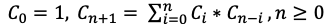
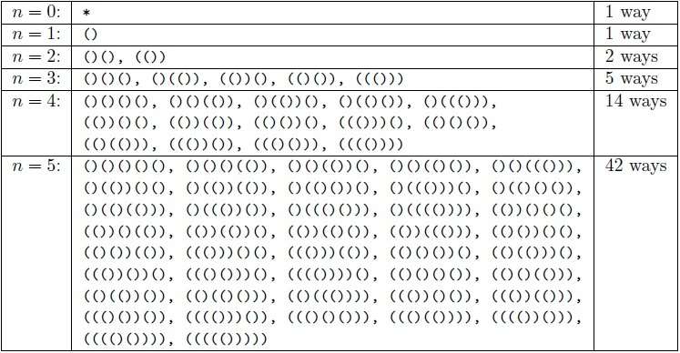
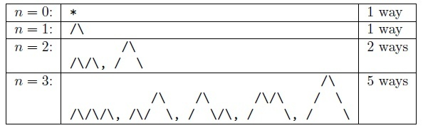
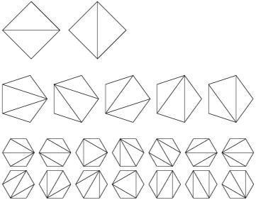
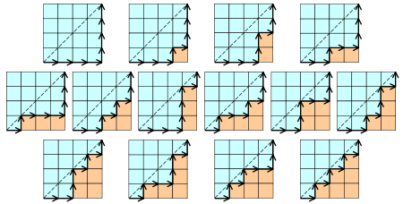
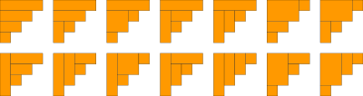
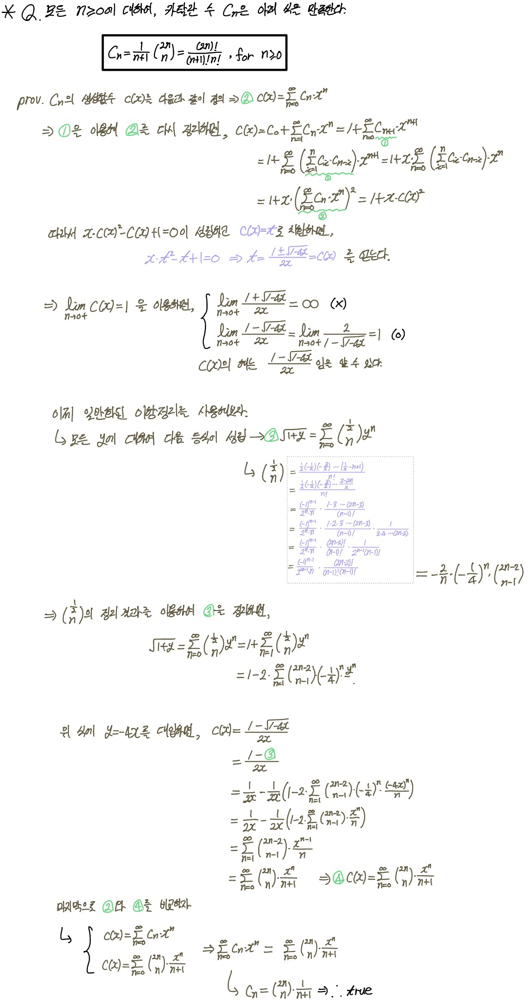

## 카탈란 수 (Catalan Number)

<p align=center></p>

&nbsp; 𝙣 번째 카탈란 수 𝘾𝘯 이란 위의 점화식을 만족하는 수열의 𝙣 번째 항이다. 이 수열의 첫 10개의 항을 나열하면 `1, 1, 2, 5, 14, 43, 132, 429, 1430, 4862, ... (𝘾₀~𝘾₉)` 이다. 코드로 표현하면 아래와 같다.

```java
// java 코드
public int catalan(int n) {
    int dp[] = new int[n + 1];
    dp[0] = 1;
    dp[1] = 1;

    for (int i = 2; i <= n; i++) {
        for (int j = 1; j <= i; j++) {
            dp[i] += dp[i-j] * dp[j-1];
        }
    }

    return dp[n];
}
```

<br>

&nbsp; 카탈란 수는 조합론에서 빈번하게 등장하는 수 중 하나로, 아래와 같은 문제들의 해답이 모두 카탈란 수로 주어진다.

> ### 1. 올바른 괄호

: n쌍의 여는 괄호 `(`와 닫는 괄호 `)`로 만들 수 있는 올바른 괄호 구조의 가짓수와 같다.

<p align=center></p>

> ### 2. 산 만들기

: 괄호와 비슷하게 `/`와 `\`을 n쌍으로 산을 만들 수 있는 방법과 같다.

<p align=center></p>

> ### 3. 다각형을 삼각형으로 나누기

: (n+2)각형을 n개의 삼각형으로 나누는 방법의 개수와 같다.

<p align=center></p>

> ### 4. 대각선 피해가기

: (n x n) 격자의 좌측 하단 좌표 `(0, 0)`에서 우측 상단 좌표 `(n, n)`을 향해 대각선을 피해 최단거리로 이동하는 경우의 수와 같다.

<p align=center></p>

> ### 5. 계단 채우기

: 높이가 n인 계단 모양을 n개의 직사각형으로 완전히 채울 수 있는 경우의 수와 같다.

<p align=center></p>

<br>

## 증명하기

<details>
<summary style='font-size: 15px'>점화식 이해하기</summary>
<p align=center></p>
</details>
<br>
<details>
<summary style='font-size: 15px'>카탈란 수의 계산</summary>
<p align=center></p>
</details>

<br>

---

### **참고자료**

- Web
  - [#wikipedia](http://en.wikipedia.org/wiki/Eug%C3%A8ne_Charles_Catalan)
  - [#geometer](http://www.geometer.org/mathcircles/catalan.pdf)
  - [@suhak](https://suhak.tistory.com/77)
  - [@jjycjnmath](https://jjycjnmath.tistory.com/139)
