## **크루스칼 알고리즘** (Kruskal Algorithm)

: 그리디 알고리즘을 이용해 그래프의 모든 정점을 최소 비용으로 연결하는 최적 해답을 구하는 알고리즘

- **그리디 알고리즘**
  - 선택을 하는 시점에서 가장 좋다고 생각되는 것을 선택
  - 크루스칼 알고리즘은 `최적의 해답`을 주는 것으로 증명돼 있음
- `사이클`이 생기지 않게 선택

</br>

## **동작 과정**

- 그래프의 간선들을 가중치의 오름차순 정렬
- 정렬된 간선 리스트에서 순서대로 사이클을 형성하지 않는 간선 선택
- 해당 간선을 MST 집합에 추가

</br>

## **동작 예시**


- V=9, E=14
- 녹색 표시: 선택
- 빨간 표시: 사이클을 만드는 간선

</br>

> ### **ⓐ 간선들의 가중치의 오름차순 정렬**

| gh  | ci  | fg  | ab  | cf  | gi  | cd  | hi  | ah  | bc  | de  | ef  | bh  | df  |
| :-: | :-: | :-: | :-: | :-: | :-: | :-: | :-: | :-: | :-: | :-: | :-: | :-: | :-: |
|  1  |  2  |  2  |  4  |  4  |  6  |  7  |  7  |  8  |  8  |  9  | 10  | 11  | 14  |

> ### **ⓑ E(g,h) 선택**

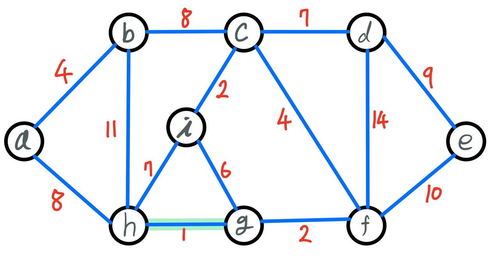

| gh  | ci  | fg  | ab  | cf  | gi  | cd  | hi  | ah  | bc  | de  | ef  | bh  | df  |
| :-: | :-: | :-: | :-: | :-: | :-: | :-: | :-: | :-: | :-: | :-: | :-: | :-: | :-: |
| `1` |  2  |  2  |  4  |  4  |  6  |  7  |  7  |  8  |  8  |  9  | 10  | 11  | 14  |

> ### **ⓒ E(c,i) 선택**

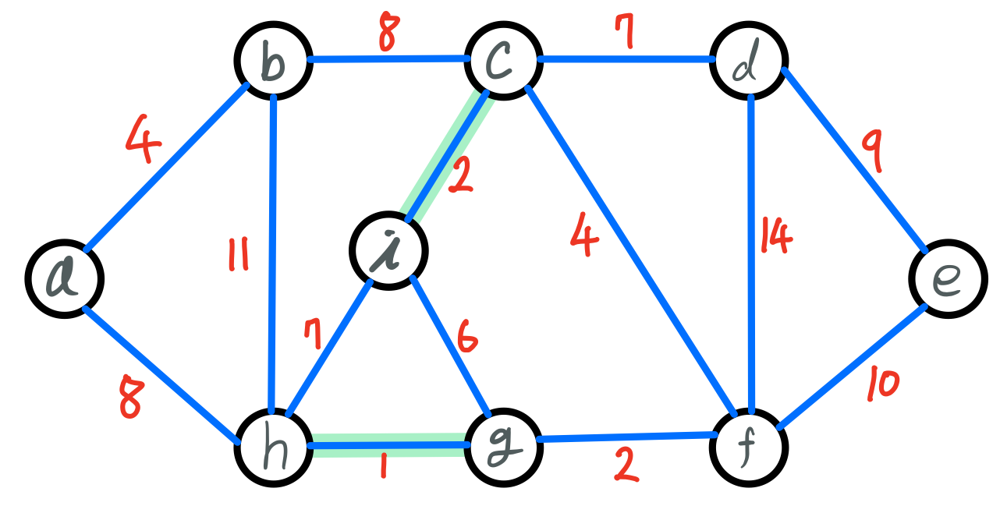

| gh  | ci  | fg  | ab  | cf  | gi  | cd  | hi  | ah  | bc  | de  | ef  | bh  | df  |
| :-: | :-: | :-: | :-: | :-: | :-: | :-: | :-: | :-: | :-: | :-: | :-: | :-: | :-: |
|  1  | `2` |  2  |  4  |  4  |  6  |  7  |  7  |  8  |  8  |  9  | 10  | 11  | 14  |

> ### **ⓓ E(f,g) 선택**

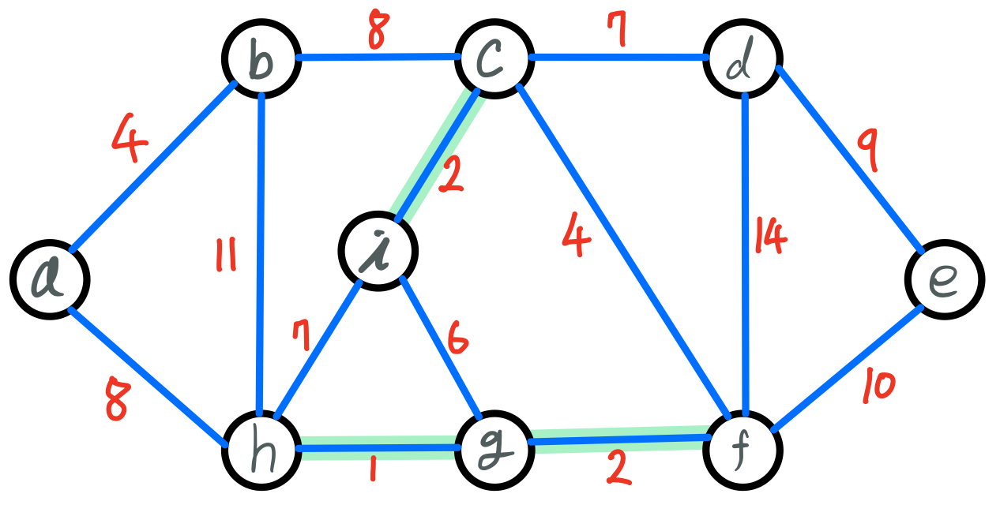

| gh  | ci  | fg  | ab  | cf  | gi  | cd  | hi  | ah  | bc  | de  | ef  | bh  | df  |
| :-: | :-: | :-: | :-: | :-: | :-: | :-: | :-: | :-: | :-: | :-: | :-: | :-: | :-: |
|  1  |  2  | `2` |  4  |  4  |  6  |  7  |  7  |  8  |  8  |  9  | 10  | 11  | 14  |

> ### **ⓔ E(a,b) 선택**

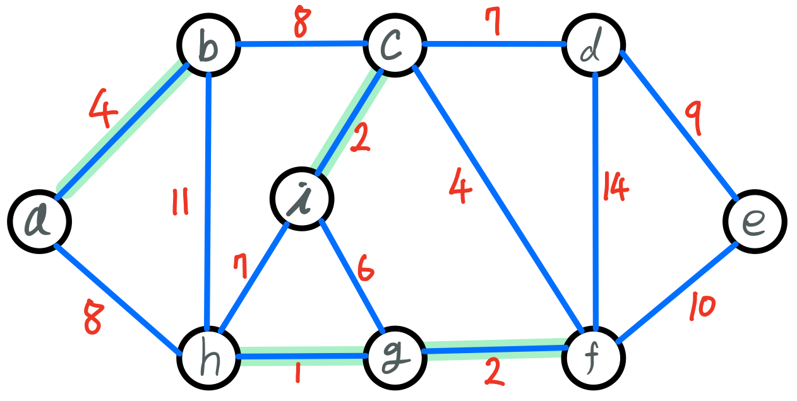

| gh  | ci  | fg  | ab  | cf  | gi  | cd  | hi  | ah  | bc  | de  | ef  | bh  | df  |
| :-: | :-: | :-: | :-: | :-: | :-: | :-: | :-: | :-: | :-: | :-: | :-: | :-: | :-: |
|  1  |  2  |  2  | `4` |  4  |  6  |  7  |  7  |  8  |  8  |  9  | 10  | 11  | 14  |

> ### **ⓕ E(c,f) 선택**

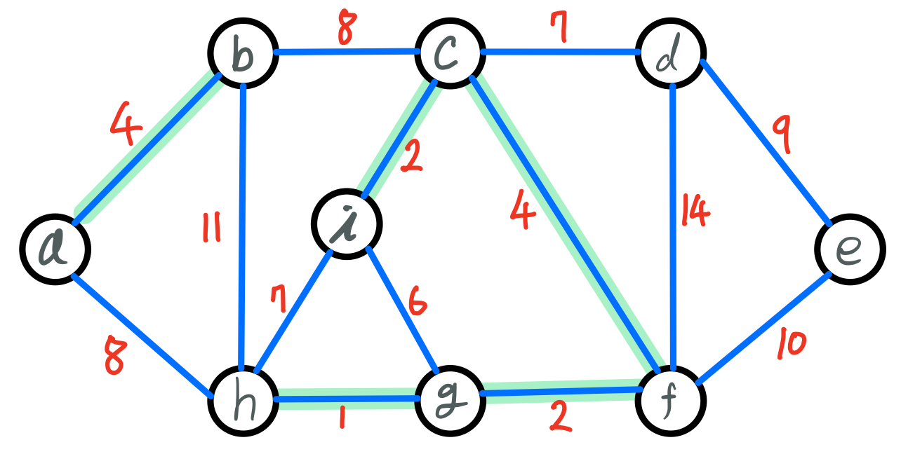

| gh  | ci  | fg  | ab  | cf  | gi  | cd  | hi  | ah  | bc  | de  | ef  | bh  | df  |
| :-: | :-: | :-: | :-: | :-: | :-: | :-: | :-: | :-: | :-: | :-: | :-: | :-: | :-: |
|  1  |  2  |  2  |  4  | `4` |  6  |  7  |  7  |  8  |  8  |  9  | 10  | 11  | 14  |

> ### **ⓖ E(g,i) → 사이클을 만드는 간선**

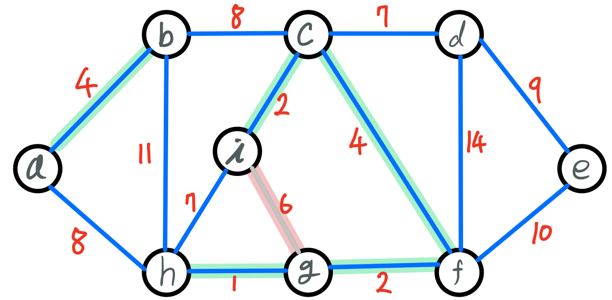

| gh  | ci  | fg  | ab  | cf  | gi  | cd  | hi  | ah  | bc  | de  | ef  | bh  | df  |
| :-: | :-: | :-: | :-: | :-: | :-: | :-: | :-: | :-: | :-: | :-: | :-: | :-: | :-: |
|  1  |  2  |  2  |  4  |  4  | `6` |  7  |  7  |  8  |  8  |  9  | 10  | 11  | 14  |

> ### **ⓗ E(c,d) 선택**

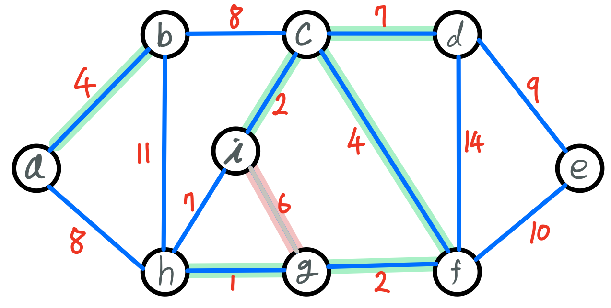

| gh  | ci  | fg  | ab  | cf  | gi  | cd  | hi  | ah  | bc  | de  | ef  | bh  | df  |
| :-: | :-: | :-: | :-: | :-: | :-: | :-: | :-: | :-: | :-: | :-: | :-: | :-: | :-: |
|  1  |  2  |  2  |  4  |  4  |  6  | `7` |  7  |  8  |  8  |  9  | 10  | 11  | 14  |

> ### **ⓘ E(h,i) → 사이클을 만드는 간선**

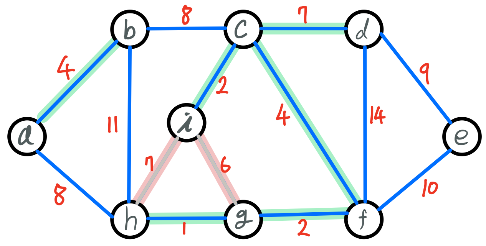

| gh  | ci  | fg  | ab  | cf  | gi  | cd  | hi  | ah  | bc  | de  | ef  | bh  | df  |
| :-: | :-: | :-: | :-: | :-: | :-: | :-: | :-: | :-: | :-: | :-: | :-: | :-: | :-: |
|  1  |  2  |  2  |  4  |  4  |  6  |  7  | `7` |  8  |  8  |  9  | 10  | 11  | 14  |

> ### **ⓙ E(a,h) 선택**

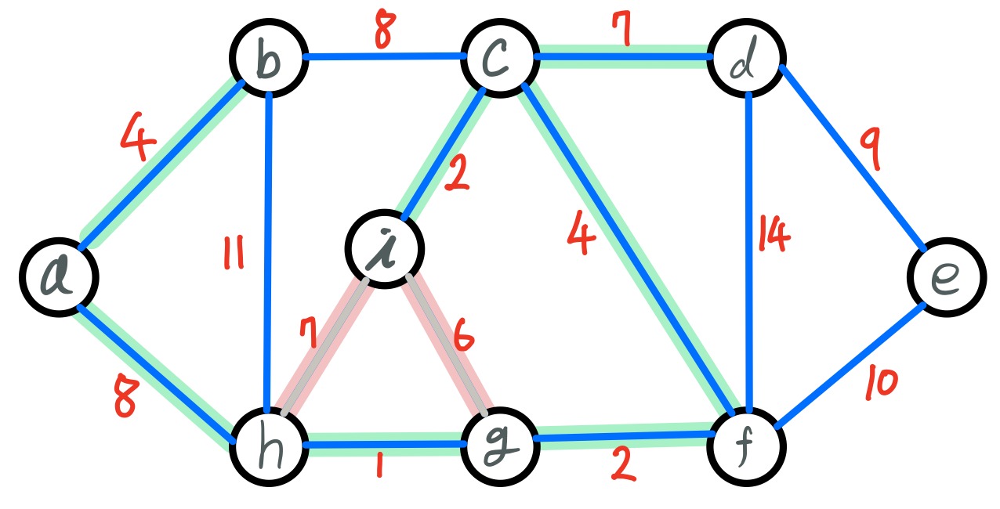

| gh  | ci  | fg  | ab  | cf  | gi  | cd  | hi  | ah  | bc  | de  | ef  | bh  | df  |
| :-: | :-: | :-: | :-: | :-: | :-: | :-: | :-: | :-: | :-: | :-: | :-: | :-: | :-: |
|  1  |  2  |  2  |  4  |  4  |  6  |  7  |  7  | `8` |  8  |  9  | 10  | 11  | 14  |

> ### **ⓚ E(b,c) → 사이클을 만드는 간선**

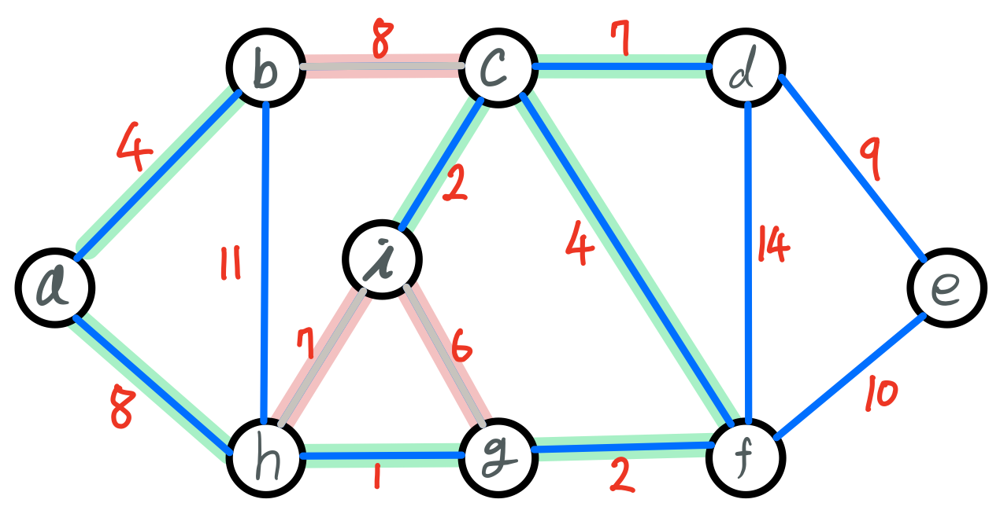

| gh  | ci  | fg  | ab  | cf  | gi  | cd  | hi  | ah  | bc  | de  | ef  | bh  | df  |
| :-: | :-: | :-: | :-: | :-: | :-: | :-: | :-: | :-: | :-: | :-: | :-: | :-: | :-: |
|  1  |  2  |  2  |  4  |  4  |  6  |  7  |  7  |  8  | `8` |  9  | 10  | 11  | 14  |

> ### **ⓛ E(d,e) 선택**

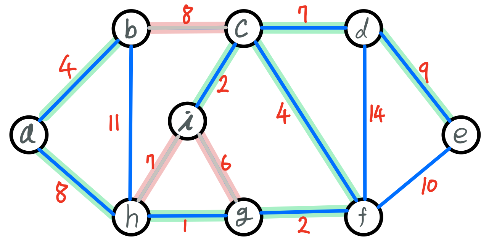

| gh  | ci  | fg  | ab  | cf  | gi  | cd  | hi  | ah  | bc  | de  | ef  | bh  | df  |
| :-: | :-: | :-: | :-: | :-: | :-: | :-: | :-: | :-: | :-: | :-: | :-: | :-: | :-: |
|  1  |  2  |  2  |  4  |  4  |  6  |  7  |  7  |  8  |  8  | `9` | 10  | 11  | 14  |

> ### **ⓜ E(e,f) → 사이클을 만드는 간선**

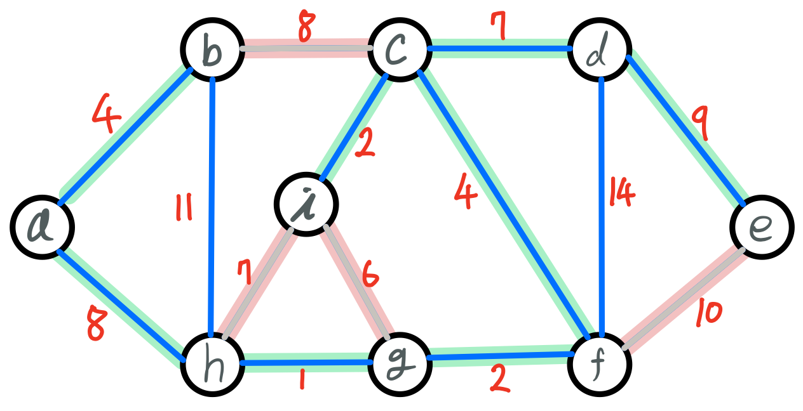

| gh  | ci  | fg  | ab  | cf  | gi  | cd  | hi  | ah  | bc  | de  |  ef  | bh  | df  |
| :-: | :-: | :-: | :-: | :-: | :-: | :-: | :-: | :-: | :-: | :-: | :--: | :-: | :-: |
|  1  |  2  |  2  |  4  |  4  |  6  |  7  |  7  |  8  |  8  |  9  | `10` | 11  | 14  |

> ### **ⓝ E(b,h) → 사이클을 만드는 간선**

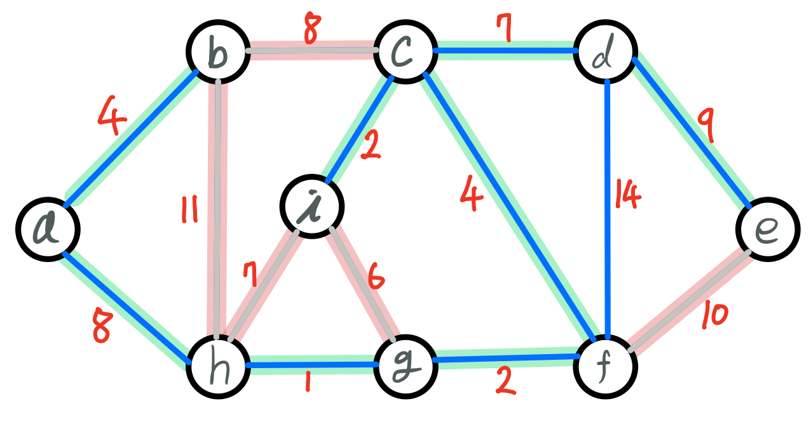

| gh  | ci  | fg  | ab  | cf  | gi  | cd  | hi  | ah  | bc  | de  | ef  |  bh  | df  |
| :-: | :-: | :-: | :-: | :-: | :-: | :-: | :-: | :-: | :-: | :-: | :-: | :--: | :-: |
|  1  |  2  |  2  |  4  |  4  |  6  |  7  |  7  |  8  |  8  |  9  | 10  | `11` | 14  |

> ### **ⓞ E(d,f) → 사이클을 만드는 간선**


| gh  | ci  | fg  | ab  | cf  | gi  | cd  | hi  | ah  | bc  | de  | ef  | bh  |  df  |
| :-: | :-: | :-: | :-: | :-: | :-: | :-: | :-: | :-: | :-: | :-: | :-: | :-: | :--: |
|  1  |  2  |  2  |  4  |  4  |  6  |  7  |  7  |  8  |  8  |  9  | 10  | 11  | `14` |

> ### **Ⓟ 완성된 MST**

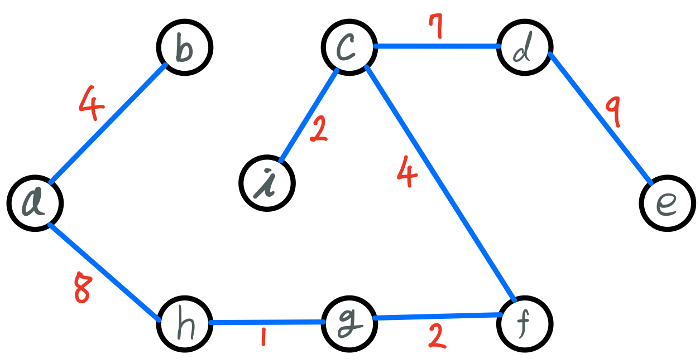

| gh  | ci  | fg  | ab  | cf  | cd  | ah  | de  |
| :-: | :-: | :-: | :-: | :-: | :-: | :-: | :-: |
|  1  |  2  |  2  |  4  |  4  |  7  |  8  |  9  |

</br>

## **구현**

```java
import java.io.BufferedReader;
import java.io.IOException;
import java.io.InputStreamReader;
import java.util.Arrays;
import java.util.Comparator;

public class KruskalTest {
	public static void main(String[] args) throws IOException{
		BufferedReader br = new BufferedReader(new InputStreamReader(System.in));
		int[] VE = Arrays.stream(br.readLine().split(" ")).mapToInt(Integer::parseInt).toArray();

		int V = VE[0];
		int E = VE[1];
		int[][] edges = new int[E][3];
		int[]parents = new int[V+1];

		for(int i=0 ; i<E ; i++) {
			int[] input = Arrays.stream(br.readLine().split(" ")).mapToInt(Integer::parseInt).toArray();
			edges[i][0] = input[0];
			edges[i][1] = input[1];
			edges[i][2] = input[2];
		}

		for(int i=0 ; i<V ; i++) {
			parents[i] = i;
		}

		int total = kruskal(edges, parents);

		System.out.println(total);
	}

	// 크루스칼 알고리즘
	public static int kruskal(int[][] edges, int[] parents) {
		int total = 0;

        // 간선들을 가중치의 오름차순으로 정렬
		Arrays.sort(edges, new Comparator<int[]>() {
			@Override
			public int compare(int[] e1, int[] e2) {
				return e1[2] - e2[2];

			}
		});

		for (int i = 0; i < edges.length; i++) {
            // 부모가 같지 않을 때 (사이클이 만들어지지 않을 때)
            if (find(parents, edges[i][0]) != find(parents, edges[i][1])) {
                total += edges[i][2];
                union(parents, edges[i][0], edges[i][1]);
            }
        }

		return total;
	}

	// 부모 정점을 체크하는 메서드
    public static int find(int[] parent, int i) {
        if (parent[i] == i)
            return i;
        return find(parent, parent[i]);
    }

    // MST를 구성하는 간선들의 집합에 추가하는 메서드
    public static void union(int[] parent, int a, int b) {
        int a_parent = find(parent, a);
        int b_parent = find(parent, b);

        if (a_parent < b_parent)
            parent[b_parent] = a_parent;
        else
            parent[a_parent] = b_parent;
    }
}

```

</br>

---

### **참고자료**

- Web
  - [@sskl660](https://sskl660.tistory.com/72)
  - [@gmlwjd9405](https://gmlwjd9405.github.io/2018/08/29/algorithm-kruskal-mst.html)
