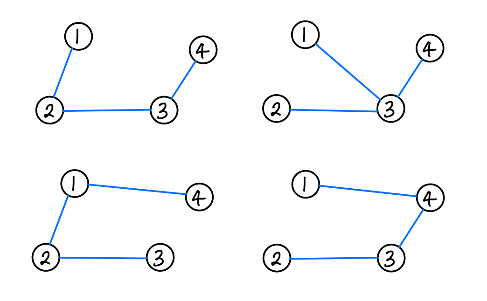
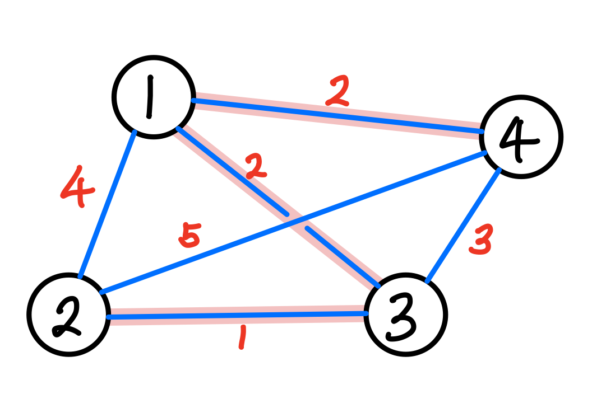

## **Spanning Tree란?**

- 그래프 내의 모든 정점을 포함하는 트리
- 그래프의 최소 연결 부분 그래프
  - 최소 연결은 간선의 수가 가장 적다는 것을 의미
  - n개의 정점을 가지는 그래프의 최소 간선의 수 = (n-1)개
- 그래프에서 일부 간선을 선택해 만든 트리

### **특징**

- DFS, BFS 등을 이용해 신장 트리를 찾을 수 있음
- 하나의 그래프는 많은 신장 트리를 포함할 수 있음
- 모든 정점들이 연결돼 있지만, 사이클이 있으면 안됨
- 따라서 그래프 내 n개의 정점을 정확히 (n-1)개의 간선으로 연결해야 함

 

## **최소 신장 트리 (MST; Minimum Spanning Tree)**

: Spanning Tree 중 사용된 간선들의 가중치 합이 최소인 트리

- 간선의 가중치 합이 최소여야 함
- n개의 정점을 갖는 그래프에 대해 반드시 (n-1)개의 간선만을 사용해야 함
- 사이클이 없어야 함

### MST 구현 방법

- [Kruskal MST 알고리즘](https://github.com/lcomment/development-recipes/blob/main/Computer%20Science/Algorithm/kruskal.md)
- [Prim MST 알고리즘]()

 

---

### **참고자료**

- Web
  - [@gmlwjd9405](https://gmlwjd9405.github.io/2018/08/28/algorithm-mst.html)
