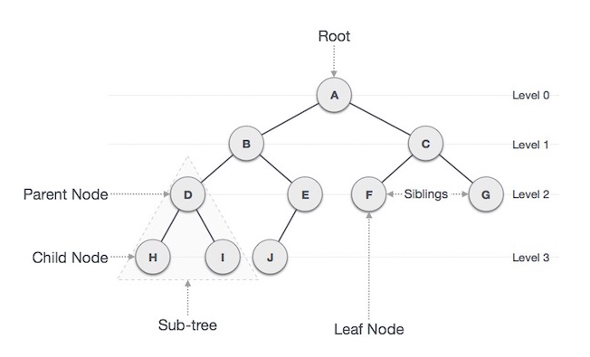

## 트리 (Tree)

: 노드(Node)들이 나뭇가지처럼 연결된 `비선형 계층적 자료구조`

- 트리 내에 하위 트리 있는 `재귀적` 자료구조
- 임의의 노드에서 다른 노드로 가는 경로는 유일함
- 순환구조(cycle)이 존재하지 않음
- 모든 노드는 서로 `연결`돼 있음
- 간선(edge)를 하나 자르면 트리가 2개로 분리됨

 

> ### 트리의 구성

    

- 노드 (Node)
  - 트리를 구성하는 기본 요소
  - Key 또는 값과 하위 노드에 대한 포인터(Pointer)를 가지고 있음
  - `루트 노드` (Root Node) : 트리 구조에서 부모가 없는 최상위 노드
  - `부모 노드` (Parent Node) : 자식 노드를 가진 노드
  - `자식 노드` (Child Node) : 부모 노드의 하위 노드
  - `형제 노드` (Sibiling Node) : 같은 부모를 가진 노드

 

- 외부 노드 (External Node, Outer Node)
  - 단말 노드(Terminal Node) 또는 리프 노드(Leaf Node)라고도 불림
  - 자식 노드가 없는 노드
  - H, I, J, F, G

 

- 내부 노드 (Internal Node, Inner Node)
  - 비 단말 노드(Non-Terminal Node) 또는 가지 노드(Branch Node)
  - 자식 노드를 하나 이상 가진 노드
  - A, B, C, D, E

 

- 간선 (Edge)
  - 노드와 노드 간의 연결선
  - 노드의 개수가 `n`개라면 간선의 개수는 `n-1`개

 

- `깊이` (Depth)
  - 루트에서 어떤 노드까지의 간선 수
  - Root Node의 깊이 == 0
- `높이` (Height)
  - 어떤 노드에서 리프 노드까지 가장 긴 경로의 간선 수
  - Leaf Node의 높이 == 0

 

---

### Reference

- [@yoongrammer](https://yoongrammer.tistory.com/68)
- [@ratsgo](https://ratsgo.github.io/data%20structure&algorithm/2017/10/21/tree/)
