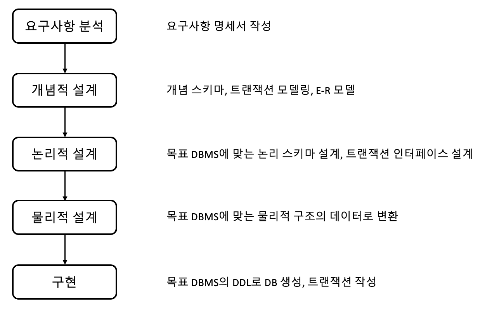

## 데이터베이스 설계

### ① 정의

: 사용자의 `요구를 분석`하여 그것들을 컴퓨터에 저장할 수 있는 DB의 구조에 맞게 `변형`한 후 특정 `DBMS로 DB를 구현`하여 일반 사용자들이 사용하게 하는 것

 

### ② 설계 시 고려사항

- `무결성`: 연산 후에도 DB에 저장된 데이터가 정해진 제약 조건을 항상 만족해야 함
- `일관성`: DB에 저장된 데이터들 사이나 특정 질의에 대한 응답이 처음부터 끝까지 변함없이 일정해야 함
- `회복`: 시스템에 장애가 생겼을 때 장애 발생 직전의 상태로 복구할 수 있어야 함
- `보안`: 불법적인 데이터의 노출 또는 변경이나 손실로부터 보호할 수 있어야 함
- `효율성`: 응답시간의 단축, 시스템의 생산성, 저장 공간의 최적화 등이 가능해야 함
- `DB 확장`: DB 운영에 영향을 주지 않으면서 지속적으로 데이터를 추가할 수 있어야 함

 

### ③ 데이터베이스 설계 순서

