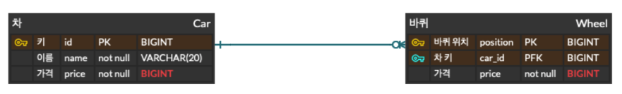
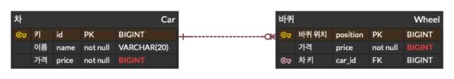

## 서론

&nbsp; RDB의 테이블을 생성하고, 테이블끼리 관계를 설정할 때 일반적으로 `외래키`(Foreign Key)를 사용한다. 외래키를 사용하여 테이블 간 `관계를 설정할 때 사용하는 전략`은 크게 두 가지가 있다. 이번 글에서는 그 두 가지에 대해 알아볼 것이다.

 

## 식별 관계 (Identifying Relationship)

    

: 부모 테이블의 기본 키 또는 유니크 키를 자식 테이블이 자신의 기본 키로 사용하는 관계

- 자식 테이블에 데이터가 존재한다면 부모 데이터가 반드시 존재
- 부모 테이블에 자식 테이블이 `종속`
- ERD 상에서 `실선 표시`

 

## 비식별 관계 (Non-Identifying Relationship)

    

: 부모 테이블의 기본 키 또는 유니크 키를 자신의 기본 키로 사용하지 않고, 외래 키로 사용하는 관계

- 자식 데이터는 부모 데이터가 없어도 독립적으로 생성 가능
- 부모 테이블과의 `의존성`을 줄일 수 있음
- 보다 `자유`로운 데이터 생성 및 수정 가능

 

---

### Reference

- [@deveric](https://deveric.tistory.com/108)
- [@developer-hm](https://developer-hm.tistory.com/217?category=910205)
