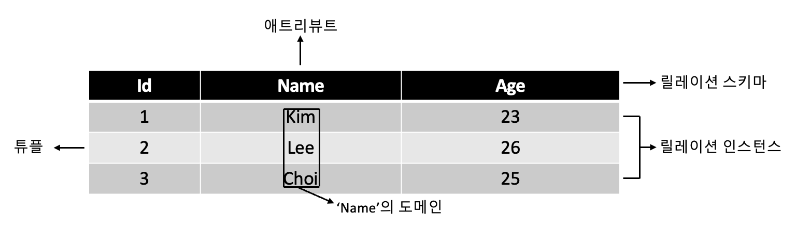

## RDB(Relational Database)

: 관계형 데이터 모델에 기초를 둔 데이터베이스다.

- 데이터 모델 → 행(Row)와 열(Column)으로 이루어졌을 때 테이블(Table)이라 할 수 있음
- 개체(Entity)나 관계(Relationship)를 모두 릴레이션(Relation)에 표현
- 장점
  - 간결하고 보기 편리함
  - 다른 RDB로의 변환이 용이
- 단점
  - 성능이 다소 떨어짐

 

## RDB의 구조

> ### ✓ Tuple

- 릴레이션을 구성하는 행
- 애트리뷰트의 모임
- 파일 구조상의 레코드
- 카다널리티(Cardinality): 튜플의 수, 기수

> ### Attribute

- DB를 구성하는 가장 작은 논리적 단위
- 파일 구조상의 데이터 항목 또는 데이터 필드
- 개체의 특성을 기술
- Degree: 속성의 수, 차수

> ### Domain

- 하나의 애트리뷰트가 취할 수 있는 같은 타입의 원자값들의 집합
- 실제 애트리뷰트 값이 나타날 때 그 값의 합법 여부를 시스템이 검사하는 데에도 이용됨

 

## RDBMS(Relational Database Management System)

: RDB를 관리하는 소프트웨어
