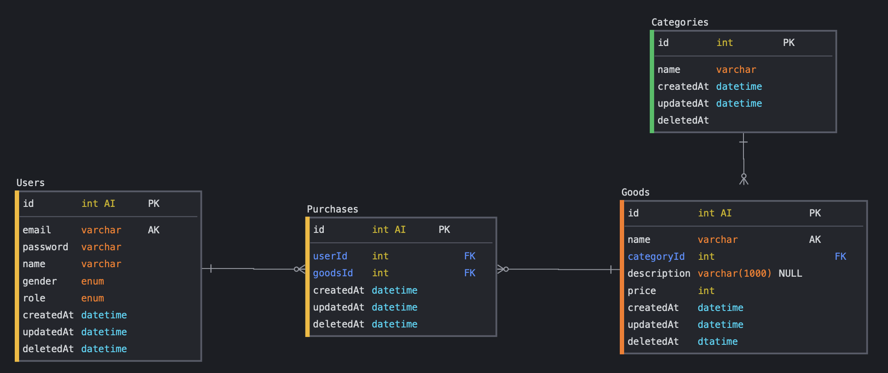

## **📌 SQL이란?**

: RDBMS의 데이터를 관리하기 위해 설계된 특수 목적의 프로그래밍 언어

- 자료 검색 및 관리
- 데이터베이스 스키마 생성과 수정
- 데이터베이스 객체 접근 조정 관리

&nbsp; RDBMS는 사용자와 데이터베이스 사이에서 사용자의 요구에 따라 정보를 생성해주고 데이터베이스를 관리해주는 소프트웨어다. 데이터를 `테이블(table)`에 `레코드(record)`로 저장하는데, 이때 필드의 이름과 데이터 유형이라는 정의된 구조에 맞게 저장해야 한다.

&nbsp; RDBMS의 R은 relaional을 의미한다. RDB는 테이블이 다른 테이블과 `관계(relation)`를 맺을 수 있다. 이러한 관계를 나타내기 위해 외래키(foreign key)를 사용한다. 관계 덕분에 데이터의 중복을 피할 수 있다.

### **💡SQL의 장점**

- 명확한 데이터 구조(스키마) 보장 → `데이터 무결성`
- 관계는 데이터 `중복 없이` 한번만 저장

### **💡SQL의 단점**

- 스키마로 인해 데이터가 유연하지 못함
- 시스템의 규모가 커질 경우 `Join문이 많은 복잡한 쿼리`가 만들어질 수 있음
- 수직적 확장(Scale-Up)만 지원 → `비용 문제` 발생

 

## **📌 NoSQL이란?**

: RDB가 아닌 다른 형태의 데이터 저장 기술

- 관계를 정의하지 않음
- 데이터베이스 구조
  - `Database`
  - `Collection`: RDB에서는 Table
  - `Field`: RDB에서는 Column
  - `Document`: RDB에서는 Row
- 다른 구조의 데이터를 같은 컬렉션(collection)에 추가 가능
- 문서(document)는 json과 비슷한 형태로 가지고 있음
- `Scale-Out`을 목표로 등장

### **💡NoSQL의 장점**

- `유연`하고 `자유`로운 데이터 구조
- `데이터 분산` 용이
- 수직적 확장(Scale-Up)뿐만 아니라 `수평적 확장(Scale-Out)`도 지원

### **💡NoSQL의 단점**

- 데이터 중복이 발생할 수 있음
  - 중복된 데이터 변경 시 `모든 컬렉션에서 수행`해야 함
- 스키마가 존재하지 않아 명확한 데이터 구조를 보장하지 않음
  - 데이터 구조 결정이 어려울 수 있음

 

## **📌 언제 무엇을 사용해야 할까?**

### **이럴 땐 SQL을 사용하세요❗️**

- 데이터 구조가 명확하여 변경될 여지가 없는 경우
- 관계를 맺고 있는 `데이터가 자주 변경`이 이루어지는 시스템인 경우

### **이럴 땐 NoSQL을 사용하세요❗️**

- 정확한 데이터 구조를 알 수 없고, 데이터가 `변경`•`확장`될 수 있는 경우
- 중복 데이터 등의 특징을 기반으로 업데이트가 많이 이루어지지 않는 시스템인 경우
- `막대한 데이터`를 저장해야 해서 DB를 Scale-Out해야 되는 시스템인 경우

---

### **참고자료**

- 웹 사이트
  - [khj93 tistory](https://khj93.tistory.com/entry/Database-RDBMS와-NOSQL-차이점)
  - [gyoogle.dev](https://gyoogle.dev/blog/computer-science/data-base/SQL%20&%20NOSQL.html)
