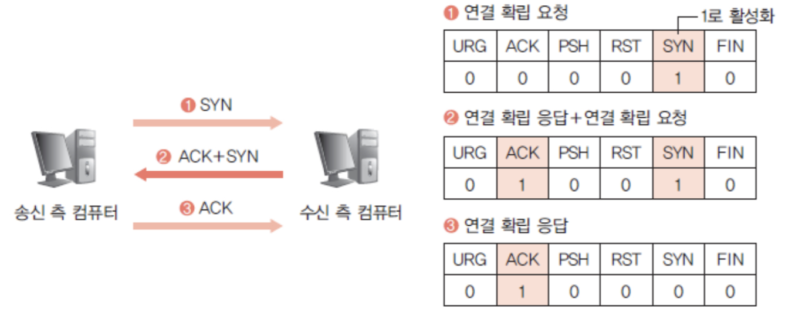
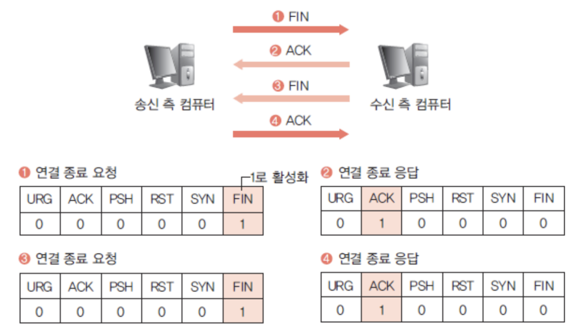

 

&nbsp; TCP 프로토콜은 대표적인 연결 지향형 프로토콜으로, 데이터를 전송하기 전에 `Connection`을 먼저 확립하고, 작업이 끝나면 종료한다. 확립할 때 사용하는 방식이 `3-way Handshaking`이고, 종료할 때 사용하는 방식이 `4-way Handshaking`이다. 다음 표를 통해 코드 비트에 대해 알아본 후 각 방식에 대해 살펴보자.

| 코드 비트 |                 설명                 |
| :-------: | :----------------------------------: |
|    URG    |  긴급하게 처리할 데이터가 들어있음   |
|    ACK    |         응답 확인 번호 사용          |
|    PSH    | TCP가 받은 데이터를 상위 계층에 전달 |
|    RST    |             연결 재설정              |
|    SYN    | 연결을 초기화하려고 순서 번호 동기화 |
|    FIN    |           데이터 송신 종료           |

 

## 3-way Handshaking

- ① 송신 측에서 `연결 확립 허가`를 위해 수신 측에 `SYN` 요청
- ② 수신 측에서 요청을 받고 허가한다는 응답을 위해 `ACK`와 함께 `연결 확립 허가`를 위해 `SYN` 전송
- ③ 수신 측 요청을 받은 송신 측에서 허가한다는 응답을 위해 `ACK` 전송

 

## 4-way Handshaking

- ① 송신 측에서 `연결 종료 요청`을 위해 수신 측에 `FIN` 요청
- ② 수신 측에서 요청을 받고 허가한다는 응답을 위해 `ACK` 전송
- ③ 수신 측에서도 `연결 종료 요청`을 위해 `FIN` 전송
- ③ 수신 측 요청을 받은 송신 측에서 허가한다는 응답을 위해 `ACK` 전송
