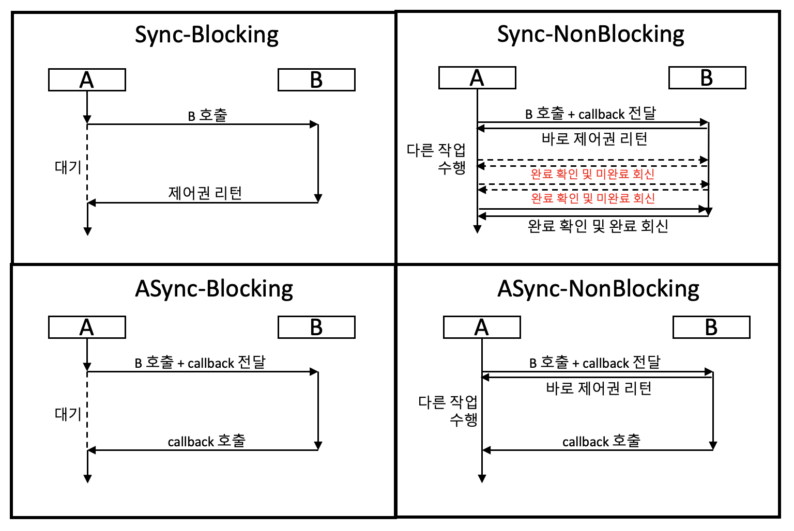

## Blocking과 Non-Blocking

> ### 호출된 함수가 바로 리턴하느냐 마느냐

&nbsp; Blocking과 Non-Blocking은 호출된 함수가 바로 리턴해서 호출한 함수에게 제어권을 넘겨주느냐, 안 넘겨주느냐의 차이다.

- Blocking
  - `호출된 함수`가 자신의 작업을 마칠 때까지 제어권을 `가지고 있음`
  - `호출한 함수`는 호출된 함수가 작업을 마칠 때까지 `기다림`
- Non-Blocking
  - `호출된 함수`가 바로 리턴해서 호출한 함수에게 제어권을 `넘겨줌`
  - `호출한 함수`는 호출된 함수를 기다리면서도 `다른 일을 진행`할 수 있음

 

## Synchronous와 Asynchronous

> ### 호출된 함수의 작업 완료 여부를 누가 신경쓰느냐

- Synchronous
  - `호출한 함수`는 `호출된 함수`가 작업을 하는 중에, 기다리면서 현재 상태를 `계속 체크`
- Asynchronous
  - `호출된 함수`의 수행 상태를 `호출된 함수` 혼자 직접 신경쓰면서 처리
  - `호출된 함수`가 작업이 끝나면 `callback` 전달

## 4가지 경우

→ 함수 `A`, `B`가 있다고 가정

    

> ### 1) Blocking & Synchronous

- ① A가 B 호출
- ② B가 제어권 받음
- ③ A는 B의 작업 완료 여부를 체크하면서 기다림

> ### 2) Blocking & Asynchronous

- ① A가 B 호출
- ② B가 제어권 받음
- ③ A는 B가 작업을 마칠 때까지 기다리지만, 완료 여부를 신경쓰지 않음

> ### 3) Non-Blocking & Synchronous

- ① A가 B 호출
- ② B가 바로 리턴해서 A에게 제어권 넘겨줌
- ③ A는 다른 작업을 하면서 B의 작업 완료 여부를 체크함

> ### 4) Non-Blocking & Asynchronous

- ① A가 B 호출
- ② B가 바로 리턴해서 A에게 제어권 넘겨줌
- ③ A는 B를 신경쓰지 않고 다른 작업을 함
- ④ 작업이 끝난 B가 A에게 callback 전달

 

---

### **참고자료**

- [@homoefficio](https://homoefficio.github.io/2017/02/19/Blocking-NonBlocking-Synchronous-Asynchronous/)
- [@gyoogle](https://github.com/gyoogle/tech-interview-for-developer/blob/master/Computer%20Science/Network/OSI%207%20계층.md)
