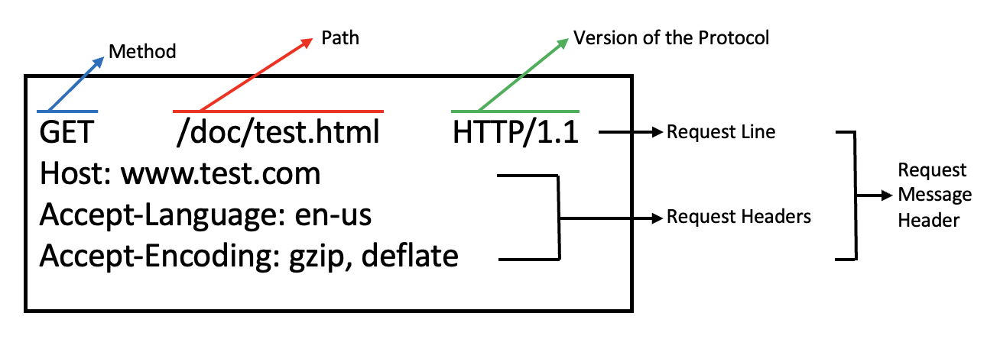

## HTTP (Hyper Text Transfer Protocol)

: Server/Client 모델을 따라 데이터를 주고 받기 위한 프로토콜

- 인터넷에서 `하이퍼 텍스트`를 교환하기 위한 통신 규약
- `80`번 포트 사용
  - HTTP Server가 80번 포트에서 요청을 기다림
  - Client는 80번 포트로 요청을 보내게 됨
- 1989년, Tim Berners Lee에 의해 처음 설계
- `WWW`(World Wide Web) 기반에서 세계적인 정보를 공유하는 데 큰 역할을 함

### HTTP의 구조

- Application 레벨의 프로토콜로, TCP/IP 위에서 작동
- 상태를 갖지 않는 `Stateless` 프로토콜
- Method, Path, Version, Headers, Body 등으로 구성
- 암호화가 되지 않은 평문 데이터를 전송하는 프로토콜 → `보안상의 문제`

 

## HTTPS (Hyper Text Transfer Protocol Secure)

: 인터넷 상에서 정보를 암호화하는 `SSL` 프로토콜을 사용해 클라이언트와 서버가 자원을 주고 받을 때 쓰는 통신 규약

- HTTP에 `데이터 암호화`가 추가된 프로토콜
- `443`번 포트 사용
- 네트워크 상에서 제3자가 정보를 볼 수 없도록 `암호화 지원`

---

### 참고자료

- [@hazel-developer](https://hazel-developer.tistory.com/145)
- [@mangkyu](https://mangkyu.tistory.com/98)
