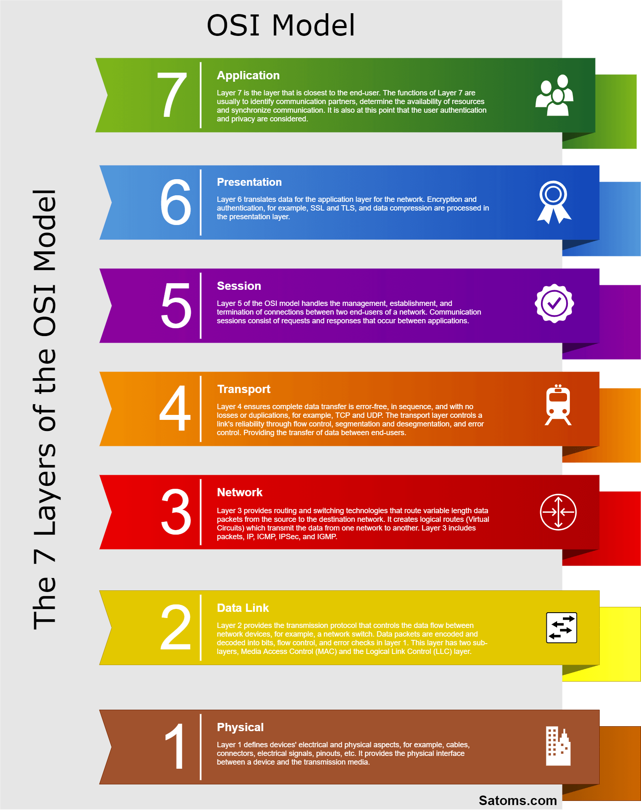

## OSI 7-Layer

### ① 정의

: 네트워크에서 통신이 일어나는 과정을 7단계로 나눈 것

### ② OSI 7계층으로 나눈 이유

> #### It is because of the fact that it will be `easy for troubleshooting the network problems`. Only the layer in which the problem exist will `be modified`. Other layers are left `untouched`.

- 통신이 일어나는 과정을 단계별로 파악할 수 있음
- 흐름을 한눈에 알아보기 쉽고, 사람들이 이해하기 쉬움
- 하나의 계층에 이상이 생겼을 때 다른 계층의 장비 및 SW를 건들지 않고, 이상 있는 계층만 고치면 됨

 

## 계층별 설명

    
    <h5>출처: https://satoms.com/7-layers-of-the-osi-model-explained/</h5>

> ### 1) 물리 계층 (Pysical Layer)

: 데이터를 전기 신호로 바꾸어주는 계층

- 데이터를 전송하는 역할
- 데이터가 무엇인지, 에러가 있는지 등은 신경쓰지 않음
- 통신 단위는 `bit`이고, `1`과 `0`으로 나타내짐
- 리피터, 케이블, 허브 등

 

> ### 2) 데이터 링크 계층 (Data Link Layer)

: `Point to Point` 간 신뢰성 있는 전송을 보장하기 위한 계층

- 물리 계층으로 송수신되는 데이터를 관리하여 안전하게 전달되도록 도와주는 역할
- 전송 단위는 `프레임`
- 프레임에 `MAC Addres`s`를 부여하고, `에러 검출`, `재전송`, `흐름제어` 진행
- 브릿지, 스위치 등

 

> ### 3) 네트워크 계층 (Network Layer)

: 여러 개의 노드를 거칠 때마다 경로를 찾아주는 역할을 하는 게층

- 논리적인 주소 구조인 `IP`를 가짐 → `계층적`
- 데이터를 목적지까지 가장 안전하고 빠르게 전달하는 기능 → 라우팅
- 이동할 경로를 선택(`라우팅`)하여 `IP 주소를 부여`하고, 해당 경로를 따라 `패킷 전달`
- 라우터, 특정 스위치 등

 

> ### 4) 전송 계층 (Transport Layer)

: 통신을 환성화하기 위한 계층

- `End to End` 통신을 다루는 최하위 계층
- 종단 간 신뢰성 있고 효율적인 데이터 전송
- 오류 검출 및 복구와 흐름제어, 중복 검사 등을 수행
- `TCP`와 `UDP`

 

> ### 5) 세션 계층 (Session Layer)

: 데이터가 통신하기 위한 논리적인 연결을 담당하는 계층

- TCP/IP 세션을 만들고 없애는 책임을 가짐
- 동시 송수신 방식, 반이중 방식, 전이중 방식의 통신과 함께 체크 포인팅과 유휴, 종료, 다시 시작 과정 등을 수행

 

> ### 6) 표현 계층 (Presentation Layer)

: 데이터 표현이 상이한 응용 프로세스의 독립성을 제공하고, 암호화하는 역할을 담당하는 계층

- 파일 인코딩, 암호화 등의 동작을 함
- 해당 데이터가 text인지, gif인지, jpg인지 등의 구분하는 역할

 

> ### 7) 응용 계층 (Application Layer)

: 최종 목적지

- 응용 프로세스와 직접 관계하여 일반적인 응용 서비스 수행
- HTTP, FTP, Telnet 등의 `프로토콜`이 있음

 

---

### **참고자료**

- [@shlee0882](https://shlee0882.tistory.com/110)
- [@gyoogle](https://github.com/gyoogle/tech-interview-for-developer/blob/master/Computer%20Science/Network/OSI%207%20계층.md)
