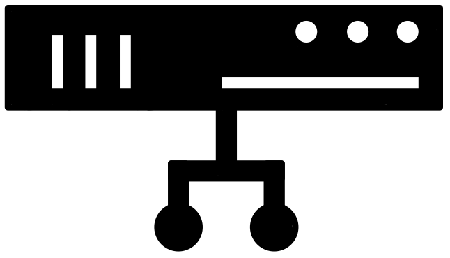
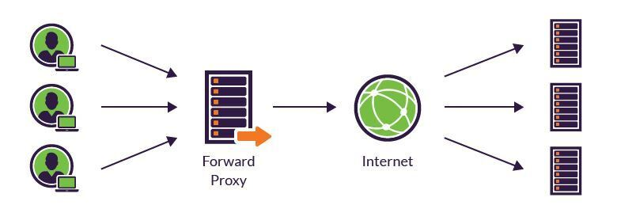
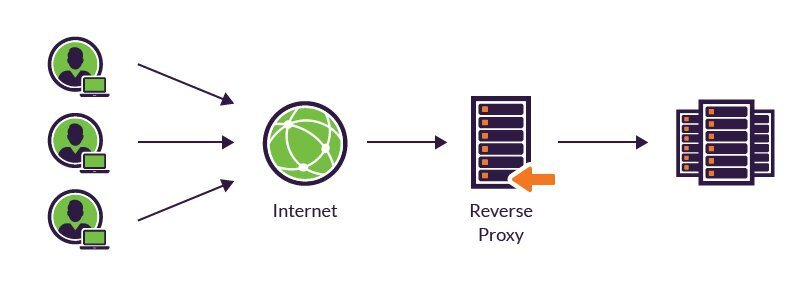

## **프록시 서버란?**

: 서버를 통해 다른 네트워크 서비스에 간접적으로 접속할 수 있게 해주는 컴퓨터 시스템이나 응용프로그램

**🧷 Client 입장에서는 원격 서버❗️, 원격 서버 입장에서는 Client❕**

 

## **프록시 서버의 목적**

- 프록시 서버에 요청된 내용들을 캐시를 이용하여 저장

 

## **프록시 서버의 특징**

- client와 외부 인터넷 사이의 링크 역할
- 보안 및 우회 기능
  - 보안상의 이유 등으로 직접 통신이 불가능할 떄 대리로 통신을 수행
  - ACL(; access control list) 정의 가능
  - 외부 인터넷에서는 client 정보를 알 수 없음
  - ip를 바꾸기 위한 용도로 많이 사용
- 캐시 기능
  - 프록시 서버에 요청된 데이터를 캐시를 이용해 저장
  - 전송시간 절약
  - 외부와 연결을 하지 않아도 됨
  - 외부와의 트래픽을 줄이게 됨
  - 네트워크 병목 현상 방지

 

## **프록시 서버의 종류**

### **① Foward Proxy**

: 프록시 서버를 Client Host들과 원격 서버의 사이에 위치시키는 방식

- Client는 요청을 보낼 때 직접이 아닌 프록시 서버를 거치게 됨
- 로컬 디스크에 데이터를 저장
- 사용 중인 웹 브라우저를 이용하여 프록시 서버 사용 설정을 해야 함
  - client가 프록시 서버를 사용하고 있다는 것을 인식할 수 있음
- 보안을 위해 기업 환경 등에서 많이 사용
- 대역복 사용을 감소시킬 수 있음
- 접근 정책 구현에 있어서 다루기 쉬우면서 비용 저렴

### **② Reverse Proxy**

: 프록시 서버를 인터넷 리소스 앞에 위치시키는 방식

- reverse proxy가 client의 요청을 받아 내부 서버에서 데이터를 받은 후 사용자에게 전달
  - client가 프록시 서버에 연결되었다는 것을 인식하지 못함

 

---

### **참고자료**

- 블로그: [yunyoung1819님](https://yunyoung1819.tistory.com/9)
- 웹사이트: https://www.imperva.com
