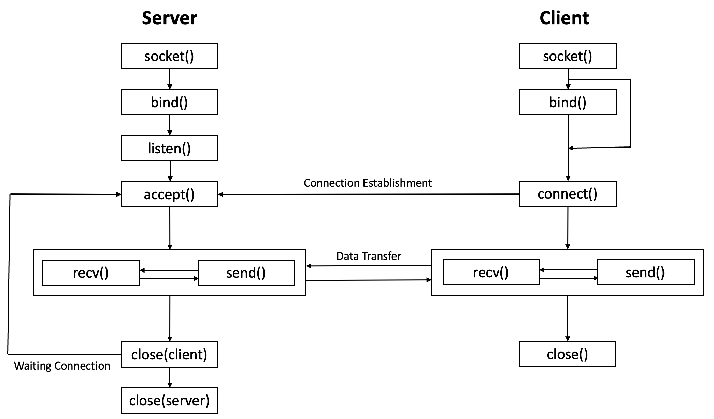
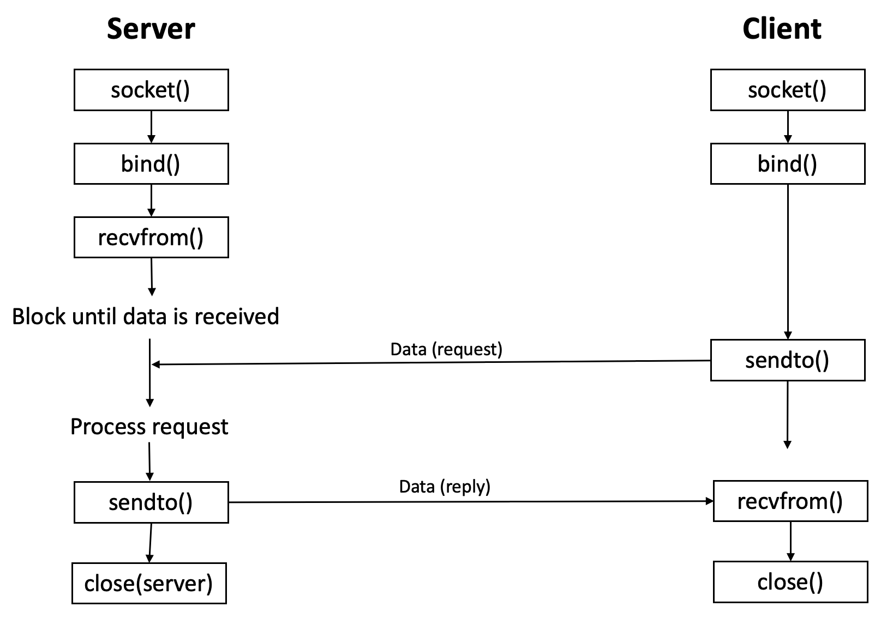

## TCP (Transmission Control Protocol)

: 인터넷 상에서 데이터를 `메세지`의 형태로 보내기 위해 `IP`와 함께 사용하는 프로토콜

> ### TCP 특징

- `연결형 서비스`, `가상 회선 방식` 제공
- `3-way Handshaking`을 통해 연결 설정
- `4-way Handshaking`을 통해 연결 해제
- `흐름제어` 및 `혼잡제어`
- 높은 `신뢰성` 보장
- UDP보다 `속도가 느림`
- 전이중(Full-Duplex), 점대점(Point to Point) 방식

> ### TCP 서버 특징

- Server Socket은 연결만 담당
- 연결 과정에서 반환된 Client Socket은 데이터 송수신에 사용 → `가상 회선 방식`
- Server와 Client는 `1:1 연결`
- Stream 전송 → 전송 데이터 크기 `무제한`
- 성능이 낮음

 

## UDP (User Datagram Protocol)

: 데이터를 `데이터그램` 단위로 처리하는 프로토콜

> ### UDP 특징

- `비연결형 서비스`, `데이터그램 방식` 제공
- 정보를 주고 받을 때 신호절차를 거치지 않음
- UDP 헤더의 `checksum` 필드를 통해 최소한의 오류만 검출
- 신뢰성이 낮음
- TCP보다 `속도가 빠름`

> ### UDP 서버 특징

- Connection이 없음 → Server Socket과 Client Socket의 구분이 없음
- Socket 대신 `IP` 기반으로 데이터 전송
- `데이터그램` 단위로 데이터 전송 → `65535byte`를 초과하면 잘라서 보냄
- 흐름제어 없음 → 재전송 X
- 신뢰성보단 성능이 중요시 되는 경우 사용

 

---

### **참고자료**

- [#wikipedia](https://ko.wikipedia.org/wiki/전송_제어_프로토콜)
- [@mangkyu](https://mangkyu.tistory.com/15)
