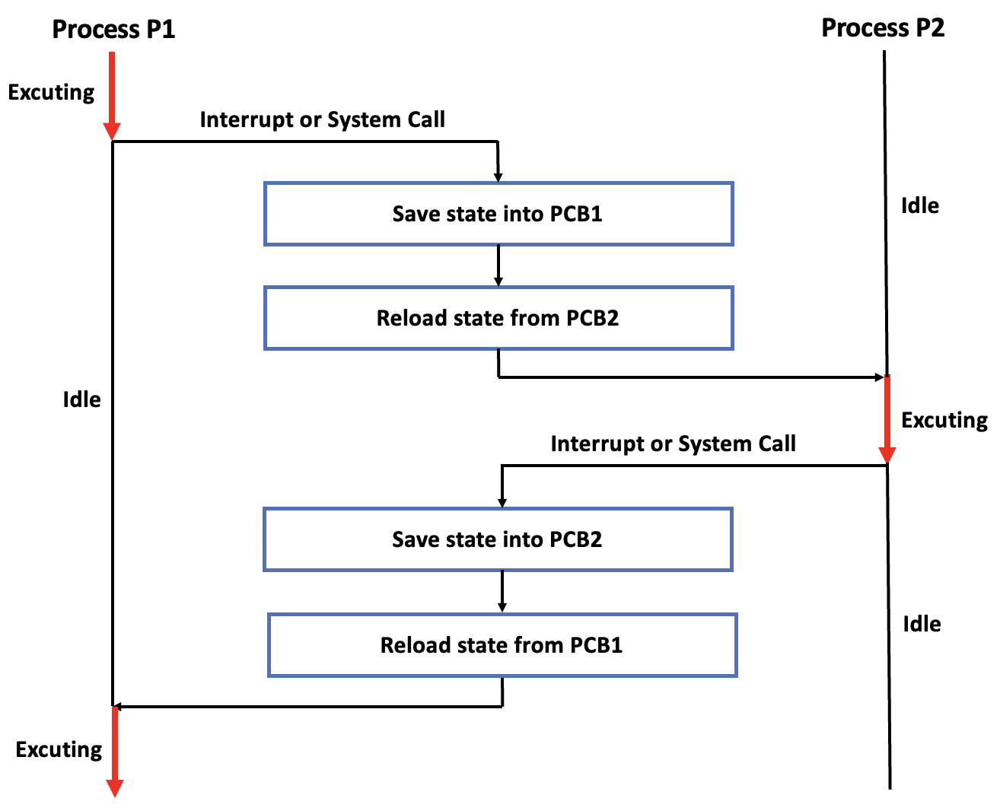

## 문맥교환 (Context Switching)

: 동작 중인 프로세스의 상태를 PCB에 보관하고, Context를 바꿀 프로세스의 상태를 불러와 복구하는 과정

    

> `Context`: PC, CPU 레지스터들의 값 등을 포함한 프로세스의 상태 정보
> `Idle` : 유휴 상태

- P1 실행 중
- Interrupt나 System Call 발생
- `P1의 상태 정보`를 PCB1에 저장
- PCB2에 저장된 `P2의 상태 정보`를 불러와 복구
- P2 실행
- Interrupt나 System Call 발생
- `P2의 상태 정보`를 PCB2에 저장
- PCB1에 저장된 `P1의 상태 정보`를 불러와 복구
- 다시 P1 실행

 

### 오버헤드 (OverHead)

- Context Switching 과정에서 시간과 메모리가 소비돼 성능 저하
- 하지만 CPU를 놀게 두지 않기 위해 오버헤드를 감수하더라도 Context Switching 해야 함

---

### 참고자료

- [@gyoogle](https://github.com/gyoogle/tech-interview-for-developer/blob/master/Computer%20Science/Operating%20System/PCB%20%26%20Context%20Switcing.md)
- [@code-lab1](https://code-lab1.tistory.com/41)
- [@beststar](https://beststar-1.tistory.com/26)
