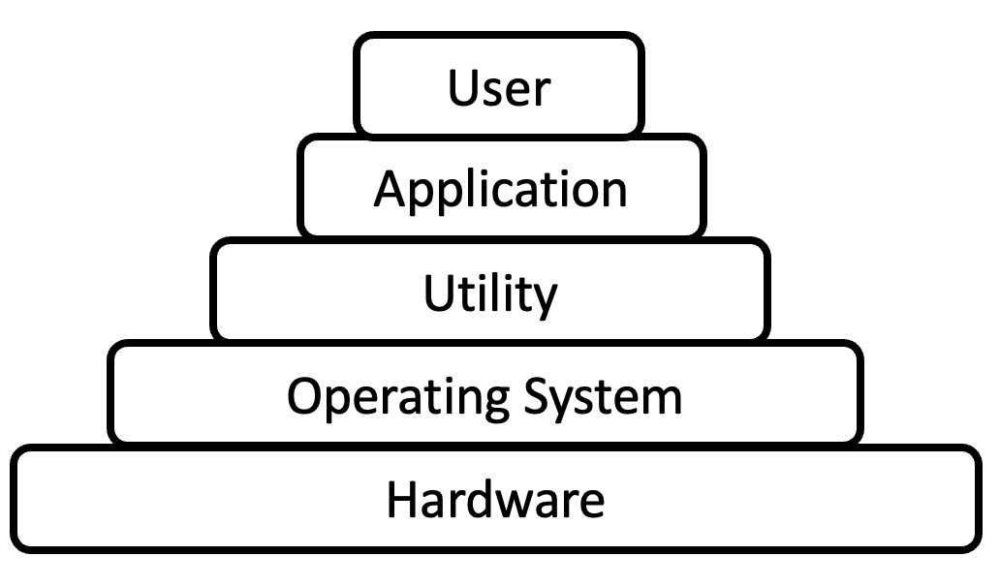

## **운영체제의 정의**

> **운영체제(OS; Operating System)**

: 컴퓨터 시스템의 `자원들을 효율적으로 관리`하며, 사용자가 컴퓨터를 편리하고 효과적으로 사용할 수 있도록 `환경을 제공`하는 여러 프로그램의 모임  
**→ 사용자와 컴퓨터 HW 간의 인터페이스로서 동작하는 시스템 SW**

<p align=center></p>

</br>

## **운영체제의 목적**

- 처리 능력(Throughput): 일정 시간 내에 시스템이 처리하는 일의 양
- 반환 시간(Turn-Around-Time): 시스템에 작업을 의뢰한 시간부터 처리가 완료될 때까지 걸린 시간
- 사용 가능도(Availability): 시스템을 사용할 필요가 있을 때 즉시 사용 가능한 정도
- 신뢰도(Reliability): 시스템이 주어진 문제를 정확하게 해결하는 정도

</br>

## **운영체제의 기능**

- 자원 관리
  - 자원의 종류: 프로세서, 기억장치, 입•출력장치, 파일 및 정보 등
- 자원의 스케줄링 기능
- 사용자와 시스템 간의 편리한 인터페이스 제공
- 시스템의 각종 HW와 네트워크를 관리 및 제어
- 데이터 관리, 데이터 및 자원의 공유 기능 제공
- 시스템의 오류 검사 및 복구
- 자원 보호 기능 제공
- 입•출력에 대한 보조 기능 제공
- 가상 계산기 기능 제공

</br>

## **운영체제의 주요 자원 관리**

- 프로세스 관리
  - 프로세스 `스케줄링` 및 `동기화` 관리 담당
  - 프로세스 생성과 제거, 시작과 정지, 메시지 전달 등의 기능 담당
- 기억장치 관리
  - 프로세스에게 메모리 `할당 및 회수` 관리 담당
- 주변장치 관리
  - 입•출력 장치 `스케줄링 및 전반적인 관리` 담당
- 파일 관리
  - 파일의 생성과 삭제, 변경, 유지 등의 `파일 관리` 담당

</br>

## **운영체제의 종류**

→ Windows, UNIX, LINUX, MacOS, MS-DOS

- 분류1
  - 단일 작업 처리 시스템: MS_DOS
  - 다중 작업 처리 시스템: Windows, UNIX, LINUX, MacOS 등
- 분류2
  - 개인용 OS: Windows, MacOS, MS-DOS
  - 서버용 OS: UNIX, LINUX

```markdown
단일 작업 처리 시스템 (Single Tasking System)
: 컴퓨터 시스템을 한 개의 작업이 독점하여 사용하는 방식

다중 작업 처리 시스템 (Multi Tasking System)
: 여러 개의 프로그램을 열어 두고 다양한 작업을 동시에 진행하는 방식
```

---

### **참고자료**

- 서적: 2022 시나공 정보처리기사 필기
- tistory: [코딩팩토리](https://coding-factory.tistory.com/300)
