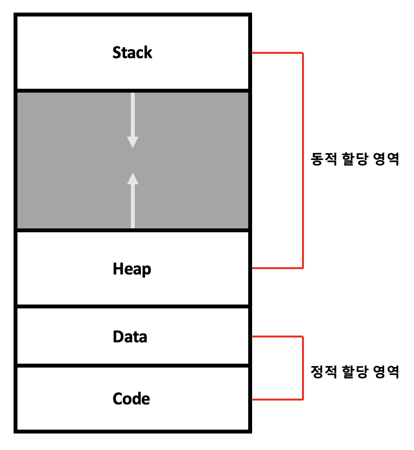
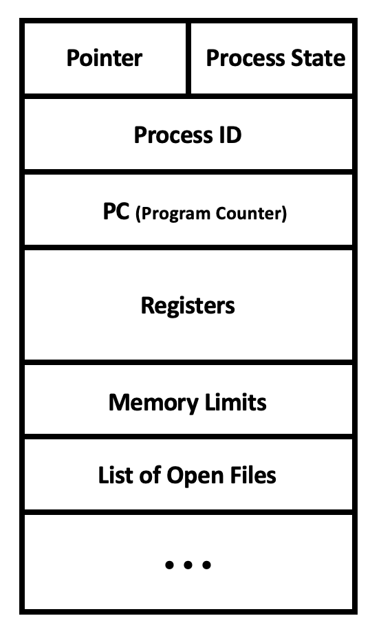

## 프로세스 주소 공간 (Process Address Place)

: 프로세스가 실행 중에 접근할 수 있도록 허용된 주소의 최대범위

> → 최대한 데이터를 공유해 메모리 사용량을 줄이기 위해 영역을 나눈다❕

    

- `Stack` 영역
  - 함수와 지역변수가 저장되는 영역
  - 함수 호출과 함께 `할당`, 함수 리턴과 함께 `소멸`
  - 재귀함수가 너무 깊거나 다량의 지역변수 존재 → Stack 영역 초과 → `Stack Overflow`
- `Heap` 영역
  - 런타임의 크기가 결정되는 영역
  - 사용자에 의해 공간이 `동적` 할당 및 해제
  - 참조형 데이터 등 할당 (`class`)
- `Data` 영역
  - 전역 변수가 저장되는 영역
  - 프로그램 시작과 함께 `할당`, 프로그램 종료와 함께 `소멸`
- `Code` 영역
  - 프로그램이 실행될 수 있도록 `기계어` 코드가 저장돼 있는 공간
  - `readonly` 상태로 저장

 

## 프로제스 제어 블록 (PCB; Process Control Block)

: 특정한 프로세스의 메타데이터(meta data)들을 저장해 놓은 OS 커널의 자료구조

    

- CPU에서 프로세스의 상태에 따라 `교체작업`을 할 때, `이전의 프로세스 상태정보`를 PCB에 저장
- `LinkedList` 방식으로 관리

 

---

### 참고자료

- [@klm03025](https://velog.io/@klm03025/운영체제-프로세스-주소-공간)
- [@zeroco](https://zeroco.tistory.com/73)
