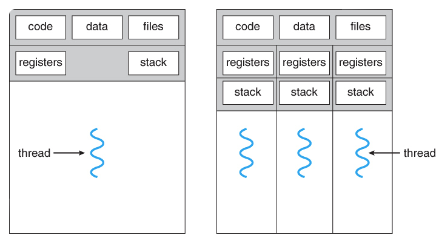

## 프로세스와 스레드 (Process And Thread)

    

> ### Process

: OS로부터 메모리 등의 `시스템 자원`을 할당받는 `작업`의 단위

- OS로부터 `독립`된 메모리 영역을 할당 받음
  - Code 영역, Data 영역, Heap 영역, Stack 영역
- 프로세스들은 독립적임 → 통신을 위해 `IPC`(; Inter-Process-Communication) 사용
- 최소 1개의 스레드(메인 스레드)를 가짐

 

> ### Thread

: 프로세스 내에서 할당 받은 자원을 이용해 동작하는 여러 흐름 단위

- 프로세스의 `Stack 영역`만 따로 할당 받음
- Code 영역, Data 영역, Heap 영역은 다른 스레드들과 `공유`
- 프로세스 자원을 공유하기 때문에 다른 스레드에 의한 결과를 바로 확인 가능

 

> ### Process와 Thread 비교

- `자원` 측면
  - 프로세스 → 자신만의 고유 자원을 할당받아 사용
  - 스레드 → 프로세스 내에서 스택 영역만 따로 할당 받고, 나머지 자원은 다른 스레드와 공유
- `효율` 측면
  - 프로세스
    - 독립된 자원을 사용하기 때문에 안전함
    - 프로세스 생성으로 인한 시스템 콜, 문맥 교환(Context Switching) 등에 의한 오버헤드
  - 스레드
    - 자원을 효율적으로 관리할 수 있고, 통신 부담이 줄어듦
    - 공유자원으로 인한 여러 문제(경쟁상태, 기아상태 등) 발생

 

## 멀티 프로세스와 멀티 스레드

> ### Multi-Process

: 하나의 프로그램을 `여러 개의 프로세스로 구성`하여 각 프로세스가 `1개의 작업`을 병렬적으로 처리하도록 하는 것

- 1개의 프로세스가 죽어도 다른 프로세스들은 계속 싫애
- Context Switching을 위한 오버헤드 발생
- 통신을 위해서 IPC가 필요

 

> ### Multi-Thread

: 하나의 프로그램을 `여러 개의 스레드로 구성`하여 각 스레드가 `1개의 작업`을 처리하도록 하는 것

- 멀티 프로세스 환경에서의 자원 할당을 위한 `시스템 콜`이나 `Context Switching`의 오버헤드를 줄일 수 있음
- `메모리 공유` → 통신이 쉽고, 효율적인 자원 사용이 가능
- 하나의 스레드에 문제가 생기면 프로세스 전체가 영향을 받음
- `공유 자원 접근`에 대한 문제가 발생할 수 있음

 

---

### 참고자료

- [@kd4](https://brunch.co.kr/@kd4/3)
- [@mangkyu](https://mangkyu.tistory.com/92)
- [@klm03025](https://velog.io/@klm03025/운영체제-프로세스와-스레드의-차이)
