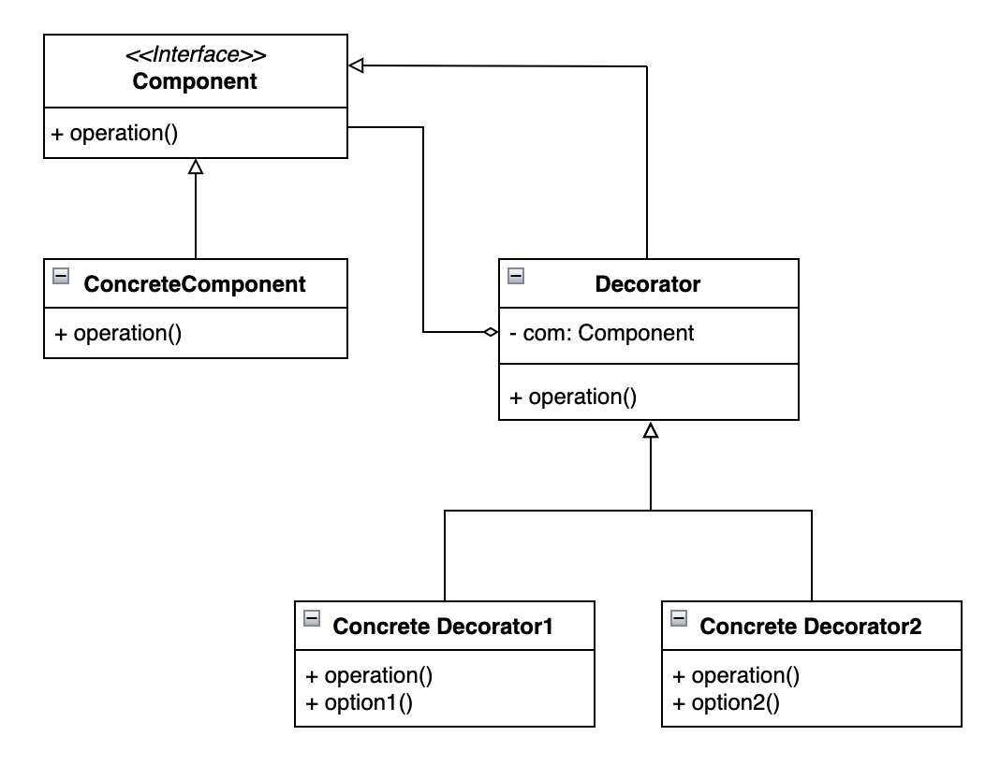

## 데코레이터 패턴 (Decorator Pattern)

&nbsp;기존 객체를 변경하지 않고 새로운 기능을 동적으로 추가할 수 있도록 하는 구조적 패턴

- 상속을 사용하는 대신 런타임에 기능을 조합(`서브클래스`)할 수 있도록 `유연성` 제공
- 다양한 기능을 독립적인 데코레이터 클래스로 구현 및 조합을 통해 `재사용성` 제공
- 여러 개의 데코레이터를 `중첩`하여 원하는 만큼 기능 추가 가능
- 각 장식자 클래스마다 고유의 책임을 가짐 (`SRP`)
- Client 수정 없이 기능 확장이 필요하면 장식자 클래스 추가 (`OCP`)

## 클래스 다이어그램

    

## 예시

- Java I/O 
- Spring HttpServletRequestWrapper/HttpServletResponseWrapper
- Resilience4j 핵심 모듈

