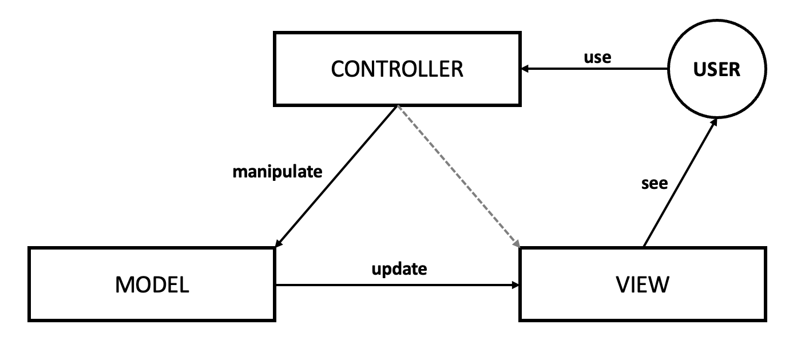

## MVC 패턴

: 하나의 애플리케이션, 프로젝트를 구성할 때 그 구성요소를 `Model`, `View`, `Controller`, 세 가지의 역할로 구분한 패턴

&nbsp; 위의 그림과 같이 `User`가 `Controller`를 조작하면 `Controller`는 `Model`을 통해서 데이터를 가져오고 그 정보를 바탕으로 시각적인 표현을 담당하는 `View`를 제어해서 사용자에게 전달한다. MVC 패턴을 사용하면 UI(; User Interface)로부터 비즈니스 로직을 분리하여 애플리케이션의 `시각적 요소`나 그 이면에서 실행되는 `비즈니스 로직`을 서로 영향 없이 쉽게 고칠 수 있는 애플리케이션을 만들 수 있다.

 

## MVC의 구성요소

> ### Model

&nbsp; `데이터를 가진 객체`를 말한다. 데이터는 `내부의 상태`에 대한 정보를 가질 수 있고, 모델을 표현하는 `이름` 속성을 가질 수 있다. 모델의 상태에 변화가 있을 때 `Controller`와 `View`에 이를 통보합니다. 이 통보를 통해 `View`는 최신의 결과를 보여줄 수 있고, `Controller`는 모델의 변화에 따른 적용 가능한 명령을 `추가`, `삭제`, `수정`할 수 있다.

- 사용자가 편집하길 원하는 `모든 데이터`를 가지고 있어야 함
- View나 Controller에 대해서 어떠한 정보도 알지 말아야 함
- 변경이 일어나면 `변경 통지`에 대한 처리방법을 구현해야 함

 

> ### View

&nbsp; `cilent 측 기술`인 HTML, CSS, Javascript들을 모아둔 컨테이너다. User가 볼 결과물을 생성하기 위해 `Model`로부터 정보를 얻어온다.

- Model이 가지고 있는 정보를 따로 `저장해서는 안됨`
- Model이나 Controller와 같이 `다른 구성요소를 몰라야 함`
- 변경이 일어나면 변경 통지에 대한 `처리방법`을 구현해야 함

 

> ### Controller

&nbsp; Controller는 User가 접근한 URL에 따라 사용자의 `요청사항을 파악`한 후에 그 요청에 맞는 데이터를`Model에 의뢰`하고, 데이터를 `View에 반영`해서 사용자에게 알려준다.

- Model이나 View에 대해 `알고 있어야 함`
- Model이나 View의 `변경을 모니터링` 해야 함

 

## MVC 패턴을 사용해야 하는 이유

- Model, View, Controller가 각각 하나의 역할만 담당하여 처리가 효율적
- 서로 분리돼 있어 유지보수와 확장이 용이하고, 유연성이 증가
- 중복 코딩의 문제점 제거

 

---

### **참고자료**

- Web
  - [@cocoon1787](https://cocoon1787.tistory.com/733)
  - [@jhc9639](https://m.blog.naver.com/jhc9639/220967034588)
