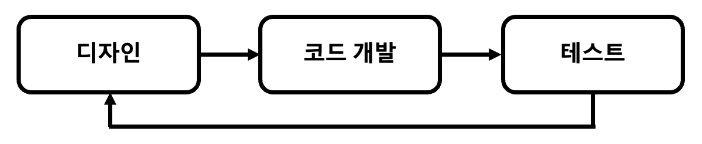
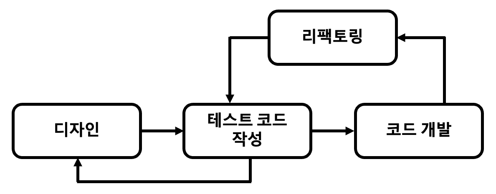
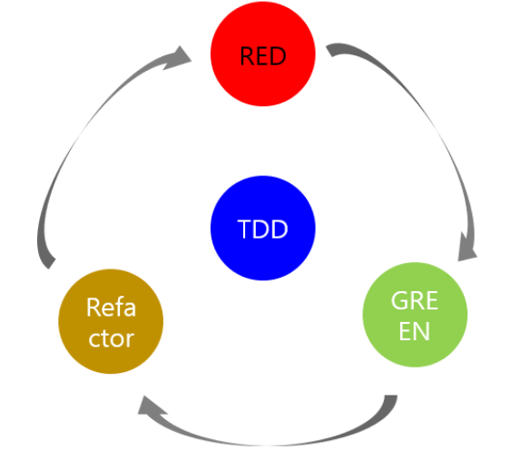

## TDD (Test-Driven Development)

> ### 테스트 주도 개발, TDD

 

&nbsp; 기존 개발 프로세스(`좌측 사진`)는 설계(디자인) 후 코드 개발을 하고 테스트케이스를 작성했다. 이 때문에 초기 설계가 완벽하지 않다면 재설계로 인해 불필요한 코드가 남거나 중복처리 될 가능성이 있다. 이와 다르게 TDD(`우측 사진`)는 설계 이후 테스트케이스를 작성한 후 코드를 개발하여 리펙토링하는 절차를 따른다.

  
  

 

&nbsp; 이와 같이 TDD는 Test-Driven Development의 약자로, `테스트 주도 개발`을 의미한다. `단위 테스트`(Unit Test)를 작성하고, 이를 통과하는 코드를 추가하는 단계를 반복하여 실제 코드를 개발한다. `짧은 개발 주기`의 반복에 의존하는 개발 프로세스이며, 애자일 방법론 중 하나인 XP(eXtream programming)의 `Test-First` 개념에 기반을 둔 단순한 설계를 중요시한다.

 

## TDD의 개발주기

    

&nbsp; 위의 그림은 TDD의 개발주기다.

- `Red` : 실패하는 테스트 코드를 먼저 작성
- `Green` : 테스트 코드를 성공시키기 위한 실제 코드 작성
- `Yellow` : 중복 코드 제거, 일반화 등의 리팩토링 수행

&nbsp; 여기서 핵심은 `실패`하는 테스트 코드를 작성할 때까지 실제 코드를 작성하면 안 되고, 실패하는 테스트를 통과할 정도의 최소 실제 코드를 작성해야 한다는 것이다. 이 과정을 통해 실제 코드를 명확하게 정의할 수 있고, 불필요한 설계를 피할 수 있으며, 정확한 요구사항에 집중할 수 있다.

 

## TDD의 장단점

- ### 장점

  - 튼튼한 객체지향적인 코드 생산
  - 재설계 시간 단축
  - 디버깅 시간 단축
  - 테스트 문서의 대체 가능
  - 추가 구현 용이

- ### 단점
  - 생산성 저하

---

### **참고자료**

- Web
  - [@clipsoft](http://clipsoft.co.kr/wp/blog/tddtest-driven-development-방법론/)
  - [@wooaoe](https://wooaoe.tistory.com/33)
