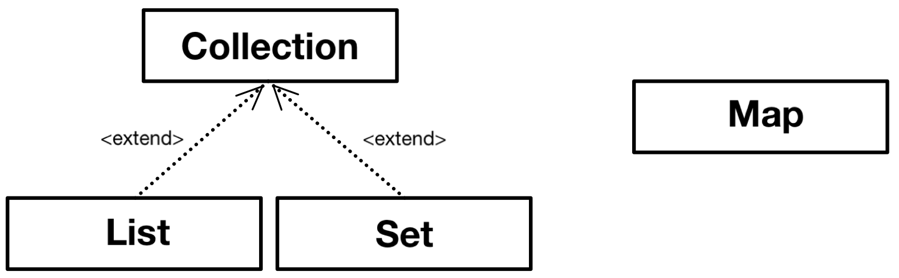

## 컬렉션 프레임워크 (Collections Framework)

&nbsp; 컬렉션 프레임워크는 데이터 군을 저장하는 클래스들을 표준화한 설계로, 컬렉션은 다수의 데이터(데이터 그룹), 프레임웍은 표준화된 프로그래밍 방식을 뜻한다. 컬렉션 프레임웍은 컬렉션, 다수의 데이터를 다루는 데 필요한 다양하고 풍부한 클래스들을 제공하기 때문에 프로그래머의 짐을 상당히 덜어준다. 또한 인터페이스와 다형성을 이용한 객체지향적 설계를 통해 표준화되어 있기 때문에 사용법을 익히기 편리하고 재사용성이 높은 코드를 작성할 수 있다.



&nbsp; 컬렉션 프레임웍에서는 컬렉션데이터 그룹을 크게 3가지 타입이 존재한다고 인식하고, 각 컬렉션을 다루기 위한 기능을 가진 3개의 인터페이스(Interface)를 정의하였다. 그리고 상단의 그림과 같이 리스트(List)와 집합(Set)의 공통된 부분을 추출하여 새로운 인터페이스인 컬렉션(Collection)을 추가로 정의하였다. 반면, 맵(Map)은 이들과 전혀 다른 형태로 컬렉션을 다루기 때문에 상속 계층도에서 따로 떨어져 있다.

&nbsp; 추가로, JDK 1.5부터 이터레이블(Iterable) 인터페이스를 추가하여 컬렉션(Collection) 인터페이스를 상속받게 하였는데, 이것은 단지 인터페이스들의 공통적인 메서드인 iterator( )를 뽑아서 중복을 제거하기 위한 것에 불과하므로 상속 계층도와는 무관하다.

</br>

<table style="border-collapse: collapse; width: 72.3256%; height: 131px;" border="1" data-ke-align="alignCenter" data-ke-style="style12">
<tbody>
    <tr style="height: 20px;">
    <td style="width: 18.6391%; height: 20px; text-align: center;">인터페이스</td>
    <td style="width: 52.1262%; height: 20px; text-align: center;">특징</td>
</tr>
<tr style="height: 20px;">
<td style="width: 18.6391%; height: 35px; text-align: center;" rowspan="2">List</td>
<td style="width: 52.1262%; height: 20px;">• 순서가 있는 데이터 집합<br>• 데이터 중복 허용</td>
</tr>
<tr style="height: 15px;">
<td style="width: 52.1262%; height: 15px;">구현 클래스: ArrayList, LinkedList, Vector, Stack, Queue
</tr>
<tr style="height: 20px;">
<td style="width: 18.6391%; height: 36px; text-align: center;" rowspan="2">Set</td>
<td style="width: 52.1262%; height: 20px;">• 순서를 유지하지 않는 데이터 집합<br>• 데이터 중복 허용 X</span><br /></span></td>
</tr>
<tr style="height: 16px;">
<td style="width: 52.1262%; height: 16px;">구현 클래스: HashSet, TreeSet</td>
</tr>
<tr style="height: 20px;">
<td style="width: 18.6391%; height: 40px; text-align: center;" rowspan="2">Map</td>
<td style="width: 52.1262%; height: 20px;">• key와 value의 쌍으로 이루어진 데이터 집합<br>• 순서가 유지되지 않음<br>• key의 중복 허용 X, value의 중복 허용</td>
</tr>
<tr style="height: 20px;">
<td style="width: 52.1262%; height: 20px;">구현 클래스: HashMap, TreeMap, Hashtable, Properties</td>
</tr>
</tbody>
</table>

&nbsp; 실제 개발 시에는 다루고자 하는 컬렉션의 특징을 파악하고, 어떤 인터페이스를 구현한 컬렉션 클래스를 사용할지 결정해야하므로 상단의 표의 개념은 굉장히 중요하다고 할 수 있다. 인터페이스의 이름이 클래스의 이름에 거의 포함돼 있기 때문에 인터페이스의 이름을 통해 확실히 숙지하도록 하자.

&nbsp; 그러나 Vector, Stack, Hashtable, Properties와 같은 클래스들은 컬렉션 프레임웍이 만들어지기 전부터 존재하던 것이다. 특히 Vector나 Hashtable과 같은 기존의 컬렉션 클래스들은 호환을 위해 설계를 변경해서 남겨뒀지만, 가능하면 사용하지 않는 것이 좋다. 이 클래스 대신, ArrayList나 HashMap을 사용하면 된다.

</br>

### **Collection Interface**

<table style="border-collapse: collapse; width: 100%; height: 300px;" border="1" data-ke-align="alignLeft" data-ke-style="style12">
<tbody>
<tr style="height: 20px;">
<td style="width: 50%; height: 20px; text-align: center;">Method</td>
<td style="width: 50%; height: 20px; text-align: center;">Explanation</td>
</tr>
<tr style="height: 40px;">
<td style="width: 50%; height: 40px;">boolean add(Object o)<br />boolean add(Collection c)</td>
<td style="width: 50%; height: 40px;">지정된 객체 or 컬렉션의 객체들을 컬렉션에 추가</td>
</tr>
<tr style="height: 20px;">
<td style="width: 50%; height: 20px;">void clear( )</td>
<td style="width: 50%; height: 20px;">컬렉션의 모든 객체 삭제</td>
</tr>
<tr style="height: 20px;">
<td style="width: 50%; height: 20px;">boolean contains(Object o)<br />boolean containsAll(Collection c)</td>
<td style="width: 50%; height: 20px;">지정된 객체 or 컬렉션의 객체들이 컬렉션에 포함돼 있는지&nbsp;</td>
</tr>
<tr style="height: 20px;">
<td style="width: 50%; height: 20px;">boolean equals(Object o)</td>
<td style="width: 50%; height: 20px;">동일한 컬렉션인지 비교</td>
</tr>
<tr style="height: 20px;">
<td style="width: 50%; height: 20px;">int hashCode( )</td>
<td style="width: 50%; height: 20px;">컬렉션의 hash code 반환</td>
</tr>
<tr style="height: 20px;">
<td style="width: 50%; height: 20px;">boolean isEmpty( )</td>
<td style="width: 50%; height: 20px;">컬렉션이 비어있는지</td>
</tr>
<tr style="height: 20px;">
<td style="width: 50%; height: 20px;">Iterator iterator( )</td>
<td style="width: 50%; height: 20px;">컬렉션의 Iterator를 얻어 반환</td>
</tr>
<tr style="height: 20px;">
<td style="width: 50%; height: 20px;">boolean remove(Object o)</td>
<td style="width: 50%; height: 20px;">지정된 객체 삭제</td>
</tr>
<tr style="height: 20px;">
<td style="width: 50%; height: 20px;">boolean removeAll(Collection c)</td>
<td style="width: 50%; height: 20px;">지정된 컬렉션에 포함된 객체 모두 삭제</td>
</tr>
<tr style="height: 20px;">
<td style="width: 50%; height: 20px;">boolean retainAll(Collection c)</td>
<td style="width: 50%; height: 20px;">지정된 컬렉션에 포함된 객체 만을 남기고 다른 객체들은 컬렉션에서 삭제<br />이 작업으로 인해 컬렉션에 변화가 있다면 <b>true</b>, 없으면 <b>false</b></td>
</tr>
<tr style="height: 20px;">
<td style="width: 50%; height: 20px;">int size( )</td>
<td style="width: 50%; height: 20px;">컬렉션에 저장된 객체의 수 반환</td>
</tr>
<tr style="height: 20px;">
<td style="width: 50%; height: 20px;">Object[ ] toArray( )</td>
<td style="width: 50%; height: 20px;">컬렉션에 저장된 객체를 객체배열(Object[ ])로 반환</td>
</tr>
<tr style="height: 20px;">
<td style="width: 50%; height: 20px;">Object[ ] toArray(Object[ ] a)</td>
<td style="width: 50%; height: 20px;">지정된 배열에 컬렉션의 객체를 저장해서 반환</td>
</tr>
</tbody>
</table>

</br>

### **List Interface**

<table style="border-collapse: collapse; width: 100%;" border="1" data-ke-align="alignLeft" data-ke-style="style12">
<tbody>
<tr>
<td style="width: 50%; text-align: center;"><b>Method</b></td>
<td style="width: 50%; text-align: center;"><b>Explanation</b></td>
</tr>
<tr>
<td style="width: 50%;">void add(int index, Object element)<br />boolean addAll(int index, Collection c)</td>
<td style="width: 50%;">지정된 인덱스에 위치한 객체 or 컬렉션에 포함된 객체 추가</td>
</tr>
<tr>
<td style="width: 50%;">Object get(int index)</td>
<td style="width: 50%;">지정된 인덱스에 위치한 객체 반환</td>
</tr>
<tr>
<td style="width: 50%;">int indexOf(Object o)</td>
<td style="width: 50%;">지정된 객체의 인덱스 반환 (첫 번째 요소부터 순방향 탐색)</td>
</tr>
<tr>
<td style="width: 50%;">int lastIndexOf(Object o)</td>
<td style="width: 50%;">지정된 객체의 인덱스 반환 (마지막 요소부터 역방향 탐색)</td>
</tr>
<tr>
<td style="width: 50%;">ListIterator listIterator( )<br/>ListIterator listIterator(int index)</td>
<td style="width: 50%;">List의 객체에 접근할 수 있는 ListIterator 반환</td>
</tr>
<tr>
<td style="width: 50%;">Object remove(int index)</td>
<td style="width: 50%;">지정된 인덱스에 위치한 객체 삭제 후 삭제된 객체 반환</td>
</tr>
<tr>
<td style="width: 50%;">Object set(int index, Object element)</td>
<td style="width: 50%;">지정된 인덱스에 객체 저장</td>
</tr>
<tr>
<td style="width: 50%;">void sort(Comparator c)</td>
<td style="width: 50%;">지정된 비교자(comparator)로 List 정렬</td>
</tr>
<tr>
<td style="width: 50%;">List subList(int fromIndex, int toIndex)</td>
<td style="width: 50%;">지정된 범위에 있는 객체 반환</td>
</tr>
</tbody>
</table>

</br>

### **Map Interface**

<table style="border-collapse: collapse; width: 100%; height: 300px;" border="1" data-ke-align="alignLeft" data-ke-style="style12">
<tbody>
<tr style="height: 20px;">
<td style="width: 50%; height: 20px;"><b>Method</b></td>
<td style="width: 50%; height: 20px;"><b>Explanation</b></td>
</tr>
<tr style="height: 20px;">
<td style="width: 50%; height: 20px;">void clear( )</td>
<td style="width: 50%; height: 20px;">Map의 모든 객체 삭제</td>
</tr>
<tr style="height: 20px;">
<td style="width: 50%; height: 20px;">boolean containsKey(Object Key)</td>
<td style="width: 50%; height: 20px;">지정된 key 객체와 일치하는 Map의 key 객체가 있는지</td>
</tr>
<tr style="height: 20px;">
<td style="width: 50%; height: 20px;">boolean contatinsValue(Object value)</td>
<td style="width: 50%; height: 20px;">지정된 value 객체와 일치하는 Map의 value 객체가 있는지</td>
</tr>
<tr style="height: 20px;">
<td style="width: 50%; height: 20px;">Set entrySet( )</td>
<td style="width: 50%; height: 20px;">Map에 저장돼 있는 key-value 쌍을 Map.Entry 타입의 객체로 저장한 Set 반환</td>
</tr>
<tr style="height: 20px;">
<td style="width: 50%; height: 20px;">boolean equals(Object o)</td>
<td style="width: 50%; height: 20px;">동일한 Map인지 비교</td>
</tr>
<tr style="height: 20px;">
<td style="width: 50%; height: 20px;">Object get(Object key)</td>
<td style="width: 50%; height: 20px;">지정한 key 객체에 대응하는 value 객체를 찾아서 반환</td>
</tr>
<tr style="height: 20px;">
<td style="width: 50%; height: 20px;">int hashCode( )</td>
<td style="width: 50%; height: 20px;">해시코드 반환</td>
</tr>
<tr style="height: 20px;">
<td style="width: 50%; height: 20px;">boolean isEmpty( )</td>
<td style="width: 50%; height: 20px;">Map이 비어있는지</td>
</tr>
<tr style="height: 20px;">
<td style="width: 50%; height: 20px;">Set keySet( )</td>
<td style="width: 50%; height: 20px;">Map에 저장된 모든 key 객체 반환</td>
</tr>
<tr style="height: 20px;">
<td style="width: 50%; height: 20px;">Object put(Object key, Object value)</td>
<td style="width: 50%; height: 20px;">Map에&nbsp; value 객체를 key객체에 연결하여 저장</td>
</tr>
<tr style="height: 20px;">
<td style="width: 50%; height: 20px;">void putAll(Map t)</td>
<td style="width: 50%; height: 20px;">지정된 Map의 모든 key-value 쌍을 추가</td>
</tr>
<tr style="height: 20px;">
<td style="width: 50%; height: 20px;">Object remove(Object key)</td>
<td style="width: 50%; height: 20px;">지정한 key 객체와 일치하는 key-value 객체를 삭제</td>
</tr>
<tr style="height: 20px;">
<td style="width: 50%; height: 20px;">int size( )</td>
<td style="width: 50%; height: 20px;">Map에 저장된 key-value 쌍의 개수 반환</td>
</tr>
<tr style="height: 20px;">
<td style="width: 50%; height: 20px;">Collection values( )</td>
<td style="width: 50%; height: 20px;">Map에 저장된 모든 value 객체 반환</td>
</tr>
</tbody>
</table>

</br>

## **Map.Entry Interface**

&nbsp;Map.Entry 인터페이스는 Map 인터페이스의 내부 인터페이스다. 내부 클래스와 같이 인터페이스도 인터페이스 안에 인터페이스를 정의하는 내부 인터페이스를 정의하는 것이 가능하다. Map에 저장되는 key-value 쌍을 다루기 위해 내부적으로 Entry 인터페이스를 정의해 놓았다. 이것은 보다 객체지향적으로 설계하도록 유도하기 위한 것이고, Map 인터페이스를 구현하는 클래스에서는 Map.Entry 인터페이스 또한 함께 구현해야 한다.

&nbsp; 다음은 Map 인터페이스의 소스코드 일부와 Map.Entry 인터페이스 메서드다.

```java
public interface Map{
	...
    public static interface Entry{
    	Object getKey();
        Object getValue();
        Object setValue(Object value);
        boolean equals(Object o);
        int hashCode();
        ...
    }
}
```

<table style="border-collapse: collapse; width: 100%; height: 120px;" border="1" data-ke-align="alignLeft" data-ke-style="style12">
<tbody>
<tr style="height: 20px;">
<td style="width: 50%; height: 20px;">Method</td>
<td style="width: 50%; height: 20px;">Explanation</td>
</tr>
<tr style="height: 20px;">
<td style="width: 50%; height: 20px;">boolean equals(Object o)</td>
<td style="width: 50%; height: 20px;">동일한 Entry인지 비교</td>
</tr>
<tr style="height: 20px;">
<td style="width: 50%; height: 20px;">Object getKey( )</td>
<td style="width: 50%; height: 20px;">Entry의 key 객체 반환</td>
</tr>
<tr style="height: 20px;">
<td style="width: 50%; height: 20px;">Object getValue( )</td>
<td style="width: 50%; height: 20px;">Entry의 value 객체 반환</td>
</tr>
<tr style="height: 20px;">
<td style="width: 50%; height: 20px;">int hashCode( )</td>
<td style="width: 50%; height: 20px;">Entry의 해시코드 반환</td>
</tr>
<tr style="height: 20px;">
<td style="width: 50%; height: 20px;">Object setValue(Object value)</td>
<td style="width: 50%; height: 20px;">Entry의 value 객체를 지정된 객체로 변경</td>
</tr>
</tbody>
</table>
<p data-ke-size="size16">&nbsp;</p>
