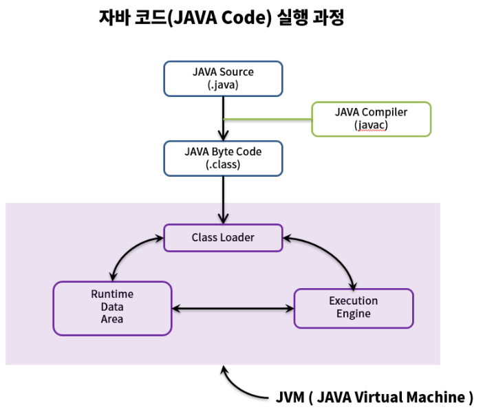

## Java의 실행과정

    
    <h5>출처: https://steady-snail.tistory.com/67</h5>

 

> ### 1. `.java` → `.class`

- `javac`라는 Java Compiler에 의해 변환
- `Byte Code`: 사람이 작성한 `소스코드`와 기계어의 중간 단계
- 어떤 프로세서에서도 작동할 수 있도록 기계어가 아닌 바이트 코드로 변환함

 

> ### 2. 컴파일 된 바이트 코드를 JVM의 `Class Loader`로 전달

- 동적 로딩을 통해 필요한 클래스들을 로딩 및 링크
- JVM의 메모리인 `Runtime Data Area`로 런타임 데이터를 올림

 

> ### 3. Execute

- `Execution Engine`은 JVM 메모리에 올라온 바이트 코드들을 명령어 단위로 가져와 실행

 

### Reference

- [@whitepro](https://whitepro.tistory.com/458)
- [@steady-snail](https://steady-snail.tistory.com/67)
