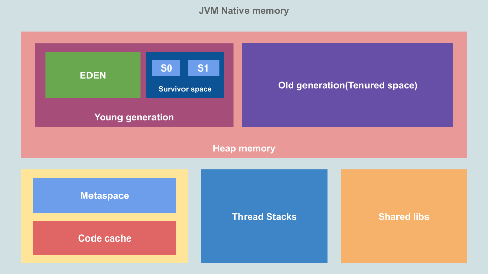

# JVM의 메모리 영역

    

> ### Heap

- 객체의 인스턴스나 동적으로 할당된 데이터. 즉 `Reference Type이 저장`
- 모든 스레드가 공유하는 공간
- `GC`가 일어남
- Young Generation: 새로 생성된 인스턴스 저장
  - EDEN: 생성된 인스턴스 저장
  - Survivor space: Minor GC에서 살아남은 인스턴스 저장
- Old Generation: 일정 횟수의 GC에서 살아남은 인스턴스 저장
  - Major GC가 일어남

 

> ### Thread Stack

- `Stack 영역`
- 각 `Thread`마다 배정되는 메모리 영역
- 메서드, 메서드 반환값, 지역변수 저장

 

> ### MetaSpace

- `메서드 영역`
- 애플리케이션의 class, 메서드 정보, static 멤버 변수 저장

 

> ### Code Cache

- JIT(Just In Time) 컴파일러가 데이터를 저장하는 영역
- 컴파일 된 코드 블럭 저장
- 자주 접근 → 미리 바이트 코드를 기계어로 변환된 부분을 저장 (`cache`)

 

> ### Shared Library

- 공유 라이브러리를 기계어로 변환한 채로 저장
- OS에서 프로세스당 한 번씩 로드

 

---

### Reference

- [@deepu](https://deepu.tech/memory-management-in-jvm/)
- [@inspirit941](https://inspirit941.tistory.com/294)
- [@whitepro](https://whitepro.tistory.com/458)
