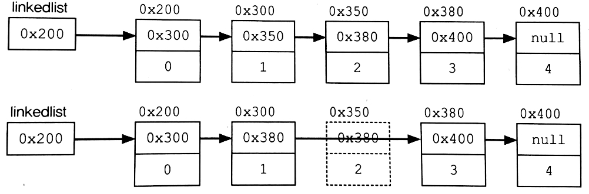

## **ArrayList**

&nbsp; ArrayList는 컬렉션 프레임워크에서 가장 많이 사용되는 컬렉션 클래스일 것이다. List 인터페이스로 구현돼 있기 때문에 **데이터의 저장순서가 유지**되고 **중복을 허용**한다는 특징을 갖는다.

</br>

```java
public class ArrayList extends AbstractList
                    implements List, RandomAccess, Cloneable, java.io.Serializable {
    . . .
    transient Object[] elementData;
    . . .
}
```

&nbsp; ArrayList는 Object 배열을 이용해 데이터를 순차적으로 저장한다. 배열과 같이 순차적으로 저장하다가 공간이 없어 더 이상 저장할 수 없으면 보다 큰 새로운 배열을 생성해 기존 배열에 있던 데이터를 새로운 배열로 복사한 다음 저장한다.

```
❗️ Q) ArrayList를 왜 Object 배열로 구현했을까?
A) ArrayList뿐 아니라 Collection Framework에 모든 종류의 객체를 담기 위해 모든 객체의 최고조상인 Object 타입의 배열로 구현됐다.
```

## **ArrayList의 생성자와 메서드**

<table style="border-collapse: collapse; width: 100%; height: 180px;" border="1" data-ke-align="alignLeft" data-ke-style="style12">
    <tbody>
        <tr style="height: 18px;">
            <td style="width: 50%; height: 18px;"><b>Method</b></td>
            <td style="width: 50%; height: 18px;"><b>Explanation</b></td>
        </tr>
        <tr style="height: 18px;">
            <td style="width: 50%; height: 18px;"><b>ArrayList()</b></td>
            <td style="width: 50%; height: 18px;">ArrayList 생성자 (default 크기: 10)</td>
        </tr>   
    <tr>
        <td style="width: 50%;">ArrayList(Collection c)</td>
        <td style="width: 50%;">컬렉션 c가 저장된 ArrayList 생성자</td>
    </tr>
    <tr>
        <td style="width: 50%;">ArrayList(int initialCapacity)</td>
        <td style="width: 50%;">지정된 초기용량을 갖는 ArrayList 생성자</td>
    </tr>
    <tr>
        <td style="width: 50%;"><b>boolean add(Object o)</b></td>
        <td style="width: 50%;">ArrayList 마지막에 객체 추가</td>
    </tr>
    <tr>
        <td style="width: 50%;"><b>void add(int index, Object element)</b></td>
        <td style="width: 50%;">지정된 위치(index)에 객체 추가</td>
    </tr>
    <tr>
        <td style="width: 50%;">boolean addAll(Collection c)</td>
        <td style="width: 50%;">컬렉션 c의 모든 객체 추가</td>
    </tr>
    <tr>
        <td style="width: 50%;">void addAll(int index, Collection c)</td>
        <td style="width: 50%;">지정된 위치(index)에 컬렉션 c의 모든 객체 추가</td>
    </tr>
    <tr>
        <td style="width: 50%;">void clear()</td>
        <td style="width: 50%;">ArrayList를 완전히 비움</td>
    </tr>
    <tr>
        <td style="width: 50%;">Object clone()</td>
        <td style="width: 50%;">ArrayList 복제</td>
    </tr>
    <tr>
        <td style="width: 50%;"><b>boolean contains(Object o)</b></td>
        <td style="width: 50%;">객체 o가 ArrayList에 포함돼 있는지</td>
    </tr>
    <tr>
        <td style="width: 50%;">void ensureCapacity(int minCapacity)</td>
        <td style="width: 50%;">ArrayList의 용량의 최소치 지정</td>
    </tr>
    <tr>
        <td style="width: 50%;"><b>Object get(int index)</b></td>
        <td style="width: 50%;">지정된 위치(index)에 저장된 객체 반환</td>
    </tr>
    <tr>
        <td style="width: 50%;"><b>int indexOf(Object o)</b></td>
        <td style="width: 50%;">지정된 객체가 저장된 위치를 찾아 반환</td>
    </tr>
    <tr style="height: 18px;">
        <td style="width: 50%; height: 18px;"><b>boolean isEmpty()</b></td>
        <td style="width: 50%; height: 18px;">ArrayList가 비어있는지 확인</td>
    </tr>
    <tr style="height: 18px;">
        <td style="width: 50%; height: 18px;">ArrayList의 Iterator 객체 반환</td>
    </tr>
    <tr style="height: 18px;">
        <td style="width: 50%; height: 18px;">int lastIndexOf(int index)</td>
        <td style="width: 50%; height: 18px;">객체 o가 저장된 위치를 끝부터 역방향으로 검색해 반환</td>
    </tr>
    <tr style="height: 18px;">
        <td style="width: 50%; height: 18px;"><b>ListIterator listIterator()</b></td>
        <td style="width: 50%; height: 18px;">ArrayList의 listIterator 반환</td>
    </tr>
    <tr style="height: 18px;">
        <td style="width: 50%; height: 18px;">ListIterator listIterator(int index)</td>
        <td style="width: 50%; height: 18px;">ArrayList의 지정된 위치부터 시작되는 listIterator 반환</td>
    </tr>
    <tr style="height: 18px;">
        <td style="width: 50%; height: 18px;"><b>Object remove(int intdex)</b></td>
        <td style="width: 50%; height: 18px;">지정된 위치(index)에 있는 객체 제거</td>
    </tr>
    <tr style="height: 18px;">
        <td style="width: 50%; height: 18px;">boolean remove(Object o)</td>
        <td style="width: 50%; height: 18px;">지정된 객체 제거</td>
    </tr>
    <tr style="height: 18px;">
        <td style="width: 50%; height: 18px;">boolean removeAll(Collection c)</td>
        <td style="width: 50%; height: 18px;">지정된 컬렉션 c에 저장된 것과 동일한 객체들 제거</td>
    </tr>
    <tr>
        <td style="width: 50%;">boolean retainAll(Collection c)</td>
        <td style="width: 50%;">ArraList에 저장된 객체 중 주어진 컬렉션 c와 공통된 것들을 제외하고나머지 삭제</td>
    </tr>
    <tr>
        <td style="width: 50%;">Object set(int index, Object element)</td>
        <td style="width: 50%;">주어진 객체를 지정된 위치(index)에 저장</td>
    </tr>
    <tr>
        <td style="width: 50%;"><b>int size()</b></td>
        <td style="width: 50%;">ArrayList에 저장된 객체의 개수 반환</td>
    </tr>
    <tr>
        <td style="width: 50%;"><b>void sort(Comparator c)</b></td>
        <td style="width: 50%;">지정된 정렬기준 c에 맞게 ArrayList 정렬</td>
    </tr>
    <tr>
        <td style="width: 50%;">List subList(int fromIndex, int toIndex)</td>
        <td style="width: 50%;">지정된 범위 내에 저장된 객체 반환</td>
    </tr>
    <tr>
        <td style="width: 50%;"><b>Object[] toArray()</b></td>
        <td style="width: 50%;">ArrayList에 저장된 모든 객체들을 객체 배열로 반환</td>
    </tr>
    <tr>
        <td style="width: 50%;">Object[] toArray(Object[] a)</td>
        <td style="width: 50%;">ArrayList에 저장된 모든 객체들을 객체배열 a에 담아 반환</td>
    </tr>
    <tr>
        <td style="width: 50%;">void trimToSize()</td>
        <td style="width: 50%;">용량을 크기에 맞게 줄임 (빈 공간 제거)</td>
    </tr>
    </tbody>
</table>

<br>

## **LinkedList**

&nbsp; 배열은 가장 기본적인 형태의 자료구조로, 구조가 간단하며 데이터 탐색 시간이 가장 빠르지만 큰 단점을 가지고 있다. 먼저 `크기를 변경할 수 없다`. 배열은 크기를 변경하기 위해 새로운 배열을 생성해 데이터를 복사헤야 한다는 단점이 있다. 또 비순차적인 데이터 삽입, 삭제에 시간이 많이 소요된다.

&nbsp; 이러한 배열의 단점을 보완하기 위해 LinkedList가 고안되었다. 배열과 다르게 LinkedList는 불연속적으로 존재하는 데이터를 서로 연결(link)한 형태로 구성돼 있다. LinkedList의 각 node들은 자신과 연결된 다음 요소에 대한 주소와 데이터로 구성돼 있다.

<p align=center>
	
</p>

&nbsp; 위의 그림은 LinkedList의 중간에 있는 node를 삭제하는 과정이다. 삭제하고자 하는 요소의 이전요소가 삭제하고자 하는 요소의 다음 요소를 참조하도록 변경하기만 하면 된다. 추가 등의 다른 과정도 이렇게 이루어지기 때문에 배열보다 오버헤드가 적다.

&nbsp; 이렇게 단방향으로 있는 LinkedList와 다르게 각 노드들이 가리키는 방향이 next와 previous, 양방향인 LinkedList도 있다. 이를 `Double LinkedList`라고 한다. 당연히 단방향일 때보다 노드 간 접근 및 이동이 쉽다. 실제로 Java의 LinkedList 클래스도 Double LinkedList로 구현돼 있다. 이보다 더 접근성을 향상한 `Doubly Circular LinkedList`도 있지만 구현이 복잡해 보통 Double LinkedList를 사용한다. (마지막 요소가 첫번째 요소를 가리키는 구조를 원형이라고 한다.)

<br>

## **Method**

<table style="border-collapse: collapse; width: 100%; height: 450px;" border="1" data-ke-align="alignLeft" data-ke-style="style12">
    <tbody>
    <tr style="height: 18px;">
        <td style="width: 50%; height: 18px;">LinkedList()</td>
        <td style="width: 50%; height: 18px;">LinkedList 생성자</td>
    </tr>
    <tr style="height: 18px;">
        <td style="width: 50%; height: 18px;">LinkedList(Collection c)</td>
        <td style="width: 50%; height: 18px;">주어진 컬렉션을 포함하는 LinkedList 생성자</td>
    </tr>
    <tr style="height: 18px;">
        <td style="width: 50%; height: 18px;">boolean add(Object o)</td>
        <td style="width: 50%; height: 18px;">지정된 객체 o를 LinkedList 끝에 삽입</td>
    </tr>
    <tr style="height: 18px;">
        <td style="width: 50%; height: 18px;">void add(int index, Object element)</td>
        <td style="width: 50%; height: 18px;">지정된 위치(index)에 객체를 추가</td>
    </tr>
    <tr style="height: 18px;">
        <td style="width: 50%; height: 18px;">boolean addAll(Collection c)</td>
        <td style="width: 50%; height: 18px;">주어진 컬렉션에 포함된 모든 요소를 LinkedList의 끝에 추가</td>
    </tr>
    <tr style="height: 18px;">
        <td style="width: 50%; height: 18px;">void clear()</td>
        <td style="width: 50%; height: 18px;">LinkedList의 모든 요소를 삭제</td>
    </tr>
    <tr style="height: 18px;">
        <td style="width: 50%; height: 18px;">boolean contains(Object o)</td>
        <td style="width: 50%; height: 18px;">지정된 객체가 LinkedList에 포함됐는지 여부</td>
    </tr>
    <tr style="height: 18px;">
        <td style="width: 50%; height: 18px;">boolean containsAll(Collection c)</td>
        <td style="width: 50%; height: 18px;">지정된 컬렉션이 LinkedList에 포함됐는지 여부</td>
    </tr>
    <tr style="height: 18px;">
        <td style="width: 50%; height: 18px;">Object get(int index)</td>
        <td style="width: 50%; height: 18px;">지정된 위치(index)의 객체 반환</td>
    </tr>
    <tr style="height: 18px;">
        <td style="width: 50%; height: 18px;">int indexOf(Object o)</td>
        <td style="width: 50%; height: 18px;">지정된 객체가 저장된 인덱스 반환</td>
    </tr>
    <tr style="height: 18px;">
        <td style="width: 50%; height: 18px;">boolean isEmpty()</td>
        <td style="width: 50%; height: 18px;">LinkedList가 비어있는지 리턴</td>
    </tr>
    <tr style="height: 18px;">
        <td style="width: 50%; height: 18px;">int lastIndexOf(Object o)</td>
        <td style="width: 50%; height: 18px;">지정된 객체의 index 반환 (역순 검색)</td>
    </tr>   
    <tr style="height: 18px;">
        <td style="width: 50%; height: 18px;">Object remove(int index)</td>
        <td style="width: 50%; height: 18px;">지정된 index의 객체 삭제</td>
    </tr>
    <tr style="height: 18px;">
        <td style="width: 50%; height: 18px;">boolean remove(Object o)</td>
        <td style="width: 50%; height: 18px;">지정된 객체를 LinkedList에서 제거</td>
    </tr>
    <tr style="height: 18px;">
        <td style="width: 50%; height: 18px;">boolean removeAll(Collection c)</td>
        <td style="width: 50%; height: 18px;">지정된 컬렉션의 요소와 일치하는 요소를 모두 삭제</td>
    </tr>
    <tr style="height: 18px;">
        <td style="width: 50%; height: 18px;">boolean retainAll(Collection c)</td>
        <td style="width: 50%; height: 18px;">지정된 컬렉션의 모든 요소가 포함되어 있는지 확인</td>
    </tr>
    <tr style="height: 18px;">
        <td style="width: 50%; height: 18px;">Object set(int index, Object element)</td>
        <td style="width: 50%; height: 18px;">지정된 위치의 객체를 주어진 객체로 바꿈</td>
    </tr>
    </tbody>
</table>

<br>

## **⭐️ LinkedList와 ArrayList의 차이**

> ### 1. 순차적으로 삽입/삭제하는 경우, ArrayList가 효율적

&nbsp; 초기용량을 고려하지 않고 봤을 때, 순차적인 작업은 ArrayList가 효율적이다. 순차적으로 삭제한다는 것은 마지막 데이터부터 역순으로 삭제해나간다는 것을 의미한다. ArrayList는 마지막 데이터부터 삭제할 경우 각 요소들의 재배치가 필요하지 않으므로 상당히 빠르다. 마지막 요소를 null로 바꿔주면 되기 때문이다.

> ### 2. 중간 데이터를 삽입/삭제하는 경우, LinkedList가 효율적

&nbsp; 중간 요소를 추가 또는 삭제하는 경우 LinkedList는 각 요소간의 연결만 변경해주면 되지만, ArrayList는 각요소들을 재배치하여 추가할 공간을 확보 또는 빈 공간을 채워야하기 때문에 처리속도가 느리다.

> ### 3. 정리

| Collection | 접근시간(읽기) | 삽입 / 삭제 | 설명                                                         |
| ---------- | -------------- | ----------- | ------------------------------------------------------------ |
| ArrayList  | 빠르다         | 느리다      | ✓ 순차적인 삽입삭제는 더 빠름 </br> ✓ 비효율적인 메모리 사용 |
| LinkedList | 느리다         | 빠르다      | ✓ 데이터가 많을수록 접근성이 떨어짐                          |
