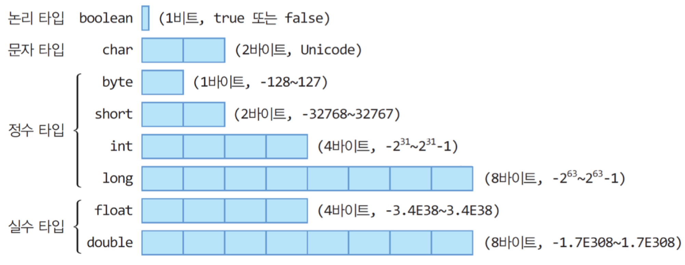

## **Java 프로그래밍의 기본 구성**

```java
1   import java.util.*;
2
3   public class Sample {
4       public static void main(String[] args) {
5           String s = "Hello World";
6           System.out.println(s);
7       }
8   }
```

- 1열: 라이브러리 import
- 3열: class 부분으로, 한 파일에 여러 개의 class를 구현할 수는 있으나 public class는 한 개만 구현 가능
- 4열: main() 메서드
- 5, 6열: String 객체 선언 및 생성, 메서드 호출

```text
❗️ Q) 함수(function)와 메서드(method)는 뭐가 다른가요?
A) 간단하게 이야기하면 함수는 메서드를 포함하는 개념이다. 함수란 여러 문장들이 하나의 기능을 구현하도록 구성한 것이다. 그 함수 중에서 클래스 내부에 정의한 함수가 바로 메서드다. 메서드는 객체의 속성을 다루기 위한 행위를 정의하고 있다고 말할 수 있다.
```

## **자료형**

### **❖ 기본 타입**

<div align=center>
    
</div>

### **❖ 레퍼런스 타입**

- Class
- Array
- Interface
