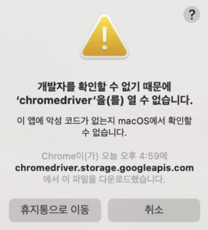

## Python Selenium

&nbsp; Python의 `셀레늄`(Selenium) 라이브러리는 웹 브라이저의 드라이버에 접속하여 제어를 할 수 있게 하는 라이브러리로, 웹 크롤링(스크래핑)을 할 때 `Beautifulsoup4`와 함께 자주 사용된다. 해당 글에서는 셀레늄 사용법에 대해 알아볼 것이고, 추가적인 이론은 [Selenium 공식 도큐멘트](https://selenium-python.readthedocs.io/index.html)를 참고하면 된다.

- [1. install](#1-install)
- [2. import](#2-import)
- [3. Driver 및 Web 불러오기](#3-driver-및-web-불러오기)
  - [Error: 개발자를 확인할 수 없기 때문에 'chromedriver'를 열 수 없습니다.](#❌-error-개발자를-확인할-수-없기-때문에-chromedriver를-열-수-없습니다)
  - [로딩 대기](#로딩-대기)
    - []()
    - []()
- [참고자료](#참고자료)

<br>

## 1. install

&nbsp; 먼저 `selenium 라이브러리`와 `webdriver`를 설치해야 한다.

```shell
// python 환경
$ pip install selenium

// conda 환경
$ conda install selenium
```

&nbsp; webdriver는 웹 브라우저별로 다르기 때문에 하단의 링크로 이동해 사용하는 브라우저와 버전, OS에 맞게 설치해야 한다. 해당 글에서는 Chrome을 이용하고, Chrome 버전은 설정에서 확인할 수 있다.

- [Chrome WebDriver](https://chromedriver.chromium.org/downloads)
- [Firefox WebDriver](https://github.com/mozilla/geckodriver/releases)
- [Microsoft Edge WebDriver](https://developer.microsoft.com/en-us/microsoft-edge/tools/webdriver/?ranMID=24542&ranEAID=je6NUbpObpQ&ranSiteID=je6NUbpObpQ-0D1qYkmiqnf.FpQuKawSww&epi=je6NUbpObpQ-0D1qYkmiqnf.FpQuKawSww&irgwc=1&OCID=AID2200057_aff_7593_1243925&tduid=%28ir__e9xfevuhxgkfbid0igytkfpkb22xquq0bdbl9tiz00%29%287593%29%281243925%29%28je6NUbpObpQ-0D1qYkmiqnf.FpQuKawSww%29%28%29&irclickid=_e9xfevuhxgkfbid0igytkfpkb22xquq0bdbl9tiz00)
- [Safari WebDriver](https://webkit.org/blog/6900/webdriver-support-in-safari-10/)

<br>

## 2. import

```python
import selenium
from selenium import webdriver
from selenium.webdriver import ActionChains

from selenium.webdriver.common.keys import Keys
from selenium.webdriver.common.by import By

from selenium.webdriver.support import expected_conditions as EC
from selenium.webdriver.support.ui import Select
from selenium.webdriver.support.ui import WebDriverWait
```

<br>

## 3. Driver 및 Web 불러오기

&nbsp; 먼저 Chrome WebDriver를 열어줘야 한다. webdriver의 `ChromeOptions()`를 통해 크롬 브로우저 옵션을 설정할 수 있고, `Chrome(executable_path, options)`을 통해 ChromeDriver를 열 수 있다. 다음 코드는 기본적인 로직이다.

```python
from selenium import webdriver

options = webdriver.ChromeOptions()
options.add_argument('headless')    # 브라우저 안 띄우기
options.add_argument('lang=ko_KR')  # KR 언어 설정
chromedriver_path = "chromedriver"  # Chrome WebDriver의 위치
driver = webdriver.Chrome(os.path.join(os.getcwd(), chromedriver_path), options=options)  # chromedriver 열기

. . .

driver.quit();  # driver 종료
```

&nbsp; 추가로 브라우저를 띄우기 위해 `driver.get(url=URL)` 코드를, 현재 url을 얻고 싶다면 `driver.current_url` 코드를, 브라우저를 닫고 싶다면 `driver.close()` 코드를 작성해주면 된다.

<br>

### ❌ Error: 개발자를 확인할 수 없기 때문에 'chromedriver'를 열 수 없습니다.

<p align=center></p>

&nbsp; Mac OS를 사용하는 유저는 `chromedriver를 여는 과정`에서 위와 같은 오류가 발생한다. 이럴 때는 `chromedriver 파일이 있는 위치`로 이동하여 다음 명령어를 활용해 chromedriver의 `확장속성(Extended Attributes)`을 삭제해주면 된다.

```shell
$ xattr -d com.apple.quarantine chromedriver
```

<br>

### ⏰ 로딩 대기

&nbsp; Selenium을 사용하다보면 `ElementNotVisibleException` 에러가 발생하는 경우가 있는데, 이유는 Ajax 등으로 웹 페이지가 로딩되는 시간 차이가 있기 때문이다. 따라서 ElementNotVisibleException 에러를 보고 싶지 않다면 해당 요소가 모두 로딩되기까지 대기해야 한다.

- #### Implicit Waits (암묵적 대기)
  - 로딩하려는 Element가 로드될 때까지 지정한 시간만큼 대기 설정
  - webdriver에 `영구적`으로 작용
  - 인자는 `second` 단위이며, Default Value는 0초

```python
from selenium import webdriver

# 5초까지 대기
driver.implicitly_wait(time_to_wait=5)
driver.get(URL)
```

- #### Explicit Waits (명시적 대기)
  - 명시적으로 어떤 조건이 성립했을 때까지 대기
  - 조건이 성립하지 않으면 timeout으로 설정된 시간만큼 최대한 대기
  - 모든 코드에 적용되는 implicitly wait과 다르게, `코드를 넣은 위치에서만 적용`

```python
from selenium.webdriver.common.by import By
from selenium.webdriver.support.ui import WebDriverWait
from selenium.webdriver.support import expected_conditions as EC

. . .

driver.get(URL)

# ID가 someid인 element가 clickable이 될 때까지 기다리고, 그 element를 리턴
wait = WebDriverWait(driver, 10)
element = wait.until(EC.element_to_be_clickable((By.ID, 'someid')))
```

&nbsp; `wait.until(condition)`을 통해 조건을 설정할 수 있다. 위 코드의 조건은 `clickable`이고, 이 밖에도 많은 조건이 존재한다.

- EC.title_is(...)
- EC.title_contains(...)
- EC.presence_of_element_located(...)
- EC.visibility_of_element_located(...)
- EC.visibility_of(...)
- EC.presence_of_all_elements_located(...)
- EC.text_to_be_present_in_element(...)
- EC.text_to_be_present_in_element_value(...)
- EC.frame_to_be_available_and_switch_to_it(...)
- EC.invisibility_of_element_located(...)
- EC.element_to_be_clickable(...)
- EC.staleness_of(...)
- EC.element_to_be_selected(...)
- EC.element_located_to_be_selected(...)
- EC.element_selection_state_to_be(...)
- EC.element_located_selection_state_to_be(...)
- EC.alert_is_present(...)

<br>

# (추가 예정)

---

### **참고자료**

- Web
  - [Selenium Documents](https://selenium-python.readthedocs.io/index.html)
  - [@greeksharifa](https://greeksharifa.github.io/references/2020/10/30/python-selenium-usage/)
  - [@somjang](https://somjang.tistory.com/entry/MAC-OSX-개발자를-확인할-수-없기-때문에-chromedriver을를-열-수-없습니다-해결-방법)
  - [@sualchi](https://sualchi.tistory.com/13721870)
  - [@hoho325](https://hoho325.tistory.com/265)
