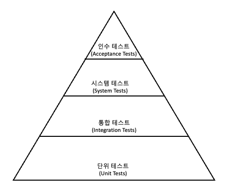

## Test

> #### Test Code: `코드`나 `비즈니스 로직` 자체를 테스트하기 위해 작성한 코드

&nbsp; 최근 애플리케이션을 개발할 때 테스트 코드로 로직을 확인하는 과정이 점점 중요해지고 있다. 많은 개발자들이 테스트 코드에 비용을 많이 투자하고, 테스트 주도 개발(TDD; Test-Driven Development)까지 등장했다. 그렇다고 `테스트 코드 작성`과 `테스트 주도 개발`은 같지 않다. 테스트에 대한 이론을 접하며 이해해보자.

 

## Test Code의 장점

- 개발 과정에서 `문제를 미리 발견`할 수 있음
- `리펙토링 리스크 감소`
- 애플리케이션을 직접 테스트하는 것보다 `시간 단축`
- `명세 문서`로서의 역할도 함
- 몇 가지 프레임워크에 맞춰 테스트 코드를 작성하면 좋은 코드 생산 가능
- 코드가 작성된 `목적을 명확히 표현` → 불필요한 내용이 추가되는 것 방지

 

## Test 종류

    

- 통합 테스트
  - 모듈을 통합하는 과정에서의 호환성 등을 포함해 애플리케이션이 정상적으로 동작하는지 확인하기 위해 수행하는 테스트
  - 애플리케이션이 `온전히 동작`하는지 테스트
  - `테스트 비용`이 커지는 단점이 있음
- 단위 테스트
  - 테스트 대상의 범위를 기준으로 가장 작은 단위의 테스트 방식
  - 일반적으로 `메서드` 단위
  - 비용이 적게 들어 테스트 피드백을 빠르게 받을 수 있음

 

---

### 참고자료

- [도서: 스프링 부트 핵심 가이드](http://www.yes24.com/Product/Goods/110142898?pid=123487&cosemkid=go16558717080451377&gclid=CjwKCAiAvK2bBhB8EiwAZUbP1BUHUQwvsBmN-wOJqiKajet4ToYFinzdksHTDYInTthVj2HEIwn0MhoC4voQAvD_BwE)
- [@galid1](https://galid1.tistory.com/783)
