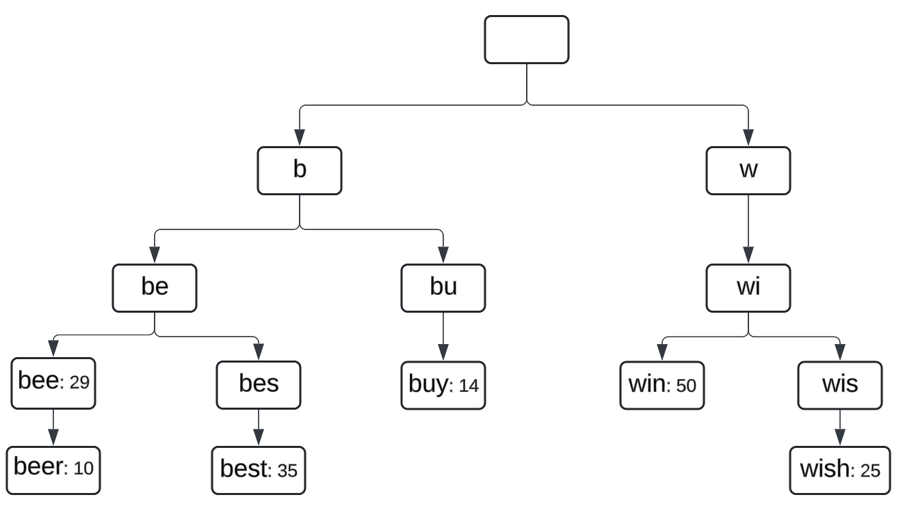
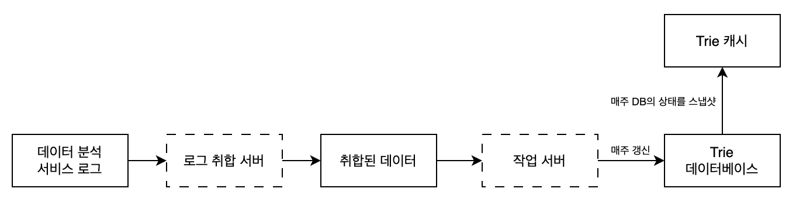

# 검색어 자동완성 시스템

## 문제

### 검색어 자동완성 시스템을 설계하라

# 1단계

## 할 수 있는 질문

<details>
    <summary>펼쳐보기</summary>

1. 자동완성의 기준은?
2. 몇 개의 자동완성 검색어가 표시돼야 하는가?
3. 자동완성 검색어를 고르는 기준은?
4. 맞춤법 검사 기능은 있는가?
5. 질의는 영어인가?
6. 대문자나 특수 문자 처리도 하는가?
7. 얼마나 많은 사용자를 지원해야 하는가?

</details>

## 면접관의 답변 예시

<details>
    <summary>펼쳐보기</summary>

1. 입력한 단어로 시작하는 검색어
2. 5개
3. 사용자가 가장 많이 검색한 검색어
4. 없음
5. 영어, 이후에는 다국어 지원도 고려
6. 영어 소문자만 처리
7. 천만 명

</details>

## 요구사항 정리

<details>
    <summary>펼쳐보기</summary>

- 빠른 응답 속도 (100ms 이내)
- 입력한 단어와의 연관성
- 정렬: 인기도 등의 순위 모델 적용
- 고가용성: 검색어 자동완성 시스템의 장애가 전체 시스템의 장애로 전파되면 안됨

</details>

## 개략적 규모 추정

<details>
    <summary>펼쳐보기</summary>

- 1인당 1일 검색 요청: 10건
- 평균적으로 20byte의 길이를 가진 검색어
- 검색창에 글자 입력 시 서버로 요청
    - 1회 검색 당 20건의 요청
- QPS
    - 10,000,000명 x 10건 x 20자 / (24시간 x 3600초) = 23,148 QPS
- 저장 용량
    - 검색 중 20%가 신규 검색어
    - 10,000,000명 x 10건 x 20byte x 20% = 0.4GB

</details>

# 2단계

## 데이터 수집 서비스

- 질의문과 사용빈도를 저장하는 빈도 테이블 생성

## 질의 서비스

- 질의문을 저장하는 query
- 질의문이 사용된 빈도를 저장하는 frequency

## 검색어 자동완성 서비스

```sql
select *
from frequency_table
where query like 'prefix%'
order by frequency desc limit 5;
```

- DB에서 조회
- 데이터가 많을 때는 병목 발생 가능

# 3단계

## 트라이 자료구조 (trie, 접두어 트리)

- 트리 형태의 자료구조
- 루트 노드: 빈 문자열
- 각 노드는 글자 하나를 저장
    - 26개의 자식노드를 가질 수 있음
- 각 트리 노드는 하나의 단어 또는 접두어 문자열을 나타냄

<p>
    
</p>

- 각 노드에 문자와 검색 빈도 저장

### 용어

- 𝘗: prefix의 길이
- 𝘯: Trie 안에 있는 노드의 개수
- 𝘤: 주어진 노드의 자식 노드 개수𝘤

### 시간 복잡도

- 해당 접두어를 표현하는 노드 탐색: 𝑶(𝘗)
- 해당 접두어를 가진 모든 유효 노드 찾기: 𝑶(𝘤)
- 유효 노드들을 정렬해서 인기 검색어 k개 찾기: 𝑶(𝘤log𝘤)
- 총 시간 복잡도: 𝑶(𝘗) + 𝑶(c) + 𝑶(𝘤log𝘤)

### 최적화

- 문제: 최악의 경우 k개의 결과를 얻기 위해 전체 탐색을 해야 함
- `prefix 최대 길이 제한`
  - 검색어의 최대 길이를 제한할 경우, 𝑶(𝘗)에서 최대 𝑶(𝘹)로 줄어듦 (1 ≦ 𝘹 ≦ 𝘗)
- 노드에 인기 검색어 캐시

## 데이터 수집 서비스

### 문제

- 타이핑 할 때마다 실시간으로 데이터가 수정되어야 한다.
- 질의가 입력될때마다 트라이를 갱신하면 너무 느려진다.
- 인기 검색어는 그다지 자주 바뀌지 않기 때문에 자주 갱신할 필요 없다.

### 데이터 수집 프로세스

<p>
    
</p>

1. 질의에 관한 원본 데이터가 보관됨
2. 로그 데이터를 잘 취합하여 시스템이 쉽게 소비할 수 있도록 함 (취합 주기 control)
3. 취합된 데이터에는 `해당 주기에 사용된 횟수` 데이터가 포함됨
4. 작업 서버가 Trie 구조를 만들고, Trie DB에 저장하는 작업을 비동기로 수행
5. 지정된 주기로 Trie DB의 스냅샷을 Trie 캐시에 저장

### Trie DB는 어떤 것으로 구성할까?

- NoSQL Document 모델
- NoSQL Key-Value 모델

## 질의 서비스

- 클라이언트에서 AJAX 요청
- 브라우저 캐싱 (제안된 검색어 캐싱)
- 데이터 샘플링 (N개 중 1개만 로깅)

## 트라이 연산

### 트라이 생성

- 작업 서버가 담당
- 데이터 분석 서비스의 로그나 DB로부터 취합된 데이터를 이용

### 트라이 갱신

- 매주 한번 갱신
  - 새로운 트라이를 만든 다음, 기존 트라이를 대체
- 트라이의 각 노드를 개별적으로 갱신
  - 성능이 좋지 않음
  - 트라이가 작을 때 고려해볼만 함

## 저장소 규모 확장

- 영어만 지원하면 됨 → 첫 글자 기준으로 샤딩 가능
- 서버가 최대 26대로 제한 
  - 알파벳 개수 26자
- 균등하게 나누기가 불가능 
  - 각 알파벳으로 시작하는 단어의 개수가 다름
- 검색어 대응 샤드 관리자를 둠
  - 어떤 검색어가 어느 저장소 서버에 저장되는지 정보 관리

# 4단계

- 다국어 지원
  - 트라이에 유니코드 데이터를 저장
- 국가별로 인기 검색어 순위가 다르다면?
  - 국가별로 다른 트라이를 사용한다.
    - 트라이를 CDN에 저장하여 응답속도를 높임
- 실시간으로 변하는 검색어의 추이
  - 지금 설계는 적절하지 않음
  - 아이디어
    - 샤딩을 통해 데이터 양을 줄임
    - 순위 모델을 바꾸어 최근 검색어에 보다 높은 가중치를 줌
    - 데이터 스트리밍 될 수도 있음 (ex. 하둡, 카프카 등)
