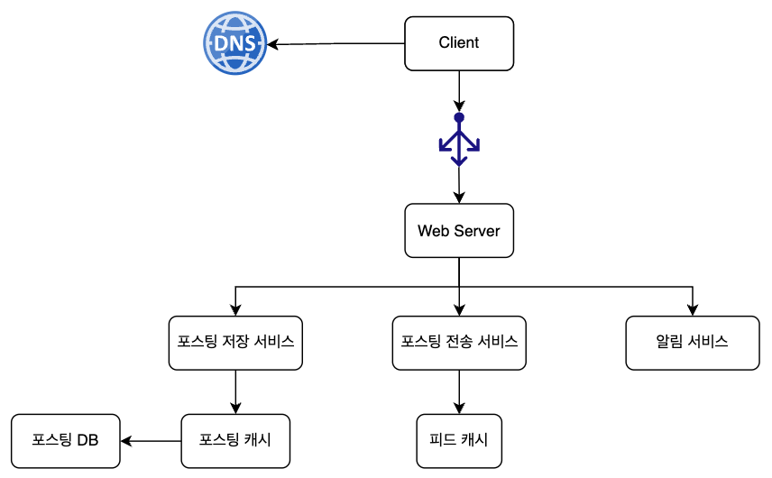
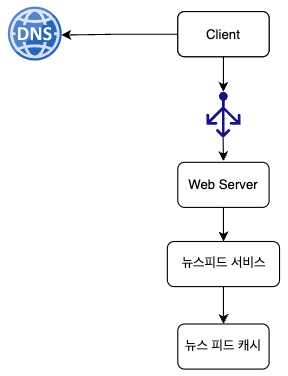
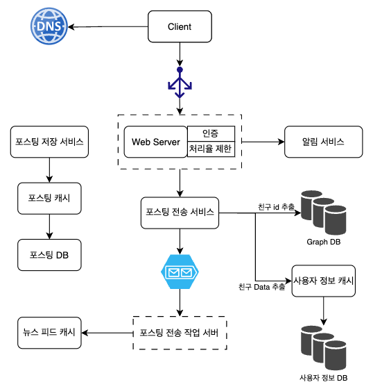
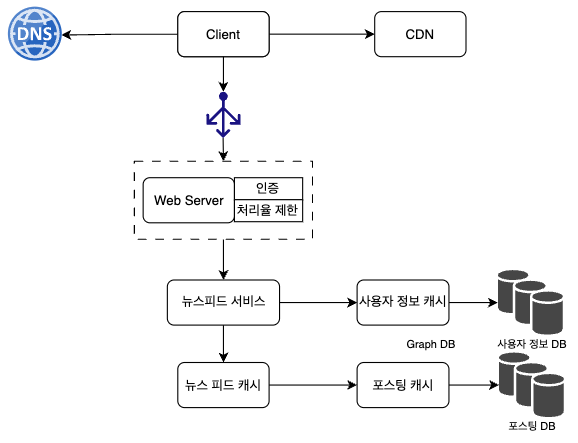

# 뉴스 피드 시스템

## 문제

### 뉴스 피드 시스템을 설계하라

# 1단계

## 할 수 있는 질문

    
펼쳐보기

1. 어떤 단말을 지원하는지?
2. 중요한 기능에는 무엇이 있는지?
3. 뉴스 피드는 어떤 순서로 스토리가 표시돼야 하는지?
4. 최대 몇 명의 친구를 가질 수 있는지?
5. 트래픽 규모는 어느 정도인지?
6. 피드에 미디어 파일을 포함해 올릴 수 있는지?

## 면접관의 답변 예시

    
펼쳐보기

1. 모바일과 웹
2. 뉴스피드 페이지에 새로운 스토리를 올리는 기능과 친구들이 올리는 스토리를 보는 기능
3. 시간 흐름 역순으로 정렬
4. 5000명
5. DAU 1,000만
6. 미디어 파일 포함 가능

# 2단계

- 피드 발행
- 뉴스 피드 생성

## 뉴스 피드 API

### 피드 발생 API

- 새 스토리를 발행하기 위한 API
- POST /v1/me/feed
- 인자
  - Body: 포스팅 내용
  - Authorization: 인증 헤더

### 피드 읽기 API

- 뉴스 피드를 가져오는 API
- GET /v1/me/feed
- 인자
  - Authorization: 인증 헤더

## 피드 발행

 

- 사용자
  - POST /v1/me/feed 요청을 보냄
- 로드 벨런서
  - 트래픽을 웹 서버로 분산
- 웹 서버
  - HTTP 요청을 내부 서비스로 중계
- 포스팅 저장 서비스
  - 새 포스팅을 DB와 캐시에 저장
- 포스팅 전송 서비스
  - 새 포스팅을 친구의 뉴스 피드에 push
- 알림 서비스
  - 친구들에게 새 포스팅이 올라왔음을 알리거나 푸시 알림을 보냄

## 뉴스 피드 생성

 

- 사용자
  - GET /v1/me/feed 호출
- 로드 밸런서
  - 트래픽을 웹 서버로 분산
- 뉴스 피드 서비스
  - 캐시에서 뉴스 피드를 가져오는 서비스
- 뉴스 피드 캐시
  - 뉴스 피드를 랜더링할 때 필요한 피드 ID를 보관

# 3단계

## 피드 발행 흐름 상세 설계

 

### 웹 서버

- 인증이나 처리율 제한 기능 수행

### 포스팅 전송(팬아웃) 서비스

- 쓰기 시점에 팬아웃 (`Push`)
  - 장점
    - 뉴스피드 실시간 갱신
    - 친구들에게 즉시 전송
    - 새 포스팅이 기록되는 순간 갱신되므로, 뉴스 피드 read가 빠름
  - 단점
    - 핫키: 친구가 많을 경우, 뉴스 피드 갱신에 많은 시간 소요
    - 서비스를 자주 이용하지 않는 사용자의 피드도 갱신해야 함
- 읽기 시점에 팬아웃 (`Pull`)
  - 장점
    - 비활성화 된 사용자 등의 뉴스피드 갱신을 하지 않음
    - 핫키 문제도 발생하지 않음
  - 단점
    - 뉴스 피드를 읽는 데 많은 시간 소요
- 두 모델 결합
  - 대부분의 사용자에겐 `Push Model`
  - 팔로워가 많은 사용자에겐 `Pull Model`

## 피드 읽기 흐름 상세 설계

 

1. 사용자가 뉴스피드 읽기 요청을 보냄
2. 로드벨런서가 요청을 웹 서버 가운데 하나로 보냄
3. 웹 서버는 뉴스 피드 서비스 호출
4. 뉴스 피드 서비스는 뉴스 피드 캐시를 통해 `포스팅 ID` 목록을 가져옴
5. 사용자 캐시와 포스팅 캐시를 가져와 뉴스 피드 생성
6. 생성된 뉴스 피드를 리턴

# 4단계

## 논의해볼 점

- DB 규모 확장
  - 샤딩과 레플리케이션
  - SQL vs NoSQL
  - 일관성 모델
- 메시지 큐를 활용한 결합도 낮추기
- 핵심 메트릭 모니터링
