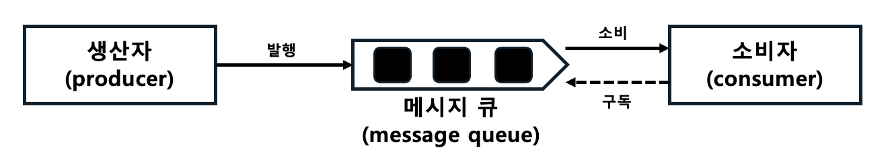

# 메시지 큐

- 자료구조 중 `Queue`를 채택하여 메세지를 전달하는, `메세지 지향 미들웨어`를 구현한 시스템
- 메시지의 무손실을 보장하는 비동기 통신 방식의 컴포넌트
- 서비스 또는 서버 간 결합이 느슨해짐
  - 메시지를 보내는 쪽과 받는 쪽이 독립적으로 동작할 수 있도록 해줌
  - 규모 확장성 보장

    

## 종류

### 1. RabbitMQ
   
- 특징
  - `AMQP`(Advanced Message Queuing Protocol) 기반
  - 다양한 프로토콜 지원
  - `안정적인 메시지` 전달 보장
  - 강력한 라우팅 기능(Direct, Topic, Fanout, Header) 등 제공
- 장점
  - 성숙한 커뮤니티와 플러그인 시스템
  - 메시지의 신뢰성 보장 기능이 뛰어남
  - 다양한 언어의 클라이언트 지원

### Apache Kafka

- 특징
  - 분산형 스트리밍 플랫폼으로, 대규모 데이터를 처리하도록 설계되었음
  - 동일 파티션 내 이벤트 처리 `순서 보장`
  - `적어도 한번 전송 방식`을 통한 멱등성 보장
  - 자연스러운 `백프레셔 핸들링`
    - 카프카의 클라이언트가 Pull 방식으로 동작
    - Push 방식은 브로커가 보내주는 속도에 의존하게 됨
  - 주로 로그와 같은 `대용량 이벤트 스트림 처리`에 탁월
  - `강력한 파티셔닝`을 통한 수평 확장
  - Pub/Sub 모델 지원
- 장점
  - 고성능의 처리 능력
  - `수평 확장`이 용이
  - 이벤트 소싱과 같은 이벤트 기반 아키텍처에 적합
  
### Amazon SQS (Simple Queue Service)

- 특징
  - AWS에서 제공하는 완전 관리형 메시지 큐 서비스
  - 서버리스 환경에서 `비용 효율적`으로 사용할 수 있음
  - 메시지 `순서가 중요하지 않은` 경우에 적합한 Standard Queue 제공
  - `순서와 중복 방지 보장`이 필요한 경우에 적합한 FIFO Queue 제공
- 장점
  - 관리가 간편하고 서버 없이 사용할 수 있음
  - AWS와의 통합 용이

### Redis Pub/Sub

- 특징
  - 인메모리 데이터 저장소인 Redis에서 제공하는 Pub/Sub 기능을 활용하여 메시지를 전달
  - 대기열이 아니라 메시지가 즉시 전송
  - 메시지 큐보다는 `실시간 데이터 전송`에 더 가까움
- 장점
  - 빠른 속도
  - 메시지 브로커와 캐싱을 동시에 수행 가능.
