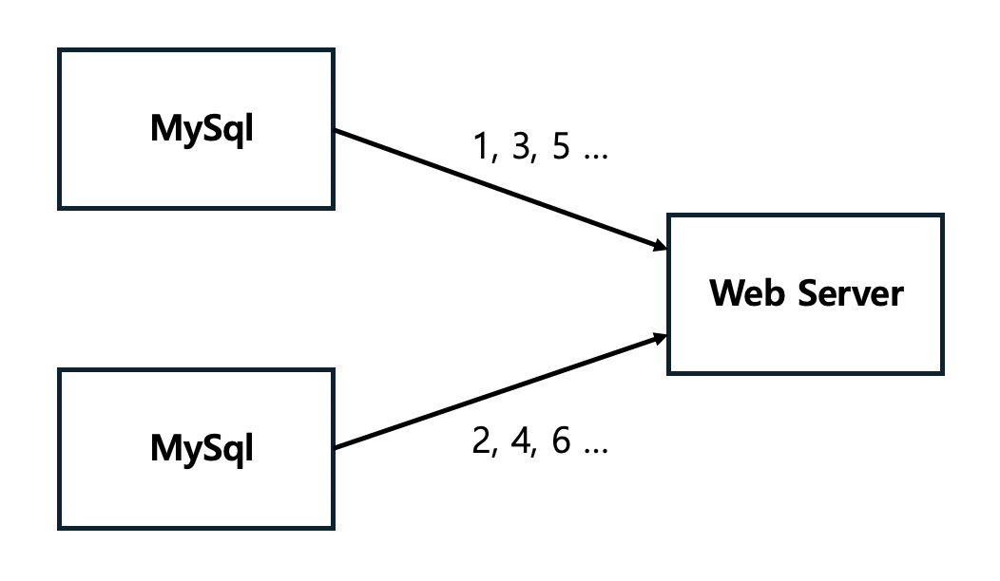
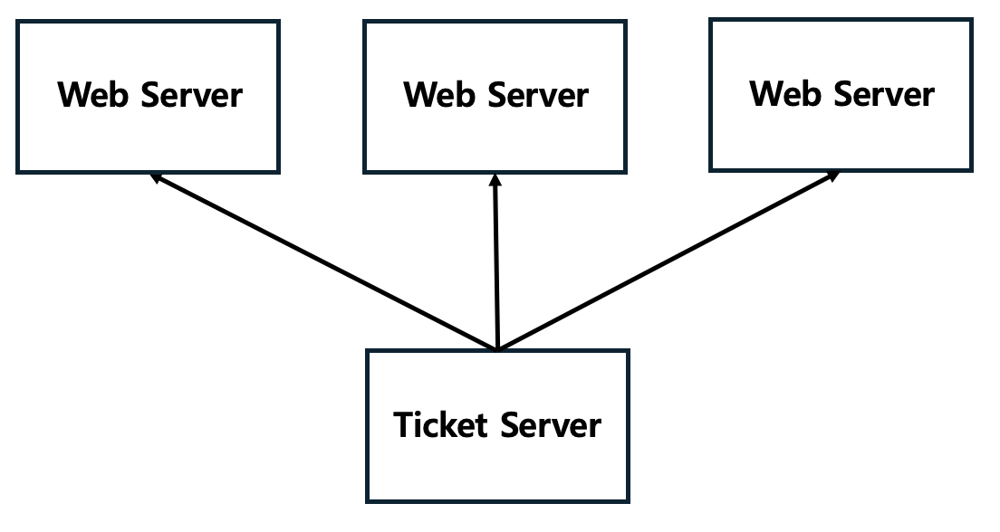

# 분산 시스템을 위한 유일 ID 생성기

## 문제

### 분산 시스템에서 사용될 유일 ID 생성기를 설계하라

- DB의 auto_increament 속성 사용?
- 여러 DB 서버를 쓰는 경우 지연 시간을 낮추기 힘듦

## 1단계

### 할 수 있는 질문

    
펼쳐보기

1. ID는 어떤 특성을 갖는지?
2. 새로운 레코드에 붙는 ID는 항상 이전보다 1만큼 큰 값인지?
3. 숫자로만 구성되는지?
4. 시스템 규모는 어느 정도인지?

### 면접관의 답변 예시

    
펼쳐보기

1. `유일`해야 하고, `정렬` 가능해야 함
2. 시간의 흐름에 따라 커지지만, 언제나 1만큼 증가하지는 않음
3. `숫자`로만
4. `초당 10,000` ID를 생성해야 함

### 답변으로 정리된 요구사항

    
펼쳐보기

1. ID는 유일해야 한다.
2. ID는 숫자로만 구성되어야 한다.
3. ID는 64비트로 표현할 수 있는 값이어야 한다.
4. ID는 발급 날짜에 따라 정렬 가능해야 한다.
5. 초당 10,000개의 ID를 만들 수 있어야 한다.

## 2단계

### 다중 마스터 복제

- DB의 `auto_increament` 활용
- 1이 아닌 `k`만큼 증가

    

#### 한계점

- 여러 데이터 센터에 걸쳐 규모를 늘리기 어려움
- ID의 유일성 보장, but 시간 흐름에 맞추어 커지도록 보장하기 힘듦
- 서버를 추가하거나 삭제할 때 잘 동작하게 만들기 어려움

### UUID

- 컴퓨터 시스템에 저장되는 정보를 유일하게 식별하기 위한 128비트짜리 수
- 충돌 가능성이 지극히 낮음
- 만드는 방법도 단순하고, 규모 확장도 쉬움

#### 한계점

- 길이가 64비트 이상임
- ID를 시간순으로 정렬하기 힘듦
- ID에 숫자가 아닌 문자가 포함될 수 있음

### 티켓 서버

- 티켓 서버(auto_increament 기능을 갖춘 DB 서버)를 중앙 집중형으로 하나만 사용
- `유일성`이 보장되는, 오직 `숫자`로만 수정된 ID 생성
- 구현이 쉽고, 중소 규모 애플리케이션에 적합

    

#### 한계점

- 티켓 서버가 `SPOF`가 됨
- 그렇다고 서버 여러 대를 구성하면 `동기화 문제` 발생

### 트위터 스노플레이크 접근법

    

- Sign
  - 음수, 양수 표시
  - 1비트 할당
- Timestamp
  - 기원 시각 이후 몇 밀리초가 경과됐는지
  - 41비트 할당
- 데이터 센터 ID
  - 5비트 할당
- 서버 ID
  - 5비트 할당
- 일련번호
  - 1ms 경과 시 0으로 초기화
  - 12비트 할당

## 3단계

### 타임스탬프

- 시간 정렬 가능
- 최대값: 2^41 - 1
- 최대 나타낼 수 있는 ms초: 69년
- overflow가 발생하는 시점에 기원 시각을 바꾸거나 ID 체계를 바꿔야 함

### 일련번호

- 총 4096개의 값 생성
- 한 서버에서 1ms 동안 4096개 이상의 데이터를 생성하는 것까지 감당함

## 4단계

- 시계 동기화
  - 한 서버의 여러 코어 또는 여러 서버일 경우 시계를 동기화 해야 한다.
- 각 절의 길이 최적화
  - 동시성이 낮다면 타임스탬프를 늘리고, 일련번호를 줄이자
- 고가용성
  - ID 생성기는 필수 불가결 컴포넌트이므로 고가용성을 제공해야 한다.
