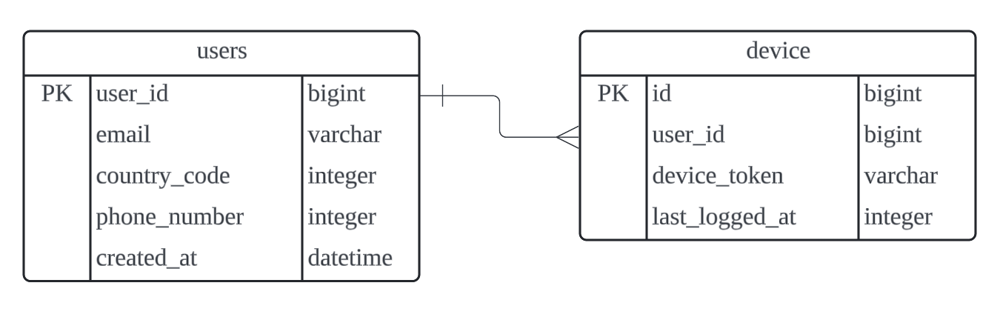
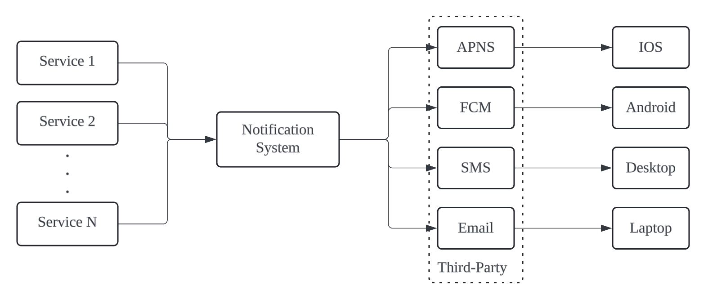
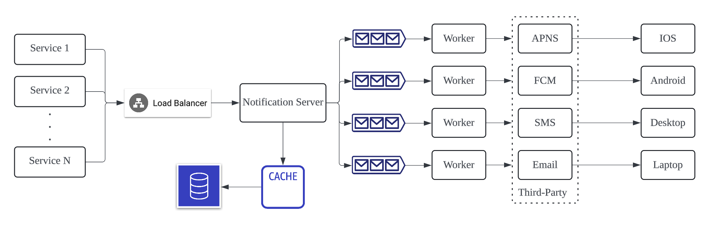
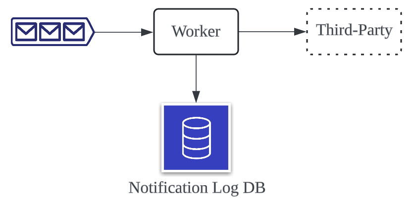
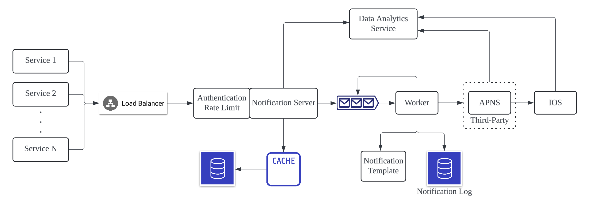

# 알림 시스템

## 문제

### 대규모 알림 시스템을 설계하라

## 1단계

### 할 수 있는 질문

    
펼쳐보기

1. 어떤 종류의 알림을 지원하는가?
2. Real-Time 시스템인가?
3. 어떤 종류의 단말을 지원하는가?
4. 사용자에게 보내는 알림은 누가 만드는가?
5. 알림에 대한 on/off 설정이 가능한가?
6. 하루에 몇 건의 알림을 보낼 수 있어야 하는가?

### 면접관의 답변 예시

    
펼쳐보기

1. Push 알림, SMS 메시지, 이메일
2. soft Real-Time (높은 부하 시, 약간의 지연 허용)
3. IOS, Android, Web
4. 클라이언트 애플리케이션 시스템 또는 서버 스케줄링
5. on/off 설정 가능
6. 모바일 Push 알림 1000만 건, SMS 100만 건, 이메일 500만 건

## 2단계

### 알림 유형별 지원 방안

- IOS 푸시 알림
  - 알림 제공자
    - 알림 요청을 만들어 ANPS로 보내는 주체
    - Device Token과 Payload를 포함
  - APNS
    - 애플이 제공하는 원격 서비스
  - IOS 단말
    - 푸시 알림을 수신하는 사용자 단말
- Android 푸시 알림
- SMS 메시지
- 이메일

### 연락처 정보 수집 절차

- Device Token, 전화번호, 이메일 주소 등의 정보 필요
- 앱을 설치하거나 계정 등록 시 사용자 정보 수집 및 DB에 저장

    

### 알림 전송 및 수신 절차 (초안)

- N개의 서비스
  - 알림 시스템을 이용할 여러 다양한 서비스
- 알림 시스템
  - 핵심 기능: 알림 전송 및 수신 처리
  - 서비스에게 알림 전송을 위한 API 제공
  - 알림 관련 서드파티에게 전달 할 알림 페이로드 생성
- 서드 파티 서비스
  - 사용자에게 실제로 알림을 전달
  - 확장성을 고려해야 함
    - 기존 서비스 제거 및 새로운 서비스 추가
  - 지역별 사용할 수 있는 서비스 제공
    - ex. 중국에서는 FCM을 사용할 수 없음
- 단말기

    

- SPOF (Single Point of Failure)
  - 알림 시스템이 다운되면 `전체 서비스의 장애`로 이어짐
- 규모 확장성
  - DB나 캐시 등 중요 컴포넌트를 `독립적으로 확장`하기 어려움
- 성능 병목
  - 알림은 자원이 많이 드는 작업
  - 트래픽이 몰리면 병목 발생

### 알림 전송 및 수신 절차 (개선)

- DB 분리
- 알림 서버에 대하여 `Scale Out`을 할 수 있는 환경 구성
- 메시지 큐를 통한 `강한 결합 제거`

    

## 3단계

### 안정성

- 데이터 손실 방지
  - 알림이 지연되거나 순서가 보장되지 않아도 됨
  - 손실이 있으면 안됨
  - 알림 관련 로그를 DB에 저장

    

- 알림 중복 전송 방지
  - 100% 보장은 어려움 
  - 알림이 도착하면 `이벤트 ID` 검사

### 추가 고려사항

- 알림 템플릿
  - 알림 내용을 템플릿화하여 관리
- 알림 설정
  - users table에 option 컬럼 구성
- 전송률 제한
  - 한 사용자가 받을 수 있는 알림 빈도 제한
- 재시도 방법
  - 알림 전송 실패 시 `재시도 전용 큐`에 push
  - 문제가 반복되면 개발자에게 `alert`
- 푸시 알림과 보안
  - Push 암호에 대한 보안 유지 필요
    - appKey
    - appSecret
    - Firebase에 대한 정보
  - 인증 및 승인된 클라이언트만 해당 API를 사용할 수 있게 제한
- 큐 모니터링
  - 메시지 큐에 쌓인 알림의 개수 모니터링
  - 너무 많은 알림이 쌓였다는건 빠르게 이벤트를 처리하지 못한다는 뜻
- 이벤트 추적
  - 알림 확인율, 클릭율, 실제 앱 사용으로 이루어지는 비율 등 매트릭 수

    

## 4단계

- 안정성
  - 메세지 전송 실패율을 낮추기 위해 안정적인 재시도 메커니즘을 도입하였다.
- 보안
  - 인증된 클라이언트만이 알림을 보낼 수 있도록 appKey, appSecret 등의 메커니즘을 이용하였다.
- 이벤트 추적 및 모니터링
  - 알림이 만들어진 후 성공적으로 전송되기까지의 과정을 추적하고 시스템 상태를 모니터링하기 위해 알림 전송의 각 단계마다 이벤트를 추적하고 모니터링할 수 있는 시스템을 통합하였다.
- 사용자 설정
  - 사용자가 알림 수신 설정을 조정할 수 있도록 하였다. 
  - 따라서 알림을 보내기 전 반드시 해당 설정을 확인하도록 시스템 설계를 변경하였다.
- 전송률 제한
  - 사용자에게 알림을 보내는 빈도를 제한할 수 있도록 하였다.
