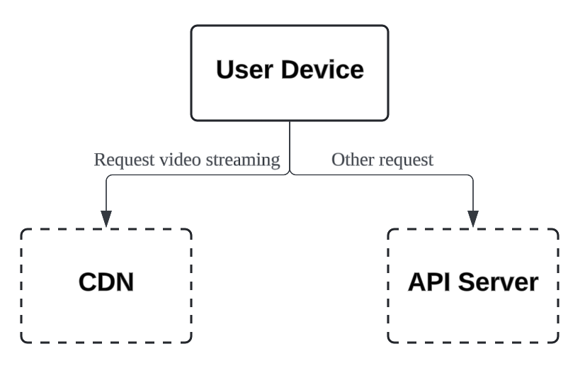
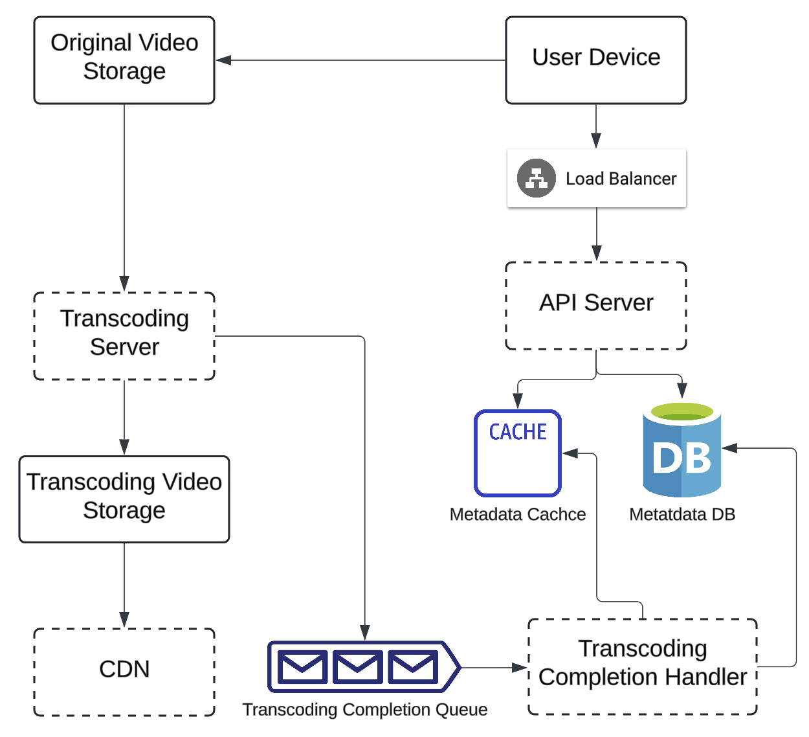
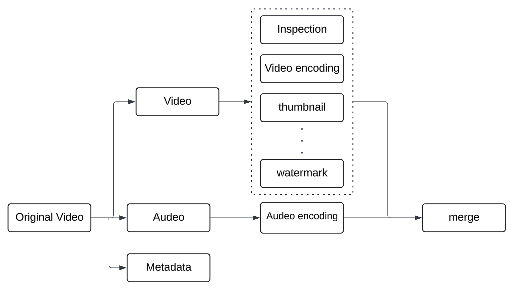
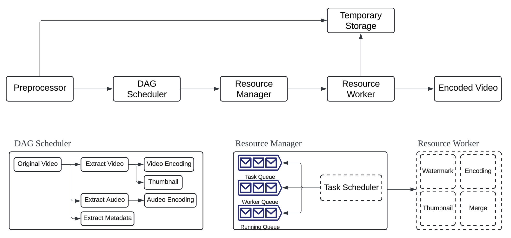

# 유튜브 시스템

## 문제

### 유튜브를 설계하라

### 유튜브 관련 통계자료 (2020)

    
펼쳐보기

- MAU: 20억 명
- 매일 재생되는 비디오 수: 50억 건
- 미국 성인 가운데 73% 유튜브 이용
- 크리에이터: 5천만 명
- 광고 수입(2019년 기준): 150억 달러 (2018년 대비 36% 증가)
- 모바일 인터넷 트래픽 가운데 37% 차지
- 80개 언어 지원

## 1단계

### 할 수 있는 질문

    
펼쳐보기

1. 어떤 기능이 메인 기능인지?
2. 어떤 클라이언트를 지원해야 하는지?
3. DAU는?
4. 사용자가 평균적으로 이 제품을 소비하는 시간은?
5. 다국어 지원
6. 어떤 비디오 해상도를 지원하는지?
7. 암호화가 필요한지?
8. 비디오 파일 크기의 제한은?
9. Cloud Service를 사용해도 되는지?

### 면접관의 답변 예시

    
펼쳐보기

1. 비디오를 올리는 기능과 시청하는 기능
2. 모바일 앱, 웹 브라우저, 스마트 TV
3. 5백만 명
4. 30분
5. 다국어 지원
6. 현존하는 비디오 종류와 해상도 대부분 지원
7. 암호화 필요
8. 최대 1GB
9. Cloud Service 사용 가능

### 기능 명세

    
펼쳐보기

1. 빠른 비디오 업로드
2. 원활한 비디오 재생
3. 재생 품질 선택 가능
4. 낮은 인프라 비용
5. 높은 가용성과 규모 확장성, 안정성
6. 지원 클라이언트: 모바일 앱, 웹 브라우저, 스마트 TV

### 개략적 규모 추정

    
펼쳐보기

- DAU: 5백만 명
- 한 사용자는 하루에 평균 `5개의 비디오` 시청
- 10% 사용자가 하루에 1 비디오 업로드
- 1개 비디오의 평균 크기: 300MB
- 비디오 저장 용량 = 5백만 x 0.1 x 300 = 150TB
- CDN 비용
  - Aws CloudFront: 0.02\$/GB
  - 5백만 x 5 video x 0.3GB x \$0.02 = \$150,000

## 2단계

    

- Blob 저장소 활용
- 단말
- 비디오를 CDN에 저장
- 비디오 스트리밍을 제외한 모든 요청을 API 서버가 처리

### 비디오 업로드 

    

- User
- Load Balancer
  - API 서버 각각으로 요청 분산
- API Server
  - 비디오 스트리밍을 제외한 다른 모든 요청 처리
- Metadata Database
  - 비디오 메타데이터 저장
  - 샤딩과 레플리케이션을 통해 성능 및 고가용성 보장
- Metadata Cache
  - 성능을 높이기 위해 `비디오 메타데이터`와 `User 객체` 캐싱
- Original Video Storage
  - 원본 비디오를 보관할 대형 이진 파일 저장소 (`Blob`)
- Transcoding Server
  - 비디오 인코딩 절차
  - 비디오의 포맷을 변환
  - 단말이나 대역폭 요구사항에 맞는 `최적의 비디오 스트림` 제공을 위해 필요
  - 트랜스코딩 완료 시 다음의 작업 `병렬적으로 실행`
    - 완료된 비디오를 Transcoding Video Storage에 `저장
    - `Transcoding Completion 이벤트`를 Transcoding Completion Queue에 추가
- Transcoding Video Storage
  - 트랜스코딩이 완료된 비디오 저장소 (`Blob`)
- CDN
  - 비디오 캐싱
  - User가 재생 버튼을 누르면 CDN을 통해 `비디오 스트리밍`
- Transcoding Completion Queue
  - 비디오 트랜스코딩 완료 이벤트를 보관
- Transcoding Completion Handler
  - Transcoding Completion Queue에서 `이벤트`를 꺼내 `메타데이터 캐시와 데이터베이스 갱신`

### 비디오 스트리밍 절차

- 재생 버튼을 누르면 원격지의 비디오로부터 지속적으로 `비디오 스트림`을 받아와 재생
- Streaming Protocol
  - `MPEG-DASH` (Moving Picture Experts Group - Dynamic Adaptive Streaming over HTTP)
    - Google
  - `HLS`
    - Apple
  - `Smooth Streaming`
    - Microsoft
  - `Adobe HTTP Dynamic Streaming`
    - Adobe
- 프로토콜마다 지원하는 `비디오 인코딩`과 `플레이어`가 다름

## 3단계

### 비디오 트랜스코딩

- 비디오를 녹화하면 단말기가 `특정 포맷`으로 저장
- 타 단말에서 순조롭게 재생하려면 서로 호환되는 `비트레이트`와 `포맷`으로 저장돼야 함
  - 비트레이트: 비디오를 구성하는 비트가 얼마나 빨리 처리돼야 하는지를 나타내는 단위
- 트랜스코딩은 다음과 같은 이유로 중요함
  - 원본 비디오는 `저장공간`을 많이 차지
  - 상당수의 단말과 브라우저는 특정 `비디오 포맷`만 지원
  - 사용자의 네트워크 대역폭을 고려하여 `저화질`과 `고화질`을 지원해야 함
  - 네트워크 상황의 변동을 고려하여 `비디오 화질 자동 변경이나 수동 변경` 지원
- 인코딩 포맷
  - `컨테이너`
    - 바디오 파일, 오디오, 메타데이트를 다음
  - `비디오 코덱`
    - 비디오 화질을 보전하면서 파일 크기를 줄일 목적으로 고안된 압축 및 압축 해제 알고리즘

### 유향 비순환 그래프(DAG) 모델

- 트랜스코딩은 컴퓨팅 자원 및 시간 소모가 큼
- 크리에이터는 각자 자기만의 `비디오 프로세싱 요구사항`을 갖음
  - 워터마크
  - 섬네일 이미지
  - 비디오 화질
- DAG가 이러한 요구사항을 해결
  - 유연성: 각기 다른 유형의 `비디오 프로세싱 파이프라인` 지원
  - 병렬성: 처리 과정의 병렬성을 높이기 위한 적절한 수준의 `추상화`

    

- 검사: 좋은 품질인지, 손상은 없는지
- 인코딩: 다양한 해상도, 코덱, 비트레이트 조합으로 인코딩
- 섬네일: 사용자가 업로드한 이미지 또는 비디오에서 자동 추출
- 워터마크: 비디오에 대한 식별정보를 이미지 위해 오버레이 형태로 표시

### 비디오 트랜스코딩 아키텍처

    

- 전처리기 (Preprocessor)
  - 비디오 분할
    - 비디오 스트림을 `GOP 단위로 쪼갬`
    - GOP: 특정 순서로 배열된 프레임 그룹
    - GOP 비디오 분할을 지원하지 않는 오래된 단말을 대신해 분할
  - DAG 생성
    - 프로그래머가 작성한 설정 파일에 따라 `DAG 생성`
  - 데이터 캐시
    - 전처리기 == 분할된 비디오의 캐시
    - 안정성을 높이기 위해 GOP와 메타데이터를 `임시 저장소에 보관`
    - 실패 시, 보관된 데이터를 활용해 인코딩 재개
- DAG 스케줄러
  - DAG 그래프를 몇 개 단계로 분할
  - 분할된 작업 각각을 자원 관리자의 `작업 큐에 삽입`
  - 위의 예시는 `두 단계`로 분리한 예시
- 자원 관리자 (Resource Manager)
  - `세 개의 큐`와 `작업 스케줄러`로 구성
    - `작업 스케줄러`는 `작업 큐`에서 작업을 가져와 `작업자`에게 할당
  - 자원 배분을 효과적으로 수행하는 역할
    - 작업 큐에서 `가장 높은 우선순위 작업을 꺼냄`
    - 해당 작업을 실행하기 적합한 `작업 서버를 고름`
    - 해당 작업 서버에게 `작업 실행을 지시`
    - `해당 작업이 어떤 서버에게 할당됐는지`에 대한 정보를 실행 큐에 삽입
    - 작업이 완료되면 해당 작업을 `실행 큐에서 제거`
  - Queue 구성
    - 작업 큐: `실행할 작업`이 보관돼 있는 Priority Queue
    - 작업 서버 큐: `작업 서버의 가용 상태 정보`가 보관돼 있는 Priority Queue
    - 실행 큐: `현재 실행 중인 작업` 및 `작업 서버 정보`가 보관돼 있는 Queue
  - 작업 스케줄러
    - 최적의 작업/서버 조합을 골라, 해당 작업 서버가 작업을 수행하도록 지시하는 역할
- 작업 서버 (Worker)
  - DAG에 정의된 작업 수행
- 임시 저장소 (Temporary Storage)
  - Blob 저장소에 저장하기
  - 임시 저장소에 보관한 데이터는 `비디오 프로세싱 후 삭제`
- 인코딩 된 비디오 (Encoded Video)
  - 인코딩 파이프라인의 최종 결과물

### 시스템 최적화

- 속도 최적화: 비디오 `병렬 업로드`
  - 비디오를 작은 GOP들로 분할해 병렬로 업로드
  - 일부가 실패해도 빠르게 업로드 재개 가능
- 속도 최적화: 업로드 센터를 `사용자 근거리`에 지정
  - 업로드 센터를 여러 지역에 둠
  - CDN을 업로드 센터로 이용
- 속도 최적화: 모든 절차를 `병렬화`
  - 메시지 큐를 도입하여 시스템 결합도를 낮춤
  - 각 단계를 병렬로 실행
- 안전성 최적화: `Presigned Url`
  - 허가된 사용자만이 올바른 장소에 비디오를 업로드 할 수 있도록 함
  - Presigned Url을 이용해 업로드 센터에 비디오를 업로드
- 안전성 최적화: `비디오 보호`
  - 디지털 저작권 관리 (DRM) 기술을 이용해 비디오 보호
  - AES 암호화
  - 워터마크 활용
- `비용 최적화`
  - 비디오 스트리밍을 위한 CDN 사용
  - CDN 비용을 줄이기 위해 `비디오 캐싱`을 활용
  - 인기 비디오는 `CDN에 캐싱`, 다른 비디오는 비디오 서버 이용
  - 직접 CDN을 구축하고 ISP(Internet Service Provider)와 제휴

### 오류 처리

- 회복 가능 오류
  - 특정 비디오 세그먼트에 대한 트랜스코딩 실패
- 회복 불가능 오류
  - 잘못된 비디오 포멧
- 요약
  - 업로드 오류: 몇 회 재시도
  - 비디오 분할 오류: 오래된 클라이언트라면 전체 비디오를 서버로 보내 전처리
  - 트랜스코딩 오류: 몇회 재시도
  - 전처리 오류: DAG 그래프 재생성
  - DAG 스케줄러 오류: 작업을 다시 스케줄링
  - 자원 관리자 큐에 장애 발생: 사본 이용
  - 작업 서버 장애: 다른 서버에서 해당 작업 재시도
  - API 서버 장에: 다른 API 서버로 요청 우회
  - 메타데이터 캐시 서버 장애: 다른 노드에서 데이터 가져오기
  - 메타데이터 데이터베이스 서버 장애: 사본 이용

## 4단계

- API 계층의 규모 확장성 확보 방안
  - API 서버의 수평 확장
- DB 계층의 규모 확장성 확보 방안
  - 샤딩과 레플리케이션
- 라이브 스트리밍
  - 응답지연이 더 낮아야 함
  - 병렬화 필요성이 떨어짐 (작은 단위의 데이터를 실시간으로 처리해야 함)
  - 오류 처리가 너무 오래 걸리면 안됨
- 비디오 삭제
  - 저작권, 불법 콘텐츠, 사용자 요청 등의 이유로 비디오 삭제 필요
