# 채팅 시스템

## 문제

### 채팅 시스템을 설계하라

## 1단계

### 할 수 있는 질문

    
펼쳐보기

1. 1:1 채팅 앱인지, 그룹 채팅 앱인지?
2. 어떤 디바이스를 지원하는지?
3. 처리해야 하는 트래픽의 규모는?
4. 그룹 채팅방의 인원 제한은?
5. 중요 기능은?
6. 채팅 메시지의 길이 제한은?
7. 종단 간 암호화가 필요한지?
8. 채팅 이력은 얼마나 오래 저장해야 하는지?

### 면접관의 답변 예시

    
펼쳐보기

1. 둘다 지원
2. 모바일, 웹 둘다 지원
3. DAU 기준 5천만 명 처리
4. 100명
5. 1:1 채팅, 그룹 채팅, 사용자 접속상태 표시 지원 / 텍스트 채팅만 가능
6. 100,000자
7. 필요없음
8. 영구 저장

### 답변으로 정리된 요구사항

    
펼쳐보기

1. 응답지연이 낮은 일대일 채팅 기능
2. 최대 100명까지 참여 가능한 그룹 채팅 기능
3. 사용자의 접속상태 표시 기능
4. 다양한 단말 지원
5. 푸시 알림

## 2단계

### 채팅 서비스에 필요한 기능

- Client들로부터 메시지 수신
- 메시지 수진자 결정 및 전달
- 수신자가 접속상태가 아닌 경우 해당 메시지 보관

### HTTP

    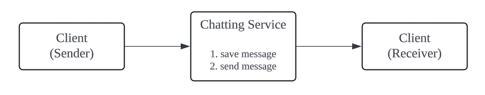

- 채팅을 시작하려는 클라이언트는 `네트워크 통신 프로토콜`을 사용하여 서비스에 접속
- 페이스북 등의 서비스는 초기에 `HTTP 프로토콜` 사용
  - 채팅 서비스에 HTTP 프로토콜로 연결한 다음, 메시지를 보내어 수신자에게 해당 메시지를 전달하라고 알림
- `keep-alive` 헤더 사용
  - 클라이언트와 서버 간의 연결을 계속 유지
  - hand-shake 횟수를 줄일 수 있음
- 단점
  - HTTP는 클라이언트가 연결을 만드는 프로토콜
  - 서버에서 클라이언트로 임의 시점에 메시지를 보내는게 어려움

### Polling

    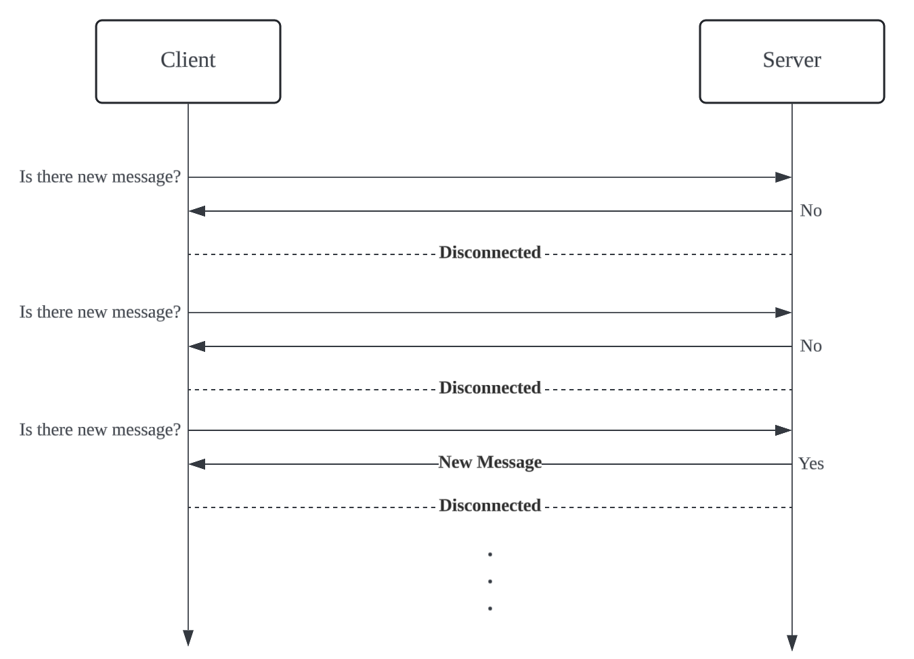

- 클라이언트가 주기적으로 서버에게 새 메시지가 있는지 물어보는 방법
- 폴링 비용과 폴링 주기는 반비례 관계
- 단점
  - 서버에게 불필요한 요청을 보냄
  - 실시간성이 떨어짐

### Long Polling

    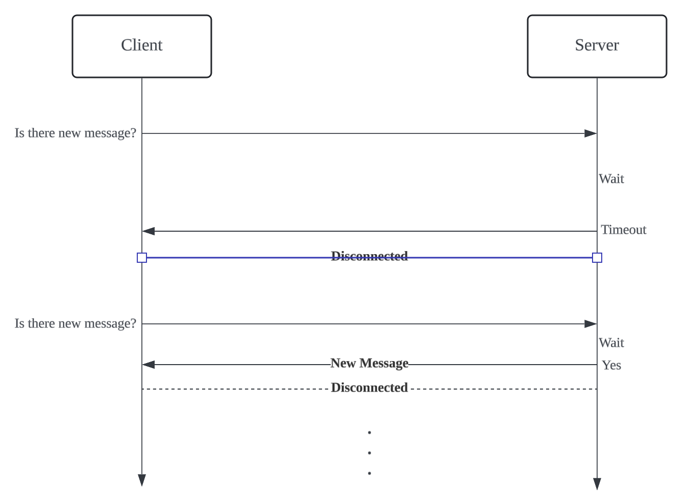

- 클라이언트는 새 메시지가 반환되거나 타임아웃 될 때까지 연결 유지
- 단점
  - Sender와 Receiver가 같은 채팅 서버에 접속하게 되지 않을 경우
    - Sender는 메시지 송신
    - Receiver는 해당 서버와 Long Polling 연결이 돼있지 않음
  - 서버 입장에서 클라이언트의 연결에 대한 정보를 알 방법이 없음
  - 여전히 비욜적
    - 타임아웃이 발생할 때마다 다시 서버에 접속해야 함

### Websocket (✓)

    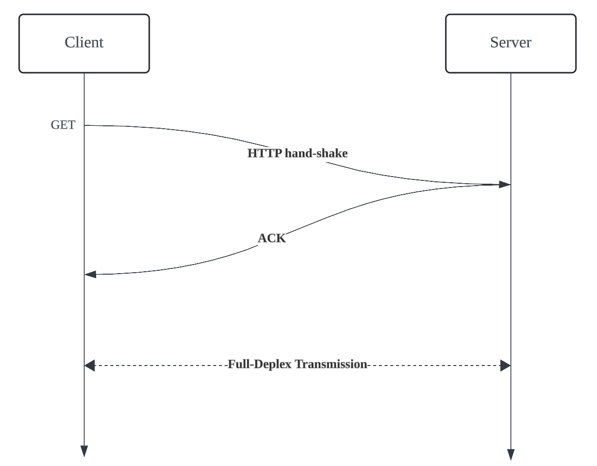

- 서버가 클라이언트에게 비동기 메시지를 보낼 때 가장 널리 사용하는 기술
- `양방향 통신`
- 최초 접속 시엔 HTTP 프로토콜 (HTTP Header 사용)
- 웹소켓을 위한 별도의 포트는 없고, `기존 포트를 사용`(80, 443)
  - 방화벽이 있는 환경에서도 잘 동작
- 프레임으로 구성된 `메시지`라는 논리적 단위로 송수신
  - 메시지에 포함될 수 있는 교환 가능한 메시지: `텍스트`와 `바이너리`
- 설계뿐 아니라 구현도 단순 및 직관적

### 개략적 설계안

- 무상태 서비스
  - 로그인, 회원가입, 사용자 프로필 표시 등을 처리
  - 로드밸런스 뒤에 위치 
    - 특정 서비스로 라우팅 될 수 있게 설계가 필요
    - `서비스 탐색` 서비스 (클라이언트가 접속할 `채팅 서버의 DNS 호스트명`을 클라이언트에게 알려줌)
- 상태 유지 서비스
  - 채팅 서비스
  - 각 클라이언트가 채팅 서버와 독립적인 네트워크 연결 유지
  - `서비스 탐색` 서비스와 협력
    - 특정 서버로 부하가 몰리지 않게 적절하게 분배
- 제 3자 연동 서비스
  - 푸시알람 서비스와 연동
- 규모 확장성
  - 서버 한대로 모든 연결을 처리하면 확장 및 SPOF 문제가 발생함

    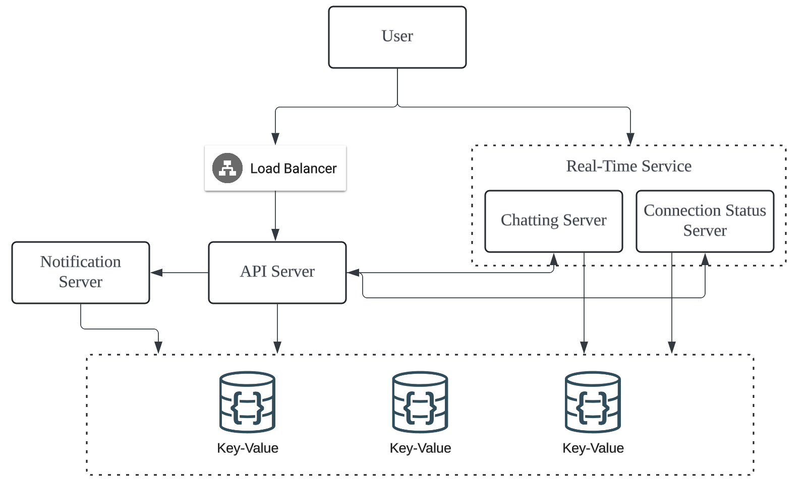

- 채팅 서버
  - 클라이언트 사이에 메시지를 중계하는 역할
- 접속 상태 서버
  - 사용자의 접속 여부 관리
- API 서버
  - 로그인, 회원가입, 프로필 변경 등 그 외 나머지 전부 처리
- 알림 서버
  - 푸시 알림 전송
- 키-값 저장소
  - 채팅 이력 보관

### DB는 무엇을 쓸 것인가?

- 일반 데이터
  - 사용자 프로필, 설정, 친구 목록 등
  - 안정성을 보장하는 `RDB`
  - 확장 시에는 샤딩이나 레플리케이션을 고려
- 채팅 이력
  - 많은 데이터 양
  - 비교적 최근 데이터만 조회
  - 무작위 조회도 있음
  - 읽기:쓰기 비율이 `1:1`
  - 읽기 지연시간이 낮은 `NoSQL`의 `Key-Value 모델`이 적합
  - Discord → `Cassandra` 
  - Facebook → `HBase`

### 데이터 모델

- 1:1 채팅과 그룹 채팅을 위한 메시지 테이블

    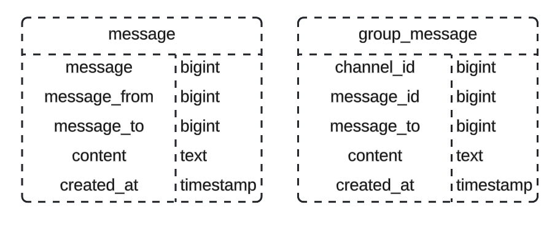

- 1:1 채팅
  - message_id가 PK
- 그룹 채팅
  - channel_id와 message_id가 PK (`복합키`)
  - channel_id는 `파티션 키`로도 사용 가능
- message_id
  - 메시지 식별자
  - 정렬 가능해야 하며, 시간 순서와 일치해야 함
  - 전역 ID 생성기 사용
    - [Snowflake](https://github.com/lcomment/development-recipes/blob/main/System%20Design/분산_시스템을_위한_유일_ID_생성기.md)
  - `지역적 순서 번호 생성기` 사용
    - 같은 채팅 세션 안에서만 순서가 보장되면 됨
    - 전역 ID 생성기보다 구현하기 쉬움

## 3단계

### 서비스 탐색

- Client에게 가장 적합한 채팅 서버를 추천
  - Client의 위치
  - 서버의 용량
- `Apache Zookeeper`를 활용하여 구현
  - 사용 가능한 모든 채팅 서버를 등록
  - 사전에 정한 기준에 따라 `최적의 채팅 서버` 추천

    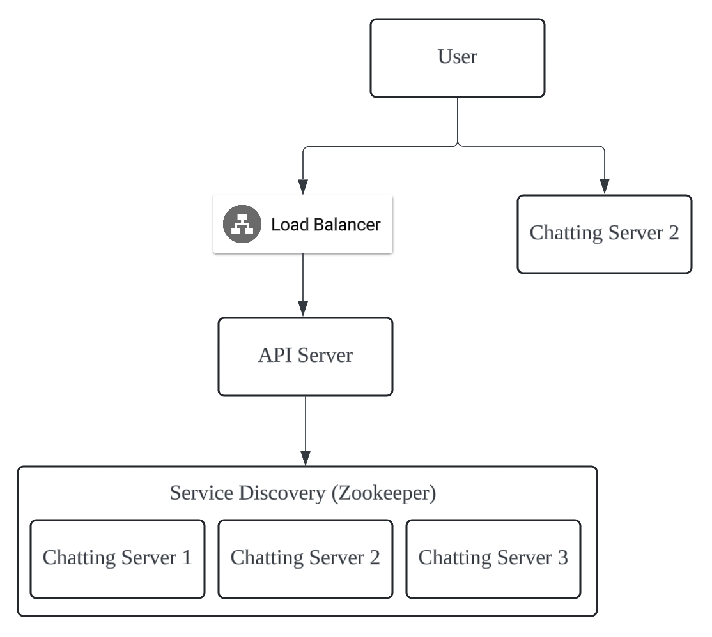

1. 사용자가 시스템에 로그인
2. 로드 밸런서가 로그인 요청을 API 서버로 전달
3. API 서버가 인증 처리
4. 서비스 탐색 기능이 동작하여 최적의 채팅 서버 추천 (채팅 서버2 ✓)
5. 사용자는 채팅 서버2와 WebSocket 연결

### 1:1 채팅 메시지 처리 흐름

    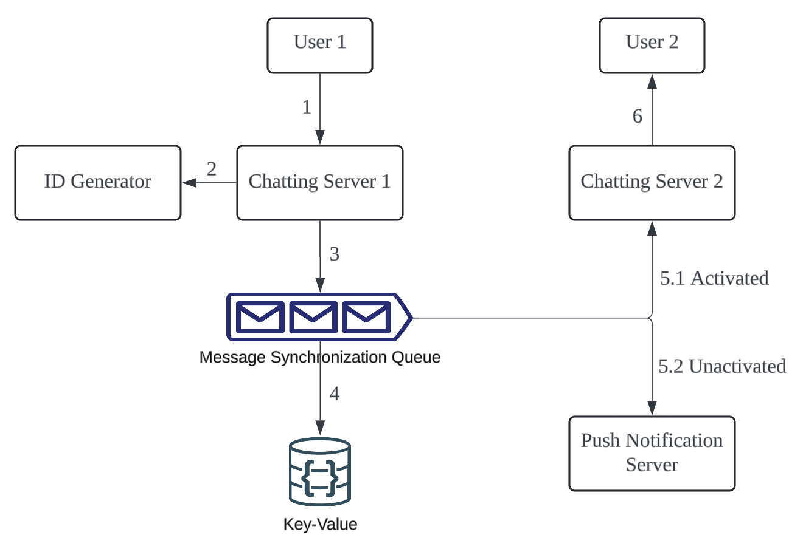

### 여러 단말 사이의 메시지 동기화

    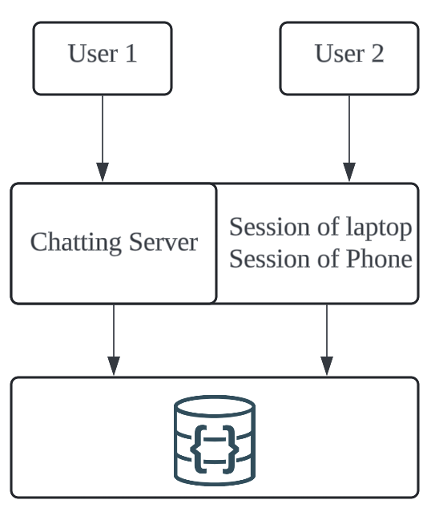

- `cur_max_message_id`
  - 각 단말마다 가지는 변수
  - 해당 단말에서 관측된 `가장 최신 메시지의 ID`를 추적
- 새로운 메시지 조건
  - Key-Value 저장소에 저장된 메시지
  - 수신자 ID == 현재 로그인 한 사용자 ID
  - message_id > cur_max_message_id

### 소규모 그룹 채팅에서의 메시지 흐름

    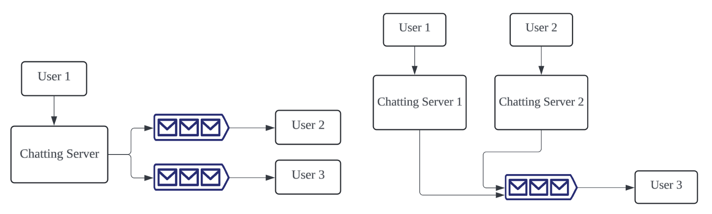
    좌: Sender 관점, 우: Receiver 관점

- User1이 보낸 메시지가 User2, User3의 `메시지 동기화 큐`에 복사
- `소규모 그룹 채팅`에 적합
  - 새 메시지가 왔는지 확인하려면 해당 사용자의 큐만 보면 됨
  - 소그룹일 경우 메시지를 수신자 별로 복사하여 큐에 넣는 작업 비용이 문제가 되지 않음
- WeChat은 위와 같은 접근법 사용
  - 그룹의 크기를 500명으로 제한

### 접속상태 표시

- 접속상태 서버는 Client와 WebSocket으로 통신하는 `Real-Time 시스템`의 일부
- 사용자 로그인
  - WebSocket 연결 시 Client의 상태(`Activated`)와 `last_active_at`를 Key-Value 저장소에 저장 
- 사용자 로그아웃
  - WebSocket 연결 종료 시 상태를 `Unactivated`로 변경
- 접속 장애
  - 네트워크가 끊어지면 WebSocket 연결도 끊어짐
  - 수시로 접속상태를 변경하는건 `UX`에 좋지 않음
  - `Heartbeat 검사`를 통해 문제 해결 
  - 마지막 박동 이벤트를 받은지 n초 이내에 다음 박동 이벤트를 받지 못하면 접속상태를 `Unactivated`로 변경

### 상태 정보의 전송

    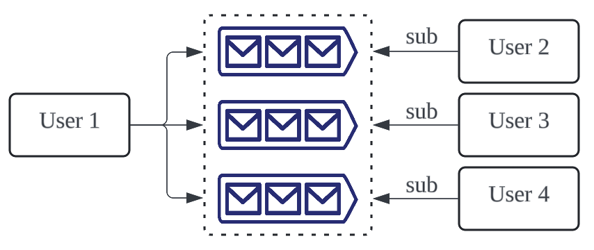

- 상태 정보 서버는 `Publish-Subscribe Model` 사용

## 4단계

### 더 논의해 볼 내용

    
펼쳐보기

- 미디어도 지원해보자
  - 압축방식
  - 클라우드 저장소
  - 섬네일 생성
- 종단 간 암호화
  - AES 암호화(?)
- 캐시
  - 이미 읽은 메시지 캐싱
  - 서버와 주고받는 데이터 양 감소
- 로딩 속도 개선
  - Slack은 유저의 데이터, 채널 등을 지역적으로 `분산`하는 네트워크를 구축
- 오류 처리
  - 채팅 서버 오류
    - 채팅 서버가 죽으면 `Service Discovery Service`가 새로운 서버 배정
  - 메시지 재전송
    - `재시도`나 `큐` 활용

