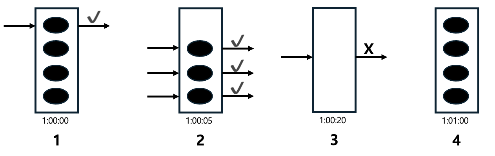
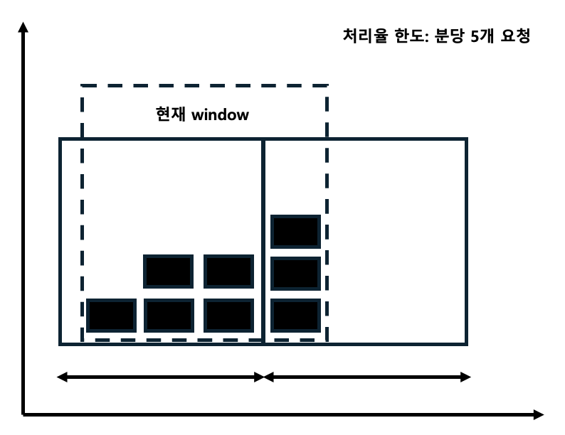
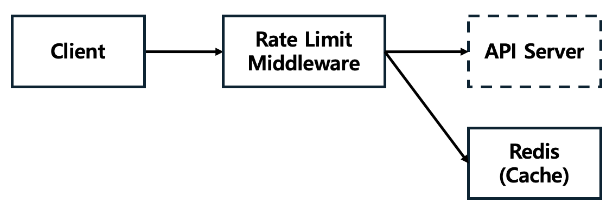

# 처리율 제한 장치

## 문제

### Rate Limiter를 설계하라

## 1단계

### 할 수 있는 질문

    
펼쳐보기

1. 어떤 종류의 처리율 제한 장치인지?
2. 어떤 기준을 사용해서 API 호출을 제어해야 하는지? (IP, 사용자 ID)
3. 시스템의 규모는 어느 정도인지?
4. 분산 환경인지?
5. 독립된 서비스인지, 애플리케이션의 코드인지?
6. 사용자의 요청이 처리율 제한 장치에 의해 걸러진 경우, 사용자에게 알려야 하는지?

### 면접관의 답변 예시

    
펼쳐보기

1. 서버 측 API를 위한 처리율 제한 장치
2. 다양한 형태의 제어 규칙을 가진 유연한 시스템
3. 대규모 요청 처리할 정도의 규모
4. 분산 환경
5. 면접자 재량으로 결정
6. 알려야 함

### 요구사항 정리

    
펼쳐보기

- 설정된 처리율을 초과하는 요청 제한
- 낮은 응답시간
- 가능한 한 적은 메모리 사용
- 분산형 처리율 제한 (하나의 장치를 여러 서버나 프로세스가 공유)
- 예외 처리 (요청 제한 시 사용자에게 알려야 함)
- 높은 결함 감내성 (제한 장치의 장애가 전체 시스템에 전파되면 안됨)

## 2단계

### Rate Limiter의 위치

- 클라이언트
  - 위변조가 가능하여 권장하지 않음
- 서버 측
  - 서버 내부 또는 미들웨어에 위치
  - MSA인 경우, API Gateway에 구현

### 점검사항

- 현재 기술 스택 점검
  - 현재 사용 언어가 서버 측 구현을 지원하기 충분할 정도로 효율이 높은지 확인
- 사업 필요에 맞는 `처리율 제한 알고리즘` 사용
  - 직접 구현 → 자유롭게 선택
  - 서드파티가 제공하는 Gateway 활용 → 선택이 제한
- 직접 구현할 인력 및 여유가 없다면 상용 솔루션 사용

### 알고리즘: 토큰 버킷 알고리즘

    

1. 토큰 4개로 시작, 요청이 들어와서 토큰 1개 소비
2. 요청 3개가 들어와서 토큰 3개 소비
3. 요청이 들어왔는데 토큰이 없어서 요청이 버려짐
4. 1분이 지나 토큰이 다시 공급됨

- aws와 스트라이프에서 활용
- 장점
  - 구현이 쉬움
  - 메모리 사용 측면에서 효율적
  - 짧은 시간 집중되는 트래픽 처리 가능
- 단점
  - 버킷 크기와 토큰 공급률, 두 인자를 적절히 튜닝하기가 까다로움

### 알고리즘: 누출 버킷 알고리즘

1. 요청이 도착하면 큐가 가득 차 있는지 체크
2. 빈 자리가 있으면 큐에 요청 추가
3. 가득 찬 경우 요청을 버림
4. 지정된 시간마다 큐에서 요청을 꺼내어 처리

- 사용하는 인자
  - 버킷 크기: 큐 사이즈와 같음
  - 처리율: 지정된 시간당 몇개의 항목을 처리할지 지정
- 장점
  - 큐의 크기가 제한돼 메모리 사용량 측면에서 효율적
  - 고정된 처리율로 인한 안정적 출력
- 단점
  - 트래픽이 한번에 몰리면 최신 요청들이 버려짐
  - 인자가 2개라 튜닝이 까다로움

### 알고리즘: 고정 윈도 카운터 알고리즘

1. 타임라인을 고정된 간격의 window로 나누고, 각 window마다 counter를 붙임
2. 요청이 접수될 때마다 카운터의 값을 1씩 증가시킴
3. 카운터의 값이 임계치에 도달하면 새로운 요청은 새 윈도가 열릴 떄까지 버려짐

- 장점
  - 메모리 효율이 좋음
  - 이해하기 쉬움
  - window가 닫히는 시점에 카운터 초기화 → 특정한 트래픽 패턴 처리에 적합
- 단점
  - window 경계 부근에 트래픽이 몰리면 기대했던 임계치보다 많은 양의 요청을 처리하게 됨

### 알고리즘: 이동 윈도 로깅 알고리즘

1. 요청의 timestamp 추적 (데이터는 레디스 sorted set 등에 저장)
2. 요청이 오면 만료된(현재 window의 시작 시점보다 오래된) timestamp 제거
3. 새 요청의 timestamp에 로그 추가
4. 로그의 크기가 허용치보다 같거나 작으면 요청이 시스템에 전달됨
5. 그렇지 않으면 요청을 버림

- 장점
  - 매우 정교 (정확)
- 단점
  - 다량의 메모리를 사용 (거부된 요청의 timestamp도 보관)

### 알고리즘: 이동 원도 카운터 알고리즘

- 현재 1분간의 요청 수 + 직전 1분간의 요청 수 x 이동 window와 직전 1분이 겹치는 비율
- 3 + 5 x 70% = 6.5개

- 장점 
  - 이전 시간대의 평균 처리율에 따라 현재 window 상태를 계산
    - 짧은 시간에 몰리는 트래픽에 대해 잘 대응
  - 메모리 효율이 좋음
- 단점
  - 직전 시간대에 도착한 요청이 균등히 분포돼 있을 때 다소 느슨

### 아키텍처

- 클라이언트가 처리율 제한 미들웨어로 요청을 보냄
- 처리율 제한 미들웨어가 Redis의 지정 버킷에서 카운터를 가져와 한도 체크
- 한도에 도달했으면 요청 거부
- 도달하지 않았으면 API 서버로 요청 전달 후 카운터 증가 및 Redis에 저장

## 3단계

### 아직 설계되지 않은 부분

- 처리율 제한 규칙은 어떻게 만들어지고, 어디에 저장되는가?
- 처리가 제한된 요청들은 어떻게 처리되는가?

### 처리율 제한 규칙

- 처리율 한도 초과 트래픽 처리
  - HTTP 429 응답 (Too many requests)
    - 어떤 요청이 한도 제한에 걸릴 때 응답
  - 경우에 따라서 한도 제한에 걸린 메시지를 나중에 처리하기 위해 큐에 보관
- 처리율 제한 장치가 사용하는 HTTP 헤더
  - 클라이언트가 자기 요청이 처리율 제한에 걸리고 있는지에 대한 정보를 아래 HTTP 헤더를 통해 전달
  - X-Ratelimit-Remaining: 윈도 내에 남은 처리 가능 요청의 수
  - X-Ratelimit-Limit: 매 윈도마다 클라이언트가 전송할 수 있는 요청의 수
  - X-Ratelimit-Retry-After: 한도 제한에 걸리지 않으려면 몇 초 뒤에 요청을 다시 보내야 하는지 알림

### 상세 설계

### 경쟁조건

- 경쟁 이슈가 발생하는 동작
  - 레디스에서 카운터의 값을 읽음
  - counter + 1 의 값이 임계치를 넘는지 확인
  - 넘지 않는다면 레디스에 보관된 카운터 값을 1만큼 증가
- 솔루션
  - Lua 스크립트 활용
  - Lock 활용
  - Sorted Set 활용

### 동기화 이슈

- 이슈
  - 여러대의 처리율 제한 장치를 사용할 경우 요창이 분산될 수 있다.
- 솔루션 
  - Sticky session 활용

### 성능 최적화

- 지연시간을 줄이기 위해 사용자의 트래픽을 가장 가까운 Edge Server로 전달
