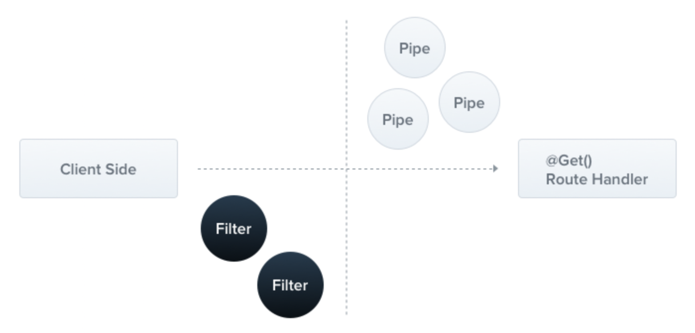

## **Exception filter란?**

&nbsp; Nest는 애플리케이션의 핸들링되지 않은 에러 처리를 위해 내장 **`Exception Layer`** 를 제공한다. 애플리케이션 코드에 의해 예외가 처리되지 않았을 때, 이 계층에서 그 예외를 잡아낸 후 자동으로 적절한 응답을 보내준다.

<p align=center></p>

&nbsp; 이 동작은 별도의 설치나 구성 없이 내장 `Global Exception Filter`에 의해 수행되는데, 이 Exception Filter는 `HttpException` 타입의 예외들을 처리한다. 예외가 `HttpException`이나 `HttpException`으로부터 상속되지 않은 클래스인 `unrecognized`인 경우, Exception Filter는 다음과 같은 defalut JSON response를 생성한다.

```json
{
  "statusCode": 500,
  "message": "Internal server error"
}
```

</br>

## **Throwing standard exceptions**

&nbsp; Nest는 `@nestjs/common`에서 공개된 내장 `HttpException`클래스를 제공한다. 일반적인 HTTP REST/GraphQL API 기반 애플리케이션에서 특정 에러 상황이 발생했을 때 표준 HTTP 응답 객체를 보내주는 것이 가장 좋다.

```typescript
// users.controller.ts
@Get(':id')
async getUser(@Param('id') id: number) {
    throw new HttpException('NotFound', HttpStatus.NOT_FOUND);
}
```

&nbsp; HttpException 말고도 `HttpException`을 상속받는 여러 표준 예외도 제공한다. 이 예외들도 모두 `@nestjs/common`에서 공개된다.

- `BadRequestException` : 400
- `UnauthorrizedException` : 401
- `ForbiddenException` : 403
- `NotFoundException` : 404
- `MethodNotAllowedException` : 405
- `NotAcceptableException` : 406
- `RequestTimeoutException` : 408
- `ConflictException` : 409
- `GoneException` : 410
- `PreconditionFailedException` : 412
- `PayloadTooLargeException` : 413
- `UnsupportedMediaTypeException` : 415
- `ImATeapotException` : 418
- `UnprocessableEntityException` : 422
- `InternalServerErrorException` : 500
- `NotImplementedException` : 501
- `BadGatewayException` : 502
- `ServiceUnavailableException` : 503
- `GatewayTimeoutException` : 504
- `HttpVersionNotSupportedException` : 505

</br>

## **Exception filters**

&nbsp; 기본 내장 Exception filter는 자동으로 많은 케이스들을 처리할 수 있지만, `Exception Layer`를 완전히 분리할 수도 있다. 예를 들어, 일부 동적 요인에 따라 로깅을 추가할 수도 있고, 다른 JSON 스키마를 사용할 수도 있는데, Exception Filter는 이 목적으로 설계되었다. `http-exception.filter.ts` 파일을 생성하고 다음 코드를 작성해 분리할 수 있다.

```typescript
import {
  ExceptionFilter,
  Catch,
  ArgumentsHost,
  HttpException,
} from "@nestjs/common";
import { Request, Response } from "express";

@Catch(HttpException)
export class HttpExceptionFilter implements ExceptionFilter {
  catch(exception: HttpException, host: ArgumentsHost) {
    const ctx = host.switchToHttp();
    const response = ctx.getResponse<Response>();
    const request = ctx.getRequest<Request>();
    const status = exception.getStatus();

    response.status(status).json({
      statusCode: status,
      timestamp: new Date().toISOString(),
      path: request.url,
    });
  }
}
```

&nbsp; 이후 `@UseFilters(new HttpExceptionFilter())` 데코레이터를 이용해 사용하면 된다.

</br>

### **참고자료**

- [Nest Docs](https://docs.nestjs.com/exception-filters)
