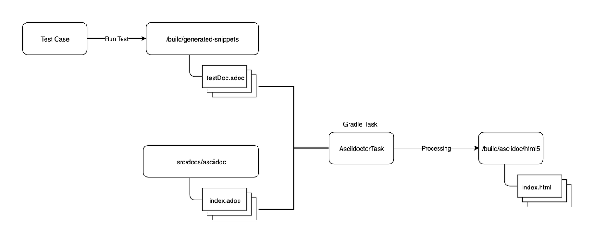

## Spring REST Docs

> _Spring REST Docs helps you to document RESTful services._
>
> > It combines hand-written documentation written with `Asciidoctor` and auto-generated snippets produced with `Spring MVC Test`. This approach frees you from `the limitations of the documentation` produced by tools like `Swagger`.

: 테스트 코드 기반으로 API 문서를 자동으로 작성해주는 프레임워크

- 테스트가 통과돼야 문서 자동 작성
- API Spec이 추가/변경/삭제 된 경우, 테스트 코드 수정 필요
- 기본적으로 Asciidoctor를 사용하여 문서 작성

 

## Spring REST Docs 공식 문서

> ##### 스니펫(snippet): 재사용 가능한 소스 코드, 기계어, 텍스트의 작은 부분을 일컫는 프로그래밍 용어

&nbsp; Spring REST Docs의 목적은 RESTful 서비스에 대한 `정확하고 읽기 쉬운 문서`를 만드는 것이다.

&nbsp; 고품질 문서를 작성하는 것은 어렵다. 이러한 어려움을 완화하는 한 가지 방법은 작업에 적합한 도구를 사용하는 것이다. 이를 위해 Spring REST Docs는 기본적으로 `Asiidoctor를 사용`한다. Asciodoctor는 `일반 텍스트를 처리`하고, 필요에 따라 스타일링되고 레이아웃된 `HTML을 생성`한다. 원하는 경우, `Markdown`을 사용하도록 Spring REST Docs를 구성할 수도 있다.

&nbsp; Spring REST Docs는 Spring MVC의 테스트 프레임워크인 Spring WebFlux의 WebTestClient 또는 REST Assured 3으로 작성된 `테스트에서 생성된 스니펫을 사용`한다. 이러한 테스트 기반 접근 방식은 서비스 문서의 `정확성을 보장`하는 데 도움이 된다. 스니펫이 올바르지 않으면 스니펫을 생성하는 테스트가 `실패`한다.

&nbsp; RESTful 서비스를 문서화하는 것은 주로 `리소스를 설명하는 것`이다. 각 리소스 설명의 두 가지 주요 부분은 `사용하는 HTTP 요청`과 `생성하는 HTTP 응답`의 세부 정보다. Spring REST Docs를 사용하면 이러한 리소스와 HTTP 요청 및 응답으로 작업하여 서비스 구현의 내부 세부 사항으로부터 `문서를 보호`할 수 있다.

&nbsp; 이러한 분리는 서비스 구현보다는 `서비스 API를 문서화`하는 데 도움이 된다. 또한 문서를 다시 작성할 필요 없이 구현을 발전시킬 수 있다.

 

## Architecture

    
    <H5>출처: https://devbksheen.tistory.com/m/entry/Spring-REST-Docs</H5>

1. Test Case가 성공하면 `.adoc 파일`이 `/build/generate-snippets` 디렉토리에 생성
2. `src/docs/asciidoc` 디렉토리에 `.adoc 파일`을 include하여 `문서 생성`
   - `*.adoc 파일`들은 API Request, Response에 대한 `Spec 파일`
   - `*.adoc 파일`들이 `HTML 파일로 변환`돼 API 문서 제공
   - `*.adoc 파일`에 API 문서를 작성하고, 필요한 API Request와 Response의 Spec은 자동 생성된 `.adoc 파일`을 이용해 표현
   - 이후 API Spec이 변경돼도 문서를 수정하지 않아도 됨
3. 생성된 `asciidoc 문서`는 AsciidoctorTask를 통해 HTML문서로 처리돼 `/build/asciidoc/html5` 디텔토리에 HTML 문서로 생성

 

---

### 참고자료

- [Spring Docs](https://docs.spring.io/spring-restdocs/docs/current/reference/html5/)
