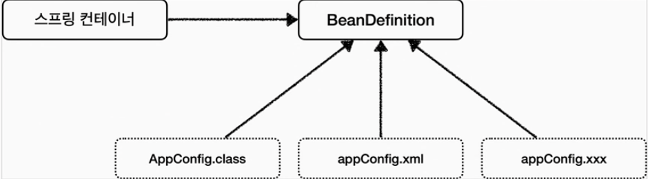

## **👨🏻‍💻BeanFactory** 

: 스프링 컨테이너의 최상위 인터페이스

- 스프링 빈을 관리하고 조회하는 역할 담당
- getBean()제공

### ApplicationContext

&nbsp; BeanFactory기능을 모두 상속받아 제공한다
빈을 관리하고 검색하는 기능을 BeanFactory가 이미 제공하는데 차이는??  -> 애플리케이션을 개발할때는 빈은 관리하고 조회하는 기능은 물론이고 수 많은 부가 기능이 필요하다.
 

1) 메시지소스를 활용한 국제화 기능 => (MessageSource)
2) 환경변수 => (EnvironmentsCapable)
3) 애플리케이션 이벤트 => (ApplicationPublisher)
4) 편리한 리소스 조회 => (ResourceLoader)

&nbsp; 간단하게 BeanFactory나 ApplicationContext를 스프링 컨테이너라고 한다.
 

***
## **🥜BeanDefinition**

<h3> 스프링 빈 설정 메타 정보
</h3>
&nbsp; 스프링이 다양한 설정 형식을 지원할 수 있는 이유는?
  -> 바로 BeanDefinition 이라는 추상화 때문이다. 즉 설정 정보의 역할과 구현을 개념적으로 분리한 것으로 설정 정보를 추상화 시켰다.
 

&nbsp; 스프링 컨테이너는 BeanDefintion(역할)만 알고 자바 코드인지, XML인지 몰라도 된다.
  
1) XML을 읽어 BeanDefinition 생성
2) 자바 코드를 읽어 BeanDefinition 생성
  

쉽게 말해 @Bean / <bean> 하나당 하나씩 메타 정보가 생성되고, 스프링 컨테이너는 이 메타 정보를 기반으로 스프링 빈을 생성한다.
***

### **참고자료**

- Web
    - [blog](https://hseungyeon.tistory.com/398)
    - [github.io](https://woovictory.github.io/2019/02/07/Design-Pattern-Factory-Pattern/)
    
