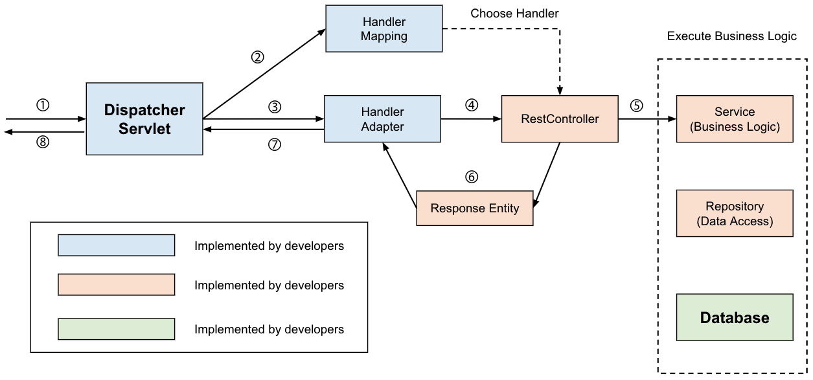

## @Controller와 @RestController

&nbsp; Spring에서 컨트롤러를 지정하기 위한 어노테이션으로는 `@Controller`와 `@RestController`가 있다. 이 두 어노테이션의 주요 차이점은 `HTTP Response Body`가 생성되는 방식이다. `@Controller`는 `Model` 객체를 만들어 데이터를 담고, `View를 반환`하기 위해 사용하고, `@RestController`는 단순히 객체만을 반환하고, 객체 데이터는 JSON 또는 XML 형식으로 HTTP 응답에 담아 전송한다.

- @Controller는 클래스를 Spring MVC 컨트롤러를 `표시`하는 데 사용하고, @RestController는 `RESTful 웹 서비스`에서 사용되는 특수 컨트롤러이며, `@Controller + @ResponseBody`와 동일함.
- @Controller는 `View` 반환 목적이고, @RestController는 `객체` 반환 목적
- @Controller는 `@Component`가 달려있고, @RestController는 `@Controller`와 `ResponseBody`가 달려있음

```java
@Target(value=TYEP)
@Retention(value=RUNTIME)
@Documented
@Component
public @interface Controller { . . .}

@Target(value=TYEP)
@Retention(value=RUNTIME)
@Documented
@Controller
@ResponseBody
public @interface RestController { . . . }
```

<br>

## Spring MVC Work-flow

> ### @Controller - View

<p align=center></p>

1. Client가 URI 형식으로 `Request`를 보냄
2. `DispatcherServlet`이 요청을 위임한 `HandlerMapping`을 찾음
3. HandlerMapping을 통해 Reqeust를 Controller로 위임
4. Controller는 Request를 처리한 후 `ViewName` 반환
5. DispatcherServlet이 `ViewResolver`를 통해 해당하는 `View`를 찾아 리턴

<br>

> ### @RestController

<p align=center></p>

1. Client가 URI 형식으로 `Request`를 보냄
2. `DispatcherServlet`이 요청을 위임한 `HandlerMapping`을 찾음
3. HandlerMapping을 통해 Reqeust를 Controller로 위임
4. Controller는 Request를 처리한 후 `객체` 반환
5. 반환되는 객체는 `JSON`으로 Serialize 되어 Client에게 반환

- `@ResponseBody`를 활용한 @Controller와 동작방식이 같음
- 객체를 반환하기 때문에 Client가 예상하는 HttpStatus를 설정해줄 수 없음
  - 이럴 경우 `ResponseEntity`로 감싸서 리턴해줘야 함

<br>

---

### 참고자료

- [@dev-coco](https://dev-coco.tistory.com/m/84)
- [@mangkyu](https://mangkyu.tistory.com/m/49)
- [@dyunge_100](https://velog.io/@dyunge_100/Spring-Controller와-RestController의-차이)
