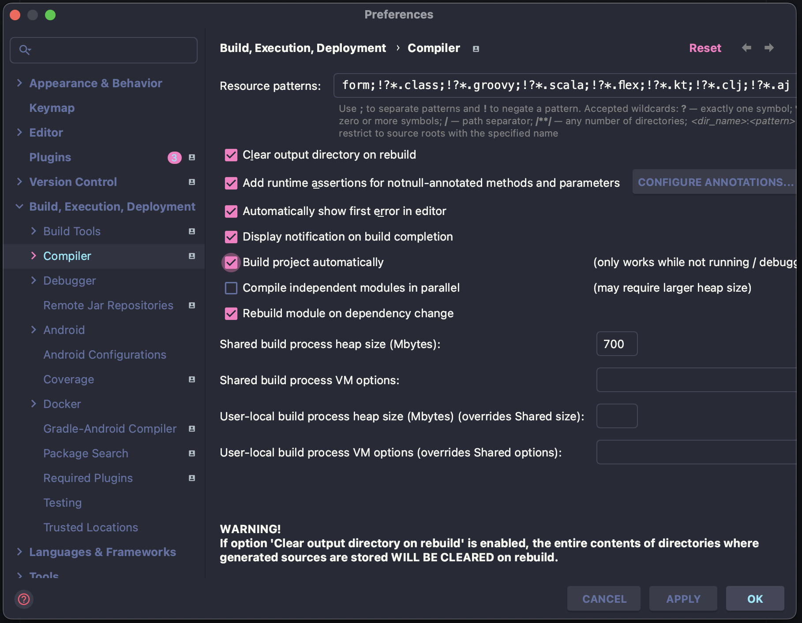

## devtools

: Spring Boot에서 제공하는 개발 편의를 위한 모듈

> → 주로 변경된 코드를 서버 또는 화면에 신속하게 반영해 결과를 확인하기 위해 사용

<br>

> ### 기능

- 클래스 로딩 문제 진단 (Diagnosing Classloading Issues)
- 속성 기본값 (Property Defaults)
- 자동 재시작 (Automaic Restart)
- 라이브 리로드 (LiveReload)
- 전역 설정 (Global Settings)
- 원격 애플리케이션 (Remote Applications)

<br>

> ### 의존성 설정

```xml
. . .
    <dependency>
        <groupId>org.springframework.boot</groupId>
        <artifactId>spring-boot-devtools</artifactId>
        <optional>true</optional>
    </dependency>
. . .
```

- Maven

```gradle
. . .
    developmentOnly("org.springframework.boot:spring-boot-devtools")
. . .
```

- Gradle

<br>

> ### LiveReload

1.  IntelliJ 설정

    - [Preferences] → [Build, Execution, Deployment] → [Compiler] → `Build project automaically`

    <p align=center>
        
    </p>

2.  application.\* 설정

```yml
# application.properties
spring.devtools.livereload.enabled=true

# application.yml
spring:
  devtools:
    livereload:
      enabled: true
```

<br>

---

### Reference

- [@iksflow](https://iksflow.tistory.com/57)
- [@mgyo](https://mgyo.tistory.com/389)
