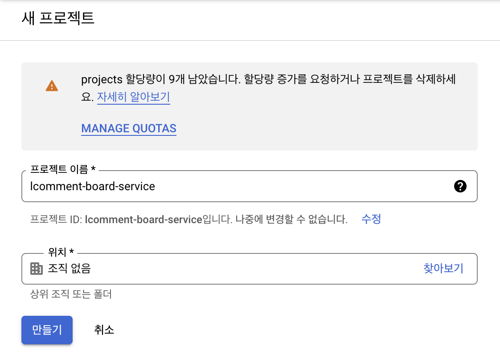
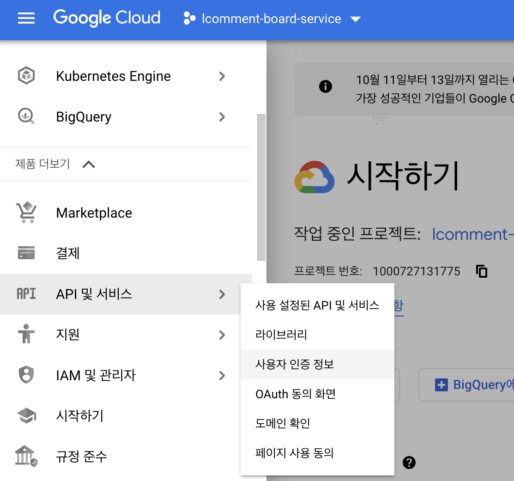
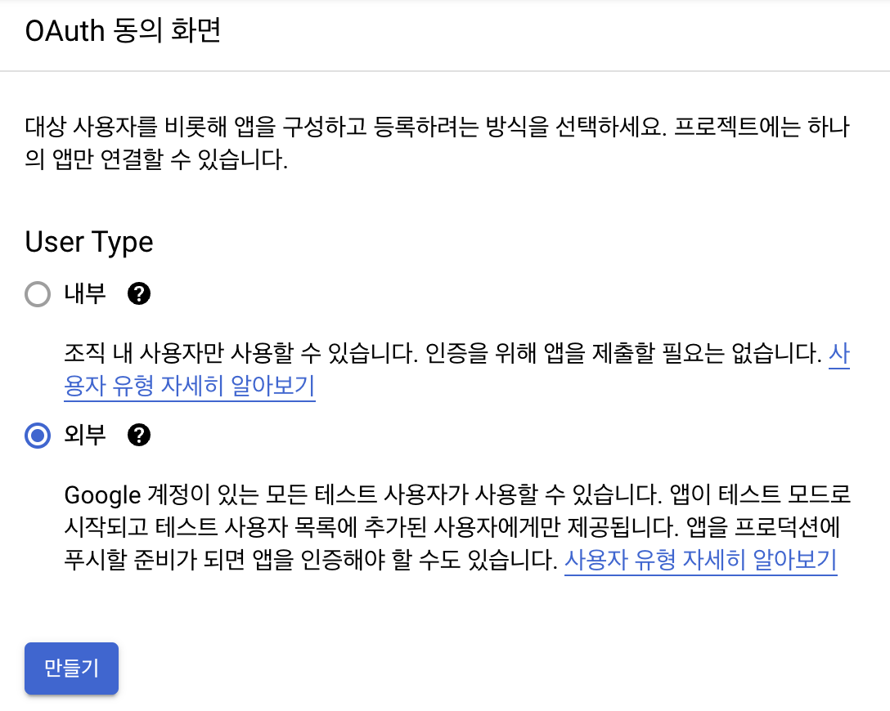
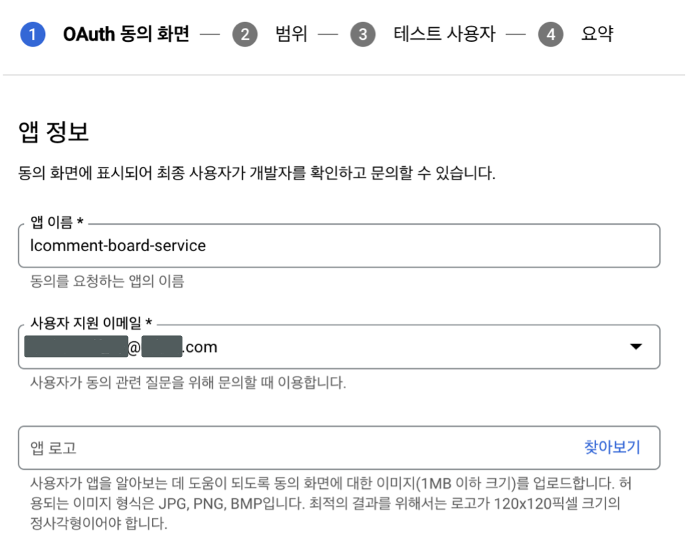
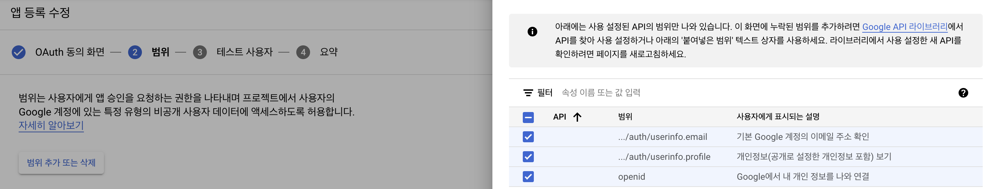
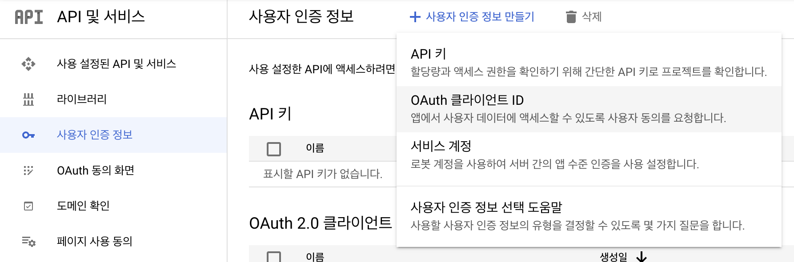
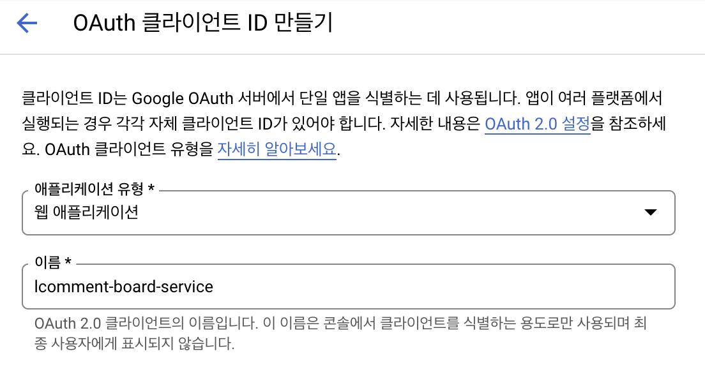
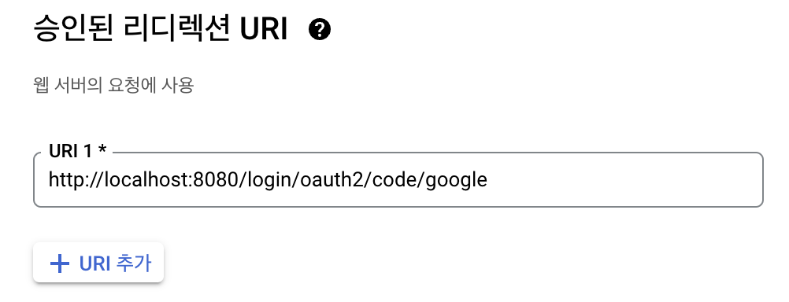

> ### OAuth2.0 관련 이론 보러가기 → [Web - OAuth2.0](https://github.com/lcomment/development-recipes/blob/main/Web/OAuth2.0.md)

<br>

# _Google Social Login_

<p align=right>
    
    
    
</p>

## 1. 구글 서비스 등록

&nbsp; 먼저 [구글 클라우드 플랫폼 주소](https://console.cloud.google.com/)로 이동하여 구글 서비스를 등록해야 한다. 접속 후 상단의 `[프로젝트 선택]` 탭을 클릭하여 `[새 프로젝트]`를 생성한다.



<br>

&nbsp; 위과 같이 프로젝트를 생성해주고, 좌측 메뉴 탭을 클릭하여 `[API 및 서비스]` 카테고리의 `[사용자 인증 정보]`를 클릭한다. `사용자 인증 정보` 화면의 `사용자 인증 정보 만들기`에는 여러 메뉴가 있지만, 이 글에서는 `OAuth 클라이언트 ID`로 구현할 것이다. `OAuth 클라이언트 ID`를 클릭해준다.

&nbsp;&nbsp;&nbsp;&nbsp;

<br>

&nbsp; 외부를 선택해주고,



<br>

&nbsp; 다음과 같이 정보를 입력해준다.



<br>

&nbsp; `Google API`의 범위는 다음과 같이 세 가지를 선택했다. 기본값이 선택한 email, profile, openid다.



<br>

&nbsp; 테스트 사용자는 넘어간 후 요약까지 확인하고 저장한다. 다음 `OAuth 클라이언트 ID 만들기` 화면으로 이동해준다.



<br>

&nbsp; 애플리케이션 유형에서 `웹 애플리케이션`을 골라주고 애플리케이션의 이름을 적어준다. `승인된 리디렉션 URI`에는 우측하단의 사진과 같이 적어준다. 스프링 부트 v2의 Security에서는 기본적으로 `{Domain}/login/oauth2/code/{Social Service Code}`로 리다이렉트 URL을 지원하고 있기 때문이다. 개발 단계에서는 사진과 같이 `localhost`로 등록하고, 이후 배포를 진행한다면 추가로 `도메인`으로 등록해주면 된다.




<br>

&nbsp; 이제 생성 버튼을 클릭하면 클라이언트 정보를 볼 수 있고, 생성된 애플리케이션을 클릭하면 인증 정보도 볼 수 있다. 해당 정보를 `JSON 파일`로 다운로드하여 보관하는 것도 추천한다.

<br>

## 2. OAuth 설정하기

&nbsp; 먼저 OAuth 정보를 설정해줘야 한다. `properties` 파일을 사용한다면 첫 번째를, `yml 파일을 사용한다면 두 번째를 참고하면 된다.

```properties
# application-oauth.properties
spring.security.oauth2.client.registration.google.client-id=client_ID
spring.security.oauth2.client.registration.google.client-secret=client_SECRET
spring.security.oauth2.client.registration.google.scope=profile,email
```

```yml
# application-oauth.yml
spring:
  security:
    oauth2:
      client:
        registration:
          google:
            client-id: client_id
            client-secret: client_SECRET
            scope: profile, email
```

&nbsp; 만약 해당 프로젝트가 깃과 연결돼있다면 `gitignore` 파일에 해당 파일을 등록하여 숨겨줘야 한다. 또 `application-oauth`이 스프링 부트의 기본 설정 파일에 포함이 되도록 등록해줘야 한다.

```properties
# application.properties
spring.profiles.include=oauth
```

&nbsp; 마지막으로 `build.gradle`에 Spring Security 관련 의존성을 추가해준다.

```gradle
dependencies {
    . . .
    implementation 'org.springframework.boot:spring-boot-starter-oauth2-client'
    . . .
}
```

<br>
