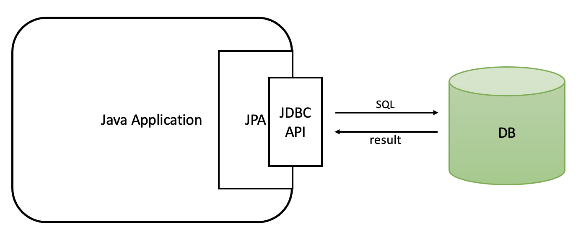
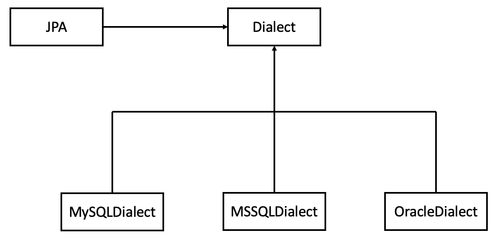

> ### ORM 관련 이론 보러가기 → [Web - ORM](https://github.com/lcomment/development-recipes/blob/main/Web/orm.md)

 

## JPA (Java Persistence API)

: Java 진영에서 ORM 기술 표준으로 사용하는 인터페이스

- 자바 애플리케이션과 JDBC 사이에서 동작
- ORM 프레임워크가 JPA 구현
  - `Hibernate` (가장 대중적)
  - EclipseLink
  - DataNucleus
- 표준이기에 다른 구현 기술로 손쉽게 변경 가능

 

## JPA를 사용해야 하는 이유

- 생산성
  - DDL, DML문 등을 자동으로 생성해주는 기능
  - DB 설계 중심의 패러다임을 `객체 설계 중심으로 역전`
- 유지보수
  - 개발자가 작성해야 했던 SQL과 JDBC API 코드를 JPA가 대신 처리
  - 유지보수 할 코드 수 감소
- 패러다임 불일치 해결
- 성능
  - 애플리케이션과 DB 사이에서 다양한 `성능 최적화` 기회 제공
- 데이터 접근 추상화와 벤더 독립성
  - 애플리케이션과 DB 사이에 `추상화`된 데이터 접근 계층 제공
  - 애플리케이션이 특정 DB 기술에 `독립적`이게 됨

 

---

### **참고자료**

- Web
  - [@dbjh](https://dbjh.tistory.com/77)
- Book
  - [자바 ORM 표준 JPA, 김영한](http://www.yes24.com/Product/Goods/90439472)
