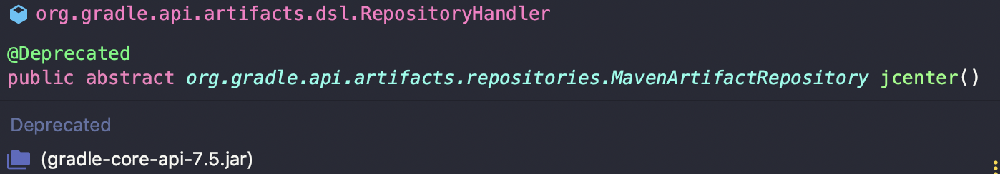

## mavenCentral()과 jcenter()

```gradle
repositories {
    mavenCentral()
    jcenter()
}
```

&nbsp; **build.gradle**의 `repositories`는 각종 의존성(라이브러리)들을 어떤 원격 저장소에서 받을지를 정해준다. `mavenCentral()`과 `jcenter()`는 Android Studio의 Gradle 플러그인 용 저장소이다.

&nbsp; 기본적으로 mavenCentral이 이전부터 많이 사용하는 저장소지만, 본인이 만든 라이브러리를 업로드하기 위해서는 많은 과정과 설치가 필요한 문제점이 있었다. 이를 보완하기 위한 라이브러리가 jcenter이다.

&nbsp; jcenter는 라이브러리 업로드를 간단하게 하였고, jcenter에 라이브러리를 업로드하면 mavenCentral에도 업로드 될 수 있도록 자동화를 할 수 있다. 따라서 jcenter는 최대 java 저장소이고 jcenter를 많이 사용하는 추세이다.

<p align=center>  </p>

&nbsp; 하지만 현재 jcenter를 이용하려 하면 `Deprecated`라고 표시되는 것을 확인할 수 있다. 많은 Android 프로젝트에서 사용하고 있는 JCenter 아티팩트 저장소의 유지보수 회사 `JFrog`가 최근 JCenter 지원을 중단했기 때문이다. 따라서 서비스 또한 종료될 것이고, 앞으로는 mavenCentral을 사용하도록 하자.

---

### **참고자료**

- Web
  - [@jack3787](https://velog.io/@jack3787/Springboot-mavenCentral과-jcenter의-차이점)
  - [@스프링 부트와 AWS로 혼자 구현하는 웹 서비스](http://www.yes24.com/Product/Goods/83849117)
