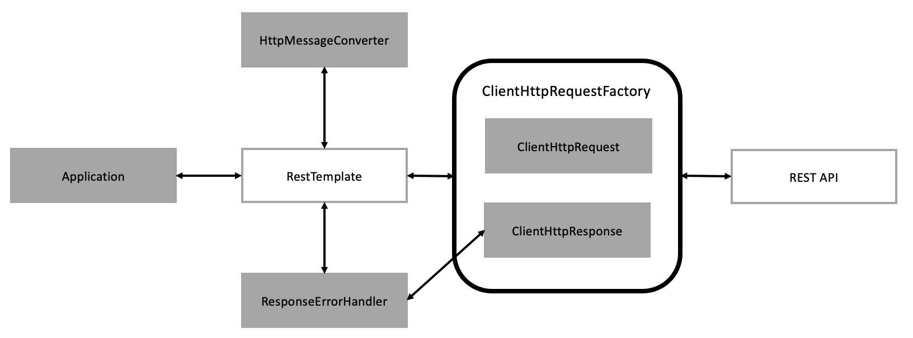

## RestTemplate

: Spring에서 HTTP 통신 기능을 손쉽게 사용하도록 설계한 템플릿

- RestFul 원칙을 따르는 서비스를 편하게 만들 수 있음
- 기본적으로 `동기` 방식으로 처리
- 비동기 방식을 사용하는 경우 AsyncRestTemplate 활용
- 현재는 deprecated 상태라 많이 사용하는 경우는 `WebClient` 방식 권장

> ### 특징

- Http 프로토콜의 멘서드에 맞는 여러 메서드 제공
- HTTP 요청 후 json, xml 문자열 등의 다양한 형식으로 응답을 받을 수 있음
- Blocking IO 기반의 동기 방식
- 다른 API 호출 시 HTTP 헤더에 다양한 값 설정 가능

 

## 동작원리

    

- 애플리케이션에서 RestTemplate 선언 및 URI와 HTTP 메서듯 BOdy 등 설정
- 외부 API로 Request 보낼 시, RestTemplate에서 `HttpMessageConverter`를 통해 RequestEntry를 요청 메시지로 반환
- 반환된 Request Message를 `ClientHttpRequestractory`를 통해 ClientHittpRequest로 가져온 후 외부 API 요청을 보냄
- 외부에서 요청에 대한 응답을 받으면 RestTemplate은 RespenseErrarklande로 오류 확인 및 오류가 있을
  시 ClientHoRespanse에서 응답 데이터 처리
- 받은 응답데이터가 정상일 시, HttpMessageConverter를 거쳐 Java 객체로 변환해 애플리케이션으로 반환

 

## 대표 메서드

| 메서드          | HTTP형태 | 설명                                                                     |
| --------------- | -------- | ------------------------------------------------------------------------ |
| getForObject    | GET      | GET 형식으로 요청한 결과를 객체로 반환                                   |
| getForEntity    | GET      | GET 형식으로 요청한 결과를 ResponseEntity 형식으로 반환                  |
| postForLocation | POST     | POST 형식으로 요청한 결과를 헤더에 저장된 URI로 반환                     |
| postForObject   | POST     | POST 형식으로 요청한 결과를 객체로 반환                                  |
| postForEntity   | POST     | POST 형식으로 요청한 결과를 ResponseEntity 형식으로 반환                 |
| delete          | DELETE   | DELETE 형식으로 요청                                                     |
| put             | PUT      | PUT 형식으로 요청                                                        |
| patchForObject  | PATCH    | PATCH 형식으로 요청한 결과를 객체로 반환                                 |
| optionsForAllow | OPTIONS  | 해당 URI에서 지원하는 HTTP 메서드를 조회                                 |
| exchange        | any      | HTTP 헤더를 임으로 추가할 수 있고, 어떤 메서드 형식에서도 사용할 수 있음 |
| execute         | any      | 요청과 응답에 대한 콜백을 수정                                           |
