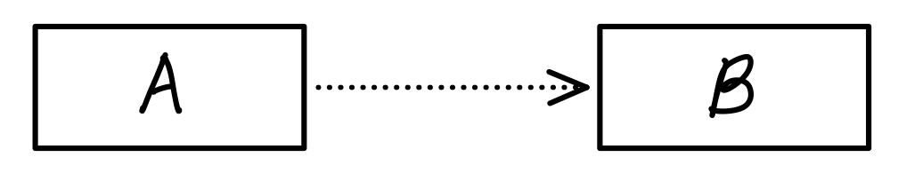
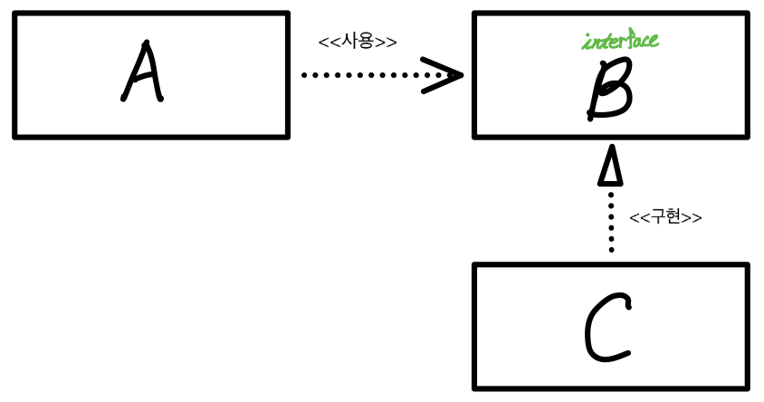

## **스프링 컨테이너** (Spring Container)

: Spring에서 Java 객체들을 관리하는 공간

- Java 객체의 라이프사이클을 관리
- 생성된 Java 객체들에게 추가적인 기능을 제공
- `IoC`와 `DI`의 원리가 적용됨

 

### **제어의 역전, IoC**

&nbsp; 스프링에서 제어의 역전은 스프링 컨테이너가 필요에 따라 Bean들을 `관리`하거나 `제어`하는 행위다.
(여기서 `Bean`은 스프링 컨테이너에 의해 관리되는 `자바 객체(POJO)`를 말한다.) 기존의 프로그램은 클라이언트 구현 객체가 스스로 필요한 서버 구현 객체를 생성하고, 연결 후 실행했다. 하지만 스프링 컨테이너를 사용하면 구현 객체는 `자신의 로직을 실행`하는 역할만 담당하고, 프로그램의 제어 흐름은 스프링 컨테이너가 담당한다.

 

&nbsp; 이와 같이 프로그램의 제어 흐름을 개발자가 아닌 외부에서 관리하는 것을 제어의 역전, `IoC`(Inversion of Control)이라고 한다.

### **의존관계 주입, DI**

&nbsp; "A가 B를 의존한다." 겉으로 보기엔 추상적인 표현이지만, 토비의 스프링에서는 의존한다는 건 의존대상, 위의 그림에서는 B가 변하면 A에 영향을 미친다고 정의돼 있다. 하지만 B는 A의 변화에 영향을 받아서는 안된다. 의존 관계에는 `방향성`이 있기 때문이다.

&nbsp; 위의 그림을 참고해보면, A는 B 인터페이스에 의존하고 있다. 만약 B 인터페이스가 변한다면 A는 영향을 받게 된다. 하지만 정작 B 인터페이스를 구현한 C가 변했을 땐 영향을 받지 않는다. B 인터페이스를 구현한 다른 객체로 바뀌어도 말이다. 이렇게 인터페이스에 대해서만 의존관계를 만들어두면 인터페이스 구현 클래스와의 `관계는 느슨`해지고, `결합도`가 낮아지게 된다. 의존관계 주입, DI는 다음의 조건을 충족하는 작업이라고 말할 수도 있다.

- 클래스 모델이나 코드에는 런타임 시점의 의존관계는 드러나지 않는다. 그러기 위해서는 `인터페이스에만 의존`하고 있어야 한다.
- 런타임 시점의 의존관계는 `컨테이너`나 `팩토리` 같은 제3의 존재가 결정한다.
- 의존관계는 사용할 오브젝트에 대한 레퍼런스를 `외부에서 제공(주입)`해줌으로써 만들어진다.

&nbsp; 의존관계 주입(DI)은 스프링이 제공하는 IoC 방법이고, 이 밖에도 getBean() 메서드 등을 통한 `의존관계 검색`(DL, Dependency Lookup)도 있다.

 

---

### **참고자료**

- Web
  - 토비의 스프링 3.1
  - [@tecoble](https://tecoble.techcourse.co.kr/post/2021-04-27-dependency-injection/)
  - [@steady-coding](https://steady-coding.tistory.com/458)
  - [@tank3a](https://velog.io/@tank3a/스프링-컨테이너와-스프링-빈)
