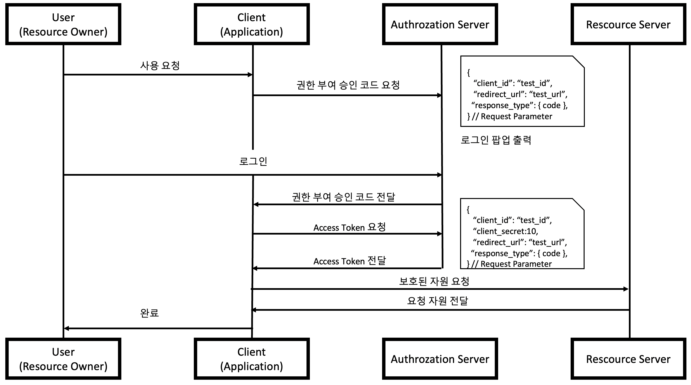
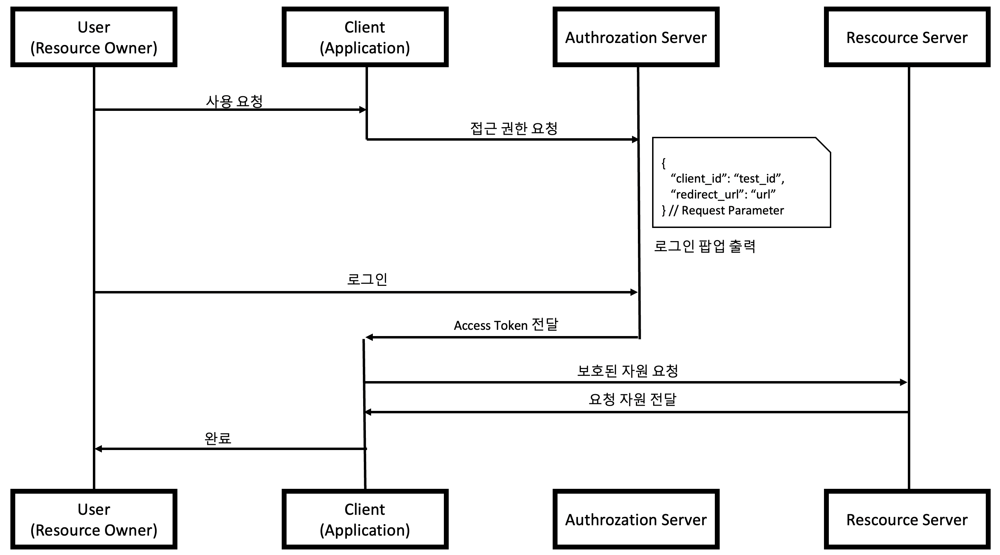
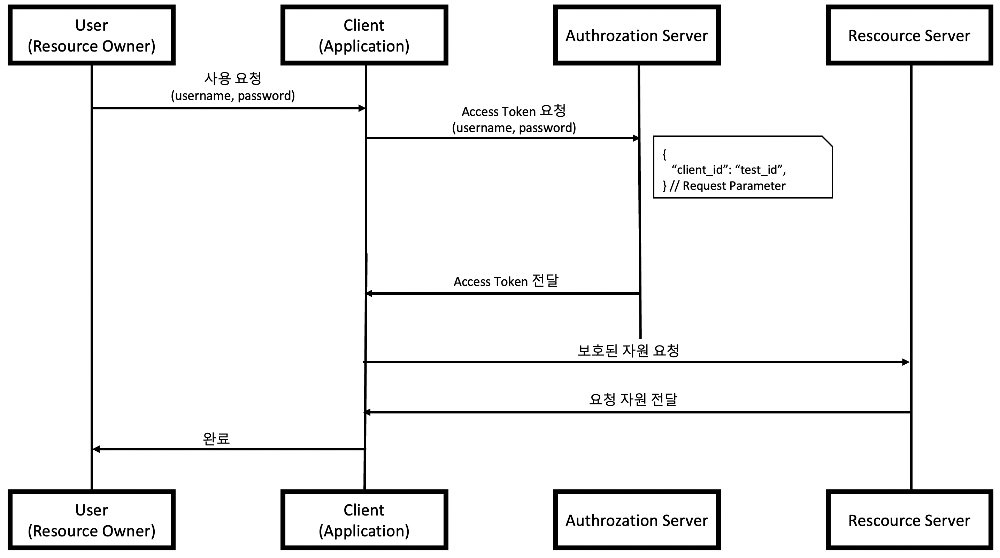
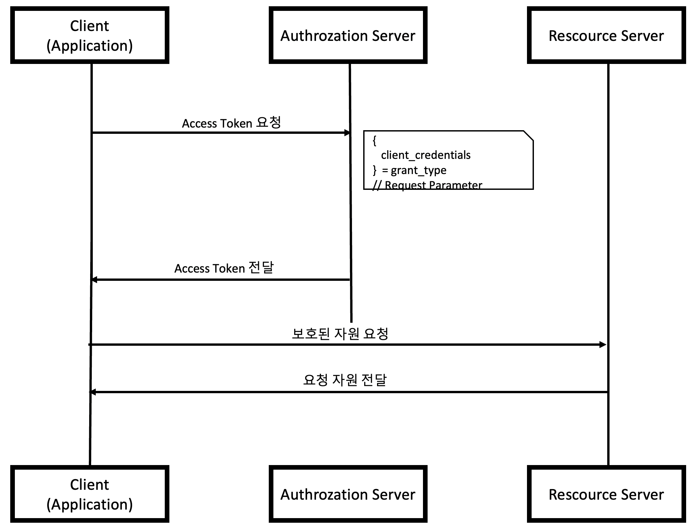

## OAuth 2.0 이란?

- Open Authorization 2.0의 줄임말
- `인증`을 위한 개방형 프로토콜
- `Third-Party` 프로그램에게 리소스 소유자를 대신해 리소스 서버에게 제공하는 `자원에 대한 접근 권한을 위임`하는 방식 제공
- Google, Facebook, Kakao 등

 

## OAuth 2.0 주요 용어

- `Authentication`
  - 인증 접근 자격이 있는지 검증 단계
- `Authorization`
  - 인가, 자원에 접근할 권한을 부여하는 것
  - 인가가 완료되면 리소스 접근 권한이 담긴 Access Token이 클라이언트에게 부여
- `Access Token`
  - 리소스 서버에게서 리소스 소유자의 보호된 자원을 획득할 때 사용되는 만료 기간이 있는 Token
- `Refresh Token`
  - Access Token 만료시 이를 갱신하기 위한 용도로 사용하는 Token
  - 일반적으로 Access Token보다 만료 기간이 긺

 

## OAuth 2.0의 4가지 역할

- 리소스 소유자 (Resource Owner)
  - 보호된 자원에 접근할 수 있는 자격을 부여해 주는 주체
  - OAuth2 프로토콜 흐름에서 클라이언트를 인증(Authorize)하는 역할을 수행
  - 인증이 완료되면 권한 획득 자격(Authorization Grant)을 클라이언트에게 부여
  - 개념적으로는 리소스 소유자가 자격을 부여하는 것이지만 일반적으로 권한 서버가 리소스 소유자와 클라이언트 사이에서 중개 역할을 수행하게 됨
- 클라이언트 (Client)
  - 보호된 자원을 사용하려고 접근 요청을 하는 애플리케이션입니다.
- 리소스 서버(Resource Server)
  - 사용자의 보호된 자원을 호스팅하는 서버
- 권한 서버 (Authorization Server)
  - 인증/인가를 수행하는 서버
  - 클라이언트의 접근 자격을 확인하고 Access Token을 발급하여 권한을 부여하는 역할을 수행

## OAuth 2.0 프로토콜의 종류

### ① 권한 부여 승인 코드 방식 (Authorization Code Grant)

- 권한 부여 승인을 위해 자체 생성한 `Authorization Code를 전달`하는 방식
- 많이 쓰이고, 기본이 되는 방식
- `간편 로그인` 기능에서 사용되는 방식
- 클라이언트가 사용자를 대신하여 특정 자원에 접근을 요청할 때 사용되는 방식
- 보통 타사의 클라이언트에게 `보호된 자원을 제공`하기 위한 인증에 사용
- `Refresh Token`의 사용이 가능
- response type → `code`

### ② 암묵적 승인 방식 (Implicit Grant)

- 자격증명을 안전하게 저장하기 힘든 클라이언트에게 최적화된 방식입니다.
  - ex. JS 등 스크립트 언어를 사용하는 브라우저
- 권한 부여 승인 코드 없이 `바로 Access Token 발급`
  - Access Token이 바로 전달되므로 `만료기간을 짧게 설정`하여 누출의 위험을 줄일 필요가 있음
- Refresh Token 사용 `불가능`
- client_secret을 사용해 클라이언트를 인증하지 않음
- 절차가 간소화돼 응답성과 효율성은 높지만, Access Token이 URL로 전달된다는 단점이 있음
- response type: `token`

### ③ 자원 소유자 자격증명 승인 방식 (Resource Owner Password Credentials Grant)

- 간단히 username과 password로 Access Token을 받는 방식
- `자신의 서비스`에서 제공하는 어플리케이션일 경우에만 사용되는 인증 방식
- 권한 서버, 리소스 서버, 클라이언트가 모두 같은 시스템에 속해 있어야 함
- Refresh Token 사용 가능
- grant type: { `username`, `password` }

### ④ 클라이언트 자격증명 승인 방식 (Client Credentials Grant)

- 클라이언트의 자격증명만으로 Access Token을 획득하는 방식
- OAuth2의 권한 부여 방식 중 가장 간단한 방식
  - 클라이언트 자신이 관리하는 리소스 혹은 권한 서버에 해당 클라이언트를 위한 제한된 리소스 접근 권한이 설정되어 있는 경우 사용
- 자격증명을 안전하게 보관할 수 있는 클라이언트에서만 사용되어야 함
- Refresh Token은 사용할 수 없음

 

---

### **참고자료**

- Web
  - [@mds_datasecurity](https://blog.naver.com/mds_datasecurity/222182943542)
  - [@meetup](https://meetup.toast.com/posts/105)
  - [@blinders](https://blinders.tistory.com/65)
